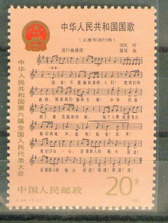

## 49年前的今天，中华人民共和国国歌《义勇军进行曲》的作词人田汉逝世

适合所有人的历史读物。每天了解一个历史人物、积累一点历史知识。三观端正，绝不戏说，欢迎留言。  

（万象历史特约作者：一一）

【1968年12月10日】49年前的今天，历经曲折的国歌作词人田汉逝世

### 

田汉（1898年3月12日－1968年12月10日），湖南长沙人，中国现代戏剧的奠基人，中华人民共和国国歌《义勇军进行曲》的作词人。

文化大革命中被批斗，并死于禁闭之中。因此，国歌一度被停唱，以《东方红》代替。1978年，人大曾把国歌改词。田汉得到平反后，1982年歌词恢复。

夏衍：“田汉是现代的关汉卿，我私下把他叫做中国的‘戏剧魂’。”曹禺：“田汉的一生就是一部中国话剧发展史。

创立南国社

1898年3月12日，出生于湖南省长沙县一户贫农家庭，6岁丧父。1912年（14岁），入读长沙师范学校，校长是徐特立。

1916年（18岁），随舅父去日本，最初学海军，后来入东京高等师范学校学教育，热心戏剧，和郭沫若、左舜生、张资平等结为挚友。1921年，与郭沫若等组织创造社，倡导新文学。

1922年（24岁），回国在上海中华书局任编辑，创办《南国月刊》，发表剧作。1925年，田汉创办南国电影剧社，拍摄了由他编剧的电影《到民间去》。

1927年秋，到上海艺术大学任文学科主任、校长，创作了多部话剧作品。

1928年，南国电影剧社改组为南国社，与徐悲鸿、欧阳予倩组建南国艺术学院，以狂飙精神推进新戏剧运动，多次到南京、杭州、广州等地演出，大获成功。

左联发起人

1930年3月，他以发起人之一的身分参加了中国左翼作家联盟成立大会，并被选为7人执行委员会之一，接着参加了中国自由运动大同盟。同年6月，南国社被查封，左翼剧团联盟改组为左翼戏剧家联盟，他是发起与组织者之一；

1932年，由瞿秋白主持加入中国共产党。和夏衍等打入电影阵地，写了《三个摩登的女性》、《青年进行曲》等进步电影文学剧本。

1935年，为电影《风云儿女》谱写主题曲《义勇军进行曲》，途中被国民政府拘捕，歌词写在香烟盒上交予聂耳谱曲。

1937年，“七七”事变后，创作了五幕话剧《芦沟桥》，并举行劳军演出。8月赴上海，参加文化界救亡工作。上海沦陷后到长沙、武汉从事戏剧界抗日统一战线工作。12月成立了中华全国戏剧界抗敌协会，他是组织者之一；

1937年，作《四季歌》、《天涯歌女》歌词，为《马路天使》的主题曲。

1938年，编辑出版《抗战戏剧》半月刊，后又去长沙筹办了《抗战日报》。

1940年，到重庆，与欧阳予倩等创办《戏剧春秋》，后到桂林领导组建新中国剧社和京剧、湘剧等民间抗日演剧团体；

四条汉子

1949年后，田汉任职文化部戏曲改进局、艺术局局长。

1966年，文化大革命开始，田汉被关押于秦城监狱，1968年因糖尿病、尿毒症和冠心病去世，死时无一亲属在旁。名单上写的名字是假名字，叫李伍。只有儿子田大畏被告知死讯，其他亲友均不知情。田汉母亲直至去世，也没有见到儿子最后一面。

1970年，中国大陆大规模批斗田汉、周扬、夏衍、阳翰笙“四条汉子”，被安排的罪名包括曾经恶毒攻击鲁迅和江青等人。因此，他在1975年被以“组织”的名义宣布为“叛徒”，并被“永远开除党籍”。

从此，中国大陆不能再唱他作词的歌曲，正式场合只能演奏国歌的曲谱，或启用新歌词《继续革命的战歌》。群众集会，也只唱《东方红》和《大海航行靠舵手》。

、梅兰芳(右2)、田汉(右3).jpg)

恢复名誉

1979年，原中央专案组对田汉的“结论”被推翻，田汉得到平反。1979年4月25日在北京八宝山革命公墓为他开了一个迟来的追悼会。1982年12月4日，第五届全国人民代表大会第五次会议通过决定：恢复《义勇军进行曲》为中华人民共和国代国歌。2004年，第十届全国人民代表大会第二次会议修改中华人民共和国宪法，将《义勇军进行曲》正式列为国歌。

义勇军进行曲

1935年，该曲由田汉作词、聂耳作曲。实际上，聂耳仅写作了简单伴奏的主旋律谱，由贺绿汀请上海百代唱片公司乐队指挥、俄国犹太裔作曲家阿龙·阿甫夏洛莫夫配器。

该曲不久就成为中国电影《风云儿女》的主题歌，并被美国黑人歌唱家保罗·罗伯逊翻唱，以此来声援中国人民的革命斗争。目前，各类乐队演奏此曲以及为合唱伴奏时，大多依照李焕之为此曲写作、1953年定稿的管弦乐总谱。

这首歌在抗日战争时期已经很流行，曾被戴安澜将军任师长的中华民国国民革命军第五军200师定为该师军歌。

《义勇军进行曲》的歌词素材源于哪里目前观点不一，但一种被众多史料佐证的观点是，《义勇军进行曲》歌词的雏形是东北抗日义勇军军歌，其中由孙铭武、孙耀祖、张显铭等人在抚顺清原组建的一支抗日武装血盟救国军的军歌《血盟救国军军歌》出现更早、更符合进行曲节奏、歌词相似度更高。

