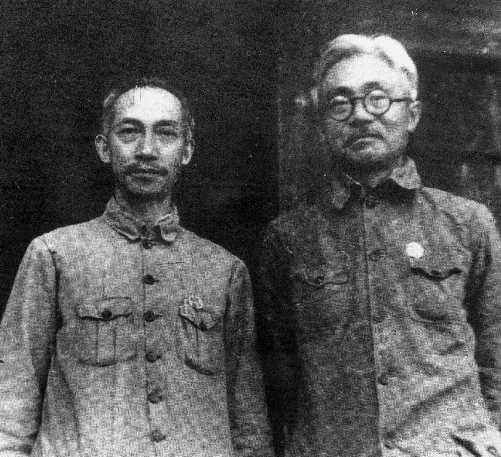
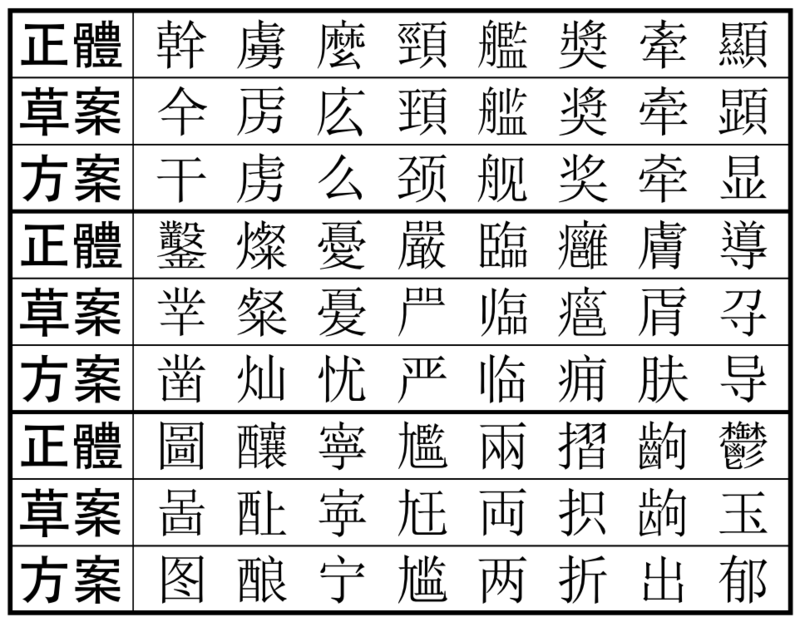

## 51年前的今天，担任17年人民大学校长并推动新中国语言文字改革的吴玉章逝世

适合所有人的历史读物。每天了解一个历史人物、积累一点历史知识。三观端正，绝不戏说，欢迎留言。  

（万象特约作者：一一）

【1966年12月12日】51年前的今天，17年人大校长，推动中国汉字改革的吴玉章逝世

吴玉章（1878年12月30日－1966年12月12日），四川荣县人，中国民主革命家。早年加入同盟会，参与四川的保路运动，后来加入中国共产党，被称为延安五老之一。1949年创立了中国人民大学，并担任校长达17年之久，是新中国教育的开拓者。担任全国文字改革委员会主任，推出了《汉字简化方案》，促使新中国扬弃传统的繁体字，统一使用简体字，使得更多的人易于学习，走出文盲。

毛泽东称赞他：“一个人做点好事并不难，难的是一辈子做好事，不做坏事，一贯的有益于广大群众，一贯的有益于青年，一贯的有益于革命，艰苦奋斗几十年如一日，这才是最难最难的啊！我们的吴玉章老同志就是这样一个几十年如一日的人。”

【第一个独立的革命政权】

1878年12月30日，吴玉章生于四川省荣县双石镇，父母早死，靠兄嫂抚养成人。1903年3月（25岁），吴玉章离开故乡，去日本东京成城学校留学。当船过三峡时，吴玉章写下了一首慷慨的述怀诗：不辞艰险出夔门，救国图强一片心。莫谓东方皆落后，亚洲崛起有黄人。

在日本，1905年吴玉章参加了中国同盟会。1911年，吴玉章回到四川，参加保路运动，与王天杰一起策动荣县独立。于9月25日，宣布荣县独立，在全国率先脱离清王朝建立军政府。荣县独立比武昌起义还早半个月，是辛亥革命时期由中国同盟会建立的第一个革命政权。

（吴玉章与夫人游丙莲）

【培养革命栋梁的教育家】

武昌起义后，他参加了中华民国临时政府的成立工作，曾任南京临时参议院议员。袁世凯任总统后，吴玉章参加二次革命，失败后逃到法国。在法组建华法教育会，为国培养人才。

1917年回国（39岁），在北京创办留法俭学预备学校，选送留法学生近两千人，周恩来、邓小平、王若飞、陈毅、聂荣臻、赵世炎、蔡和森、张申府等留法学生，后来都成为中国革命的栋梁。

1922年，任成都高等师范学校（四川大学前身）校长。通过吴玉章介绍，当时在成都养伤的川军将领刘伯承结识了杨闇公。在吴玉章、杨闇公二人的影响下，刘伯承的思想发生了深刻的变化，逐步走向革命的道路。

（留法时期的吴玉章）

【由学生介绍加入中国共产党】

1924年（46岁），吴玉章与杨闇公在重庆组建中国青年共产党（1925年3月该党自行解散，其成员大多转入中国共产党）。1925年2月，吴玉章到达北京，由当年他的学生、时任中共北京市委负责人的赵世炎介绍加入了中国共产党。

1927年11月（49岁），南昌起义失败后，赴苏联，在东方大学等校学习、任教。1938年4月，60岁的吴玉章回到中国。

（四川大学望江校区的吴玉章雕像）

【一辈子做好事的延安五老】

1939年11月（61岁），吴玉章到延安，先后任延安宪政促进会会长、陕甘宁边区新文字协会会长、鲁迅艺术学院院长、延安大学校长、陕甘宁边区政府文化委员会主任等职。他与董必武、徐特立、谢觉哉、林伯渠一起被尊称为“延安五老”。

1940年1月15日，党中央为他补行了六十寿辰（本是1938年12月30日）的庆祝大会。毛泽东亲临致祝词，称赞他：“一个人做点好事并不难，难的是一辈子做好事，不做坏事，一贯的有益于广大群众，一贯的有益于青年，一贯的有益于革命，艰苦奋斗几十年如一日，这才是最难最难的！我们的吴玉章老同志就是这样一个几十年如一日的人。”

（1938年10月，吴玉章和林伯渠合影）

【17年的人民大学校长】

1945年，抗战胜利后，吴玉章任中共四川省委书记。1948年8月，成立华北大学（今中国人民大学），任命吴玉章为校长。1949年12月（71岁），在华北大学的基础上建立了中国人民大学，吴玉章担任校长。

《人民日报》称中国人民大学为“新中国的第一个新型正规大学”。吴玉章担任中国人民大学校长达17年之久，直至1966年12月12日去世，为中国人民大学的建设和发展作出了巨大的贡献。

（吴玉章与人大新闻系学生）

推出第一次《汉字简化方案》

1949年，吴玉章给毛泽东写信，提出为了有效的扫除文盲，需要迅速进行文字改革。毛泽东把信批复给郭沫若、茅盾等人研究，于1949年10月成立中国文字改革协会，吴玉章任常任理事会主席。

1954年10月（76岁），中国文字改革协会改为国务院直属的中国文字改革委员会，吴玉章为主任。1955年1月7日，改革委员会发表《汉字简化方案（草案）》。1955年11月21日，教育部发出《关于在各级学校推行简化汉字的通知》；1956年1月31日，《汉字简化方案》在《人民日报》正式公布。

（1955年的简化字草案与1956年的正式方案中，一部分简化不同的字）

1977年12月，中国文字改革委员会发布了《第二次汉字简化方案（草案）》。方案推出后饱受争议，最终于1986年6月24日被废除。那时吴玉章去世已经20年。

（《人民日报》试用二简字，字形怪异，令读者困惑）