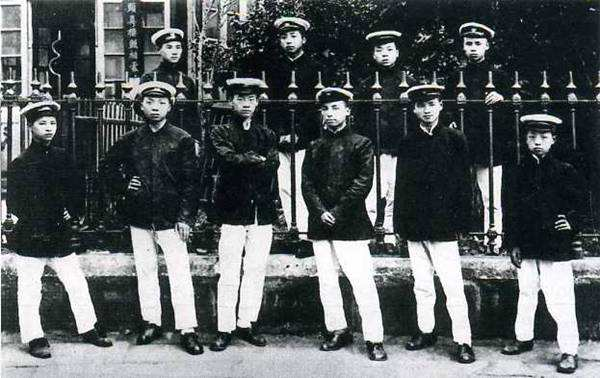
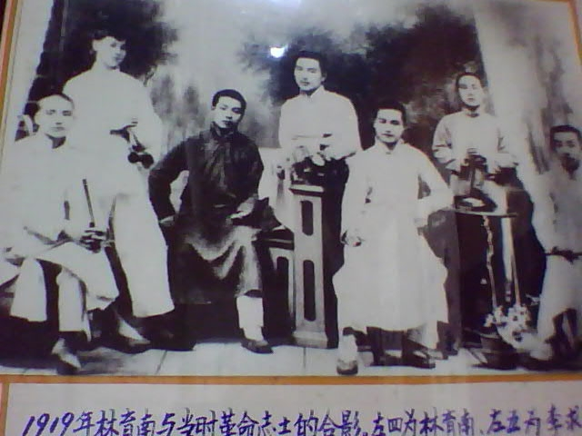
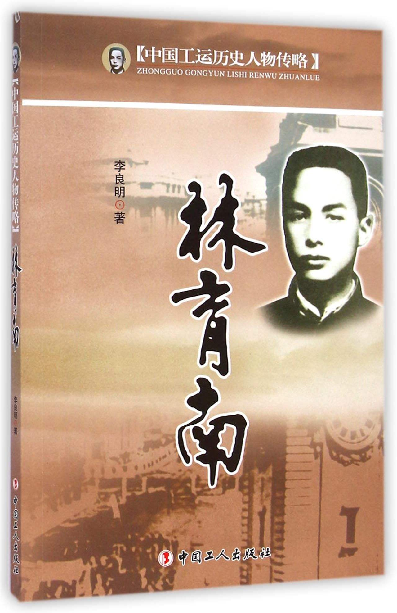
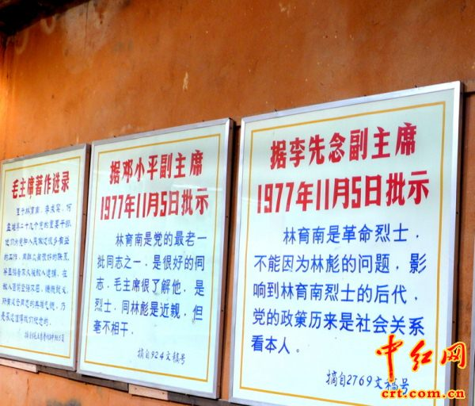

## nnnn姓名（资料）

适合所有人的历史读物。每天了解一个历史人物、积累一点历史知识。三观端正，绝不戏说，欢迎留言。  

### 成就特点

- 林彪的堂兄
- 林氏三兄弟
- ​

### 生平

【1898年12月15日】119年前的今天，共产党早期领导人，离奇被捕的林彪堂兄林育南出生

【中国革命的林氏三兄弟】

林育南（1898年12月15日－1931年2月7日），中共早期领导人之一，龙华二十四烈士之一，与堂兄林育英和堂弟林彪并称为“林氏三兄弟”。他们三人都在中共党内担任过极其重要的职务，在中国的革命史上留下了浓浓的印迹。

1915年（17岁），林育南入武昌中华大学附中。1917年10月，参加恽代英组织的互助社。“五四”运动爆发，与恽代英、陈潭秋等组织和领导武汉罢工、罢课、罢市的斗争，为武汉学生联合会负责人之一。

（互助社成员于1918年在武汉合影，前排左3挥代英，左4林育南）

【武汉工人运动的领袖】

1921年，回湖北黄冈家乡，任职浚新小学。7月，与恽代英等发起具有共产主义性质的革命团体“共存社”。中共一大后，恽代英、林育南宣布解散共存社，加入中国共产党。

1922年5月起，任中国劳动组合书记部武汉分部主任，参与领导汉阳钢铁厂大罢工，并筹建起全国第一个地方总工会——“武汉工团联合会”，任该会秘书主任。10月，任湖北省工团联合会秘书主任，与施洋创办该会机关报——《真报》。

1923年，参加组织和领导了震撼世界的京汉铁路“二七”大罢工。“二七”惨案后，被军阀悬赏通缉。6月，出席中国共产党第三次全国代表大会。接着在中国社会主义青年团第二次全国代表大会上，当选为团中央委员、组织部长。

【鼓励林彪的关键一两步】

1924年，国共合作时期，任国民党汉口执行部青年干事，任武汉学生联合会主席。

这一年，林彪将自己想投考广州黄埔军校的想法告诉林育南，林育南回信：“你这个考虑很对，每个人的一生都有很关键的一两步，这个步子如迈对了，就可受用无穷，如迈错了，就会跌入深谷。武力没有正义是暴政，正义没有武力是无能。中国的革命，最终要靠军事解决问题，共产主义事业需要大批军事人才。我和你八哥(林育英)搞党务、工（人）运（动），你搞军事，我们林家三兄弟就各有所长。”

【坚持革命的湖北佬】

1925年初赴上海，在上海总工会负责宣传工作，参加领导“五卅运动”。1926年9月，随北伐军进入武汉，与李立三、项英、刘少奇等领导湖北工运。

1927年1月，任湖北总工会第一次代表大会秘书长，被选为省总工会宣传部主任。在中共五大上当选为候补中央委员。大革命失败后，任中共湖北省委宣传部长。与黄松龄、向警予等秘密出版《长江》，继续宣传革命。

1927年底赴上海，任中共沪东区委书记。1929年11月，任全国总工会秘书长，主持日常工作。1930年5月，任中华全国苏维埃代表大会中央准备委员会秘书长。

【反对王明的代价】

1930年12月（32岁），本应该进入中央苏区，抵达浙江衢州遇到国民党军围剿苏区的封锁线，无法进入，只好取道杭州返回上海。

1931年1月7日在上海，共产国际米夫主持中共六届四中全会，未通知林育南参加。全会把王明推上中共的最高领导岗位。1月8日，林育南联系多名党员，在党内发表《告同志书》，反对由王明掌握中共最高领导权。

17日，林育南在同多位反王明派党员会面时，在上海汉口路东方旅社被逮捕。2月7日，包括左联五烈士以及20多位共产党员与同情者，在上海龙华警备司令部看守所被枪杀，时年33岁。

【依旧是谜的被捕事件】

对于这次30多人的被捕事件，争议很大。早期史料上说是叛徒王掘夫告密；也有人说是康生叛卖所致，与反王明的斗争有关。

《炎黄春秋》杂志曾发表《谁是告密者——龙华二十四烈士被捕之谜》一文，则说林育南等龙华二十四烈士被捕是王明告的密。

事件发生后，王明写了一首《悼“二七”龙华死难烈士》诗：“廿六英雄同遇难，而今二七更怆然。育南师辈孟雄友，泪洒春风泣杜鹃。”

【】

【】

### 照片

