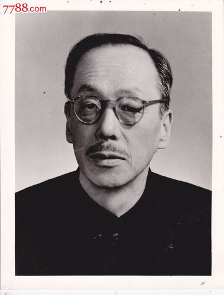
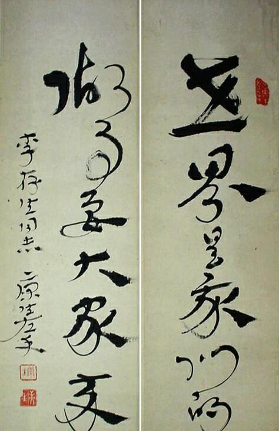
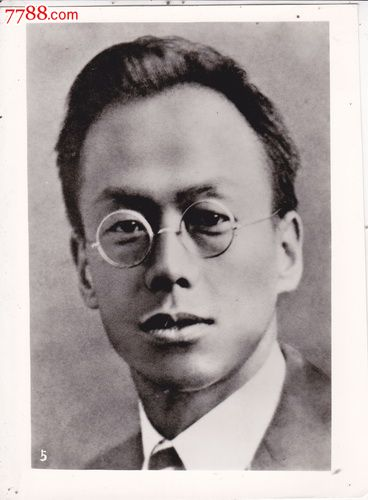
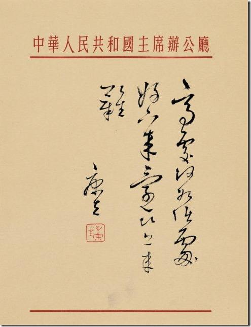
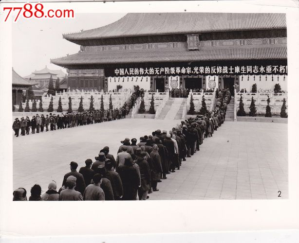
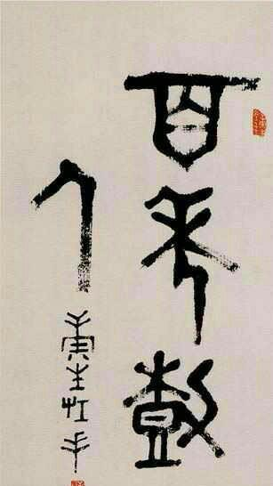

## 42年前的今天，中国贝利亚康生去世

适合所有人的历史读物。每天了解一个历史人物、积累一点历史知识。三观端正，绝不戏说，欢迎留言。  

【1975年12月16日】42年前的今天，写得一手好字的文革关键人物康生去世

### 

康生（1898年11月4日－1975年12月16日），山东诸城人。中国共产党早期领导人之一，“文化大革命”的关键人物，后被列为林彪、江青反革命集团主犯，因为长期掌控中国情报机构而被称为“中国的贝利亚”。

其艺术造诣很高，真草隶篆众体皆能，尤善章草，自成“康体”，堪称大家。

（康生左手章草：世界是我们的，做事要大家来）

【可能被捕叛变的地下党】

1898年11月4日，康生出生于山东省诸城县大台庄一个名门望族，原名张宗可。17岁结婚，生有一子一女。

1924年（26岁），张宗可赴上海大学学习，并改名张溶。1925年加入中国共产党。在大学期间，担任上海总工会干事、上海大学特支书记，并结识了后来的妻子曹轶欧。

1927年，发生四一二事件，国民党开始清党，共产党被迫转入地下。张溶化名赵容开，始从事地下情报工作。1930年，赵容曾被捕。据时任中共政治局委员的卢福坦称，赵容在被捕期间曾叛变，但此事最终没有定论。

【取俄国名字的特科杀手】

1931年起（33岁），赵容与周恩来、陈云等人负责中共中央特科的情报与保卫工作。在顾顺章叛变等案件中，他协助周恩来处理了中共有关文件和人员的转移工作及消灭顾顺章家属的制裁任务。

1933年，赵容被派驻莫斯科，是中共驻共产国际代表团的副团长，他在苏联取了俄文名字，中文音译就是康生。斯大林发动肃反，中共也成立了肃反办公室，负责处理旅苏党员干部。王明为办公室主任，康生为副主任。

【主持延安整风的月老】

1937年（39岁），回到延安，受到毛泽东的信任，成为毛的忠实跟随者。一般认为，原籍诸城的江青与康生旧时相识，后来江青到延安与毛泽东相恋，曾得到康生帮助。

康生出任中央书记处书记、中央党校校长、并领导新成立的中共中央社会部，主抓党内的情报保卫工作。1942年，帮助毛泽东发动了延安整风，制造红色恐怖，遭到各方指责。

【长期养病后的东山再起】

1949年后，康生因病长期修养。1956年（58岁），在八届一中全会上，康生当选为中央政治局候补委员、中央委员。康生复出之后，开始负责党内的意识形态工作。

1959年，康生任《毛泽东选集》编辑委员会副主任，主持编辑《毛泽东选集》第四卷。在此期间，中央文教小组设立理论小组，康生任组长。1959年中期，康生负责领导中共中央党校的工作。至此，康生掌握了党内的理论工作领导权。

【文化大革命的先声】

1959年（61岁），在庐山会议上，康生大力批评彭德怀，指责彭德怀原名“彭得华”“野心好大，要得中华！还起个号叫‘石穿’，水滴石穿，搞阴谋嘛！”，导致彭德怀被打成“右倾机会主义分子”、“反党集团”。

1962年，康生指责小说《刘志丹》是为高岗翻案，是“利用小说搞反党活动”，炮制了反党小说刘志丹案，以致小说作者李建彤被关押审查，受牵连的有数万人，被迫害至死的有数千人，被认为是“文化大革命”的先声。

在中共八届十中全会上，康生被增补为中央书记处书记。

### 

（康生书法：高处何如低处好，下来还比上来难）

【文化大革命中的刽子手】

1966年（68岁），“无产阶级文化大革命”爆发。5月28日，中央文革小组成立，康生任小组顾问。

1967年起，康生参与制造了“贺龙兵变案”、“六十一人叛徒集团案”，“赵健民特务案”，"内人党事件"、“罗瑞卿为首的地下黑公安部案”等多起冤假错案，

1968年9月16日，刘少奇被康生等人定罪为“大叛徒、大内奸、大工贼、大卖国贼、大汉奸”。

【死于癌症的四把手】

1970年（72岁），庐山会议后，康生以养病为由，闭门不出。1973年，在中共十大上，康生当选为中共中央副主席，名列毛泽东、周恩来、王洪文之后。

1974年起，康生患上癌症，长期在医院休养。1975年12月16日，康生死于前列腺癌。

【死后身败名裂】

中共中央发布的讣告称他为“中国共产党的优秀党员，是中国人民的伟大的革命战士和马克思主义理论家，是党和国家卓越的领导人之一、中国人民的伟大的无产阶级革命家，光荣的反修战士。”

1980年10月16日，中共中央决定把他开除党籍，并撤销悼词。不久，他被最高人民法院特别法庭认定为“林彪、江青反革命集团案主犯”，其骨灰被迁出八宝山革命公墓。

【优秀的书法大家】

康生出生于书香世家，擅长书法绘画，其艺术造诣被认为是众多中共领导中最优秀的。康生擅绘画，他常用“鲁赤水”的名款作画，这三个字与齐白石的名字字字相对，似有与其争锋之意。

康生有收藏文物的嗜好，喜欢收集砚台和善本书。“文化大革命”抄家盛行期间，康生收获甚丰，掠夺的图书达34000多册、文物5500多件，从而变相地保护了一些文物。文革结束后，康生收藏的文物曾在景山公开展览。

康生真草隶篆众体皆能，尤善章草，自成“康体”，堪称大家。

（康生书法：巧夺天工）

（康生左手大篆：百年树人）

（康生左手隶书：解放）

