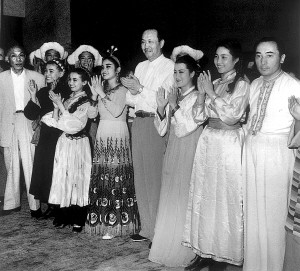
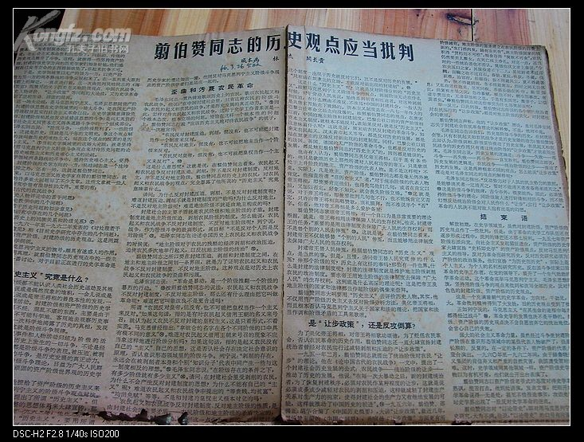

## 49年前，“马列五老”之一、来自湖南的维吾尔族人翦伯赞自杀

【1968年12月18日】49年前的今天，大陆最正统的马克思主义历史学家翦伯赞夫妻一同自杀

翦伯赞（1898年4月14日－1968年12月18日），维吾尔族，湖南桃源人。与郭沫若、吕振羽、侯外庐、范文澜并称为史学界的“马列五老”之一，是马克思主义史学的代表人物。他与范文澜一起系统地应用马克思主义方法，重新解释了中国历史。

翦伯赞继承了顾颉刚的“华夏族羌人起源说”，认为汉族起源于走下昆仑山的羌人，并指出研究中国史需抛弃大汉族主义。主编《中国史纲要》，著有《中国历史哲学教程》、《中国史论集》、《中国史纲》等。

文革中因遭受迫害而夫妻一同自杀。余英时认为，翦伯赞对中国史的分期，代表了当时中国大陆史学界的正统，其中心系统不是从中国史的内部整理出来的，而是借自西方的现成模式。

【定居湖南600年的维族人】

翦伯赞的祖先是高昌维吾尔族哈勒八士。明初，朱元璋册封哈勒八士为“荆襄都督”，赐姓“翦”，并赐义女杜叶公主为妻，后被封为镇南定国将军，在湖广的辰州、常德一带镇守。后代则在湖南桃源定居，或从商，或务农。

翦伯赞的父亲是晚清秀才，曾担任常德中学、常桃汉沅联合县立中学校长。1916年，18岁的翦伯赞进北京法政专门学校学习，不久转入国立武昌商业专门学校（今武汉大学经济管理学院前身），1919年毕业。1924年，赴美国加利福尼亚大学攻读经济专业。

回国后，他却转而研究史学和历史哲学。他在1936年（38岁）出版的《历史哲学教程》一书，是中国第一部系统的马克思主义史学理论著作。1937年5月，加入中国共产党。从1940年起，完成了《中国史纲》第一卷、第二卷和《中国史论集》等。

（翦伯赞故居）

【替曹操摘去奸臣的帽子】

1952年，全国高校院系调整，翦伯赞转到北京大学，任历史学系教授兼系主任长达16年，任北大副校长6年。翦伯赞协同郭沫若、范文澜等人筹建了中国历史学会。历任第一、二、三届全国人民代表大会代表，中国科学院哲学社会科学部学部委员。

1958年，毛泽东多次为曹操翻案，翦伯赞在1959年2月发表《应该替曹操恢复名誉》一文，“我们应该替曹操摘去奸臣的帽子，替曹操恢复名誉。”毛泽东看了翦伯赞的文章后，进一步发挥自己评曹操的观点，从评曹操这一特定历史人物的角度告诉人们：无产阶级就是要讲专政。

1961年，翦伯赞主编《中国史纲要》，肯定吕振羽的主张“殷商是奴隶社会”。

（周恩来、翦伯赞、范文澜、周扬合影）

【抛弃大汉族主义】

翦伯赞继承了顾颉刚的“华夏族羌人起源说”，指出“在野蛮时代之初，分布于甘肃、青海一带的诸羌之族，亦开始新的迁徙，一批批羌人走下昆仑山，来到东方，创造了中华民族的早期文明。”翦伯赞与费孝通、谭其骧、白寿彝等人一同支撑起了‘自古论’和‘共创论’大厦的框架。

翦伯赞指出，“过去以至现在，都是以大汉族主义为中心，处理中国的历史，因此，过去以至现在的中国史著述都不是中国史，而是大汉族史。但是大汉族史，不是中国史。……研究中国史，首先应该抛弃那种以大汉族主义为中心之狭义的种族主义的立场，把自己超然于种族主义之外，用极客观的眼光，把大汉族及其以外之中国境内的诸种族，都当作中国史构成的历史单位”。

（翦伯赞（左一）乌兰夫（右四）合影）

【被批判的农民起义观点】

1961年以来，翦伯赞在《对处理若干历史问题的初步意见》中，对他十年前在《论中国古代的农民战争》中的说法作了重要修改。他说：“在经历了一次大的农民战争以后，封建统治阶级为了恢复封建秩序，有时对农民作出一定程度的让步，但不是对每一次农民战争都让步，他们对于那些小的局部的农民战争是不会让步的。让不让，让多少，这要决定于阶级对抗的形势，决定于农民战争带来的阶级力量对比的变化。”

1965年12月，《红旗》杂志发表戚本禹的文章《为革命而研究历史》，对翦伯赞的历史观点进行了批判，攻击翦伯赞的观点是“超阶级”、“纯客观”的资产阶级观点。12月21日，毛泽东发话：“戚本禹的文章很好，我看了三遍，缺点是没有点名。”1966年3月，《红旗》杂志又发表戚本禹等三人的文章《翦伯赞同志的历史观点应当批判》，给翦伯赞扣上“资产阶级史学代表人物”的帽子，说他的上述两篇文章是“反马克思主义的史学纲领”。

【夫妻一同自杀和平反】

文化大革命初，他被当作“反动学术权威”，被扣上“反对马克思主义”的帽子，备受肉体摧残，人格凌辱。毛泽东曾于中共八届十二中全会上发出“最高指示”，特别提到“对北京大学的翦伯赞、冯友兰要给出路”。但秘密成立的“翦伯赞专案组”，对其进行逼供，要求他证明1935年刘少奇与国民政府谈判时有变节行为。

1968年12月18日夜（70岁），翦伯赞夫妻双双吃下大量安眠药自杀身亡。

1978年8月，中共中央领导人邓小平亲自批示：“我认为应予昭雪”，为他彻底平反昭雪。1979年2月22日，官方举办了他的追悼会。

### 

