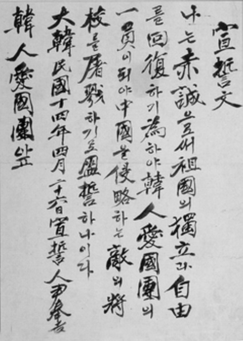
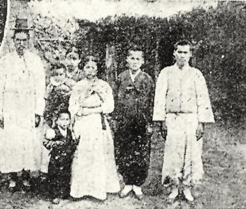
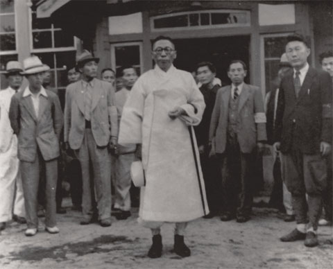
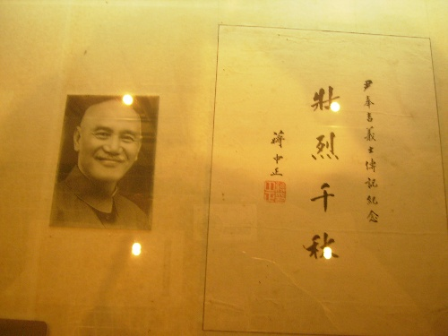

## 85年前的今天，反日义士尹奉吉在中国被枪毙

适合所有人的历史读物。每天了解一个历史人物、积累一点历史知识。三观端正，绝不戏说，欢迎留言。  

【1932年12月19日】85年前的今天，一个人炸死一堆日本高官的韩国义士尹奉吉在日军被枪毙

尹奉吉小传：我一个24岁的韩国人，在中国炸死一堆日本高官，值了！

尹奉吉（1908年6月21日－1932年12月19日），号梅轩。1932年4月29日，在上海虹口公园，尹奉吉以一人之力，炸死多名日军高官，震惊世界，被称为反日义士。

爆炸案死伤的日军大员包括：1、白川义则（陆军大将，一二八事变日本上海派遣军司令）身中多枚弹片重伤，送院后死亡；2、河端贞次（日本驻沪居民团行政委员长）当场被炸死；3、植田谦吉（陆军中将，第九师团长，后任关东军总司令）被炸断一腿；4、重光葵（日本驻华公使，后任日本外相）被炸断一腿；5、野村吉三郎（海军中将，第三舰队司令）被炸瞎一眼。

【流亡中国的韩国人】

尹奉吉在1908年6月21日出生于大韩帝国的忠清南道礼山郡。两岁时，韩国被日本吞并，沦为其殖民地。

1919年，11岁的尹奉吉亲身经历韩国人争取民族独立的“三一运动”及其之后的血腥镇压。1925年（17岁），尹奉吉在家乡办学，进行农民教育及启蒙运动。

1930年（22岁），他离开家乡到中华民国流亡，经过东北、青岛，辗转于1931年到达上海市，并认识当时在上海组成韩国临时流亡政府的金九。

（尹奉吉离家前同家人的合影）

（尹奉吉与金九合影）

【被转包的暗杀行动】

1932年1月28日，日军向驻守上海闸北的十九路军发动进攻，爆发了“一·二八”淞沪抗战。3月24日，在英美等国压力下，两国谈判停战。上海的日本军政要人决定借4月29日庆祝“天长节”（昭和天皇生日）的机会，在虹口公园举行“淞沪战争祝捷大会”。

在此背景下，淞沪警备司令陈铭枢等人决定采取暗杀行动，破坏日军的庆祝活动。“暗杀大王”王亚樵表示支持。但“祝捷大会”不许任何中国人入场，难以下手。王亚樵于是请流亡上海的大韩民国临时政府帮忙。王亚樵找到交情颇深的临时政府内务总长安昌浩，提出此事，并提供经费4万元。安昌浩随后约见了时任大韩民国临时政府警务部长的金九，交待了此任务。

【一次成功的“恐怖”袭击】

1932年4月29日，在虹口公园（今日之鲁迅公园），日本人庆祝“天长节”，同时祝贺一二八事变的军事胜利。尹奉吉以日本人装扮进入会场，身上带着制作成水壶模样的炸弹。

当典礼仪式中，日本人一起唱国歌时，尹奉吉将炸弹掷向主席台。爆炸声中，一个个日军“大佬”非死即伤。尹奉吉被当场逮捕。死伤的日本人包括：

1、白川义则（陆军大将，一二八事变日本上海派遣军司令）身中多枚弹片重伤，送院后死亡；

2、河端贞次（日本驻沪居民团行政委员长）当场被炸死；

3、植田谦吉（陆军中将，第九师团长，后任关东军总司令）被炸断一腿；

4、重光葵（日本驻华公使，后任日本外相）被炸断一腿；

5、野村吉三郎（海军中将，第三舰队司令）被炸瞎一眼。

5月25日，尹奉吉被以谋杀罪判处死刑。12月19日，押送到日本，在石川县金泽日本陆军基地内被枪决，尸体被埋葬在金泽墓地内路旁。

【中日韩都被纪念】

战后，1946年5月，尹奉吉的遗骸被移送至韩国，安放在首尔孝昌公园的三一庙内。现在上海市、日本金泽也有尹奉吉的纪念碑，首尔设有尹奉吉的纪念馆。

每年4月29日，即事件发生之日，尹奉吉的故乡韩国忠清南道礼山郡都要举行梅轩文化节。1966年10月，蒋介石曾邀其弟弟与儿子到台湾访问，参加当年的双十国庆典礼。

（1946年5月15日，尹奉吉的遗骸被移送韩国时，金九亲自迎接）

（尹奉吉纪念馆里，蒋介石的题词）

