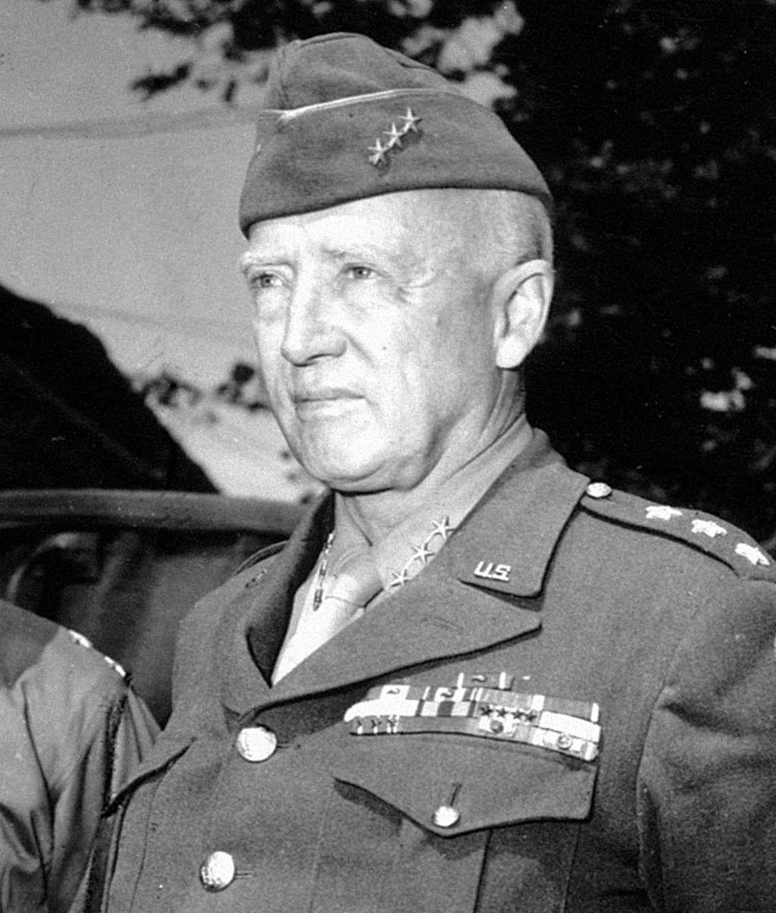
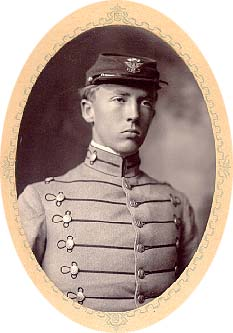
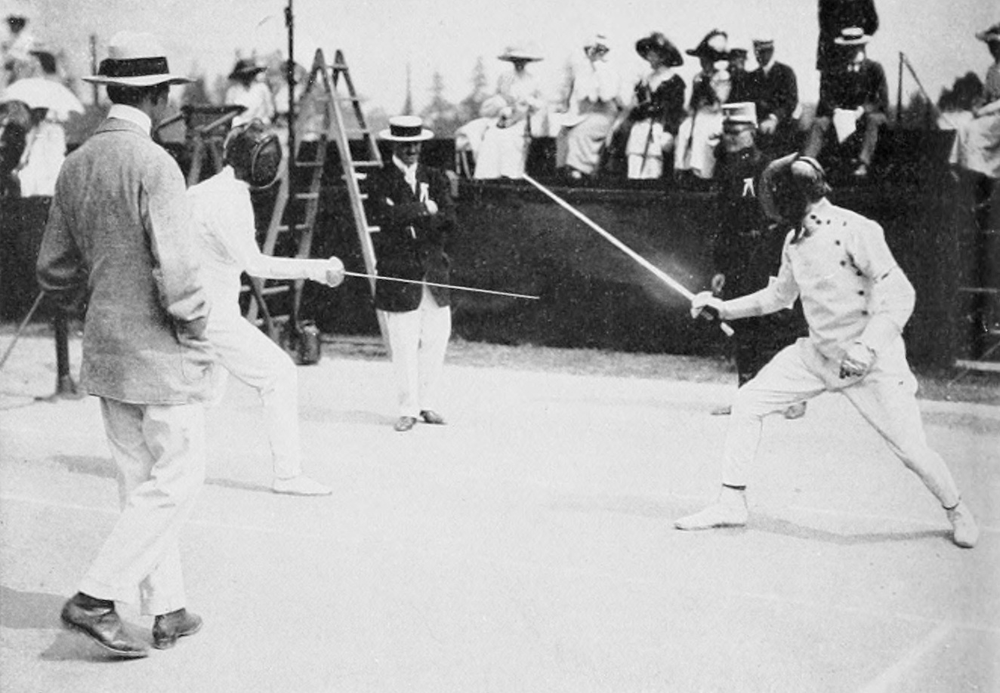
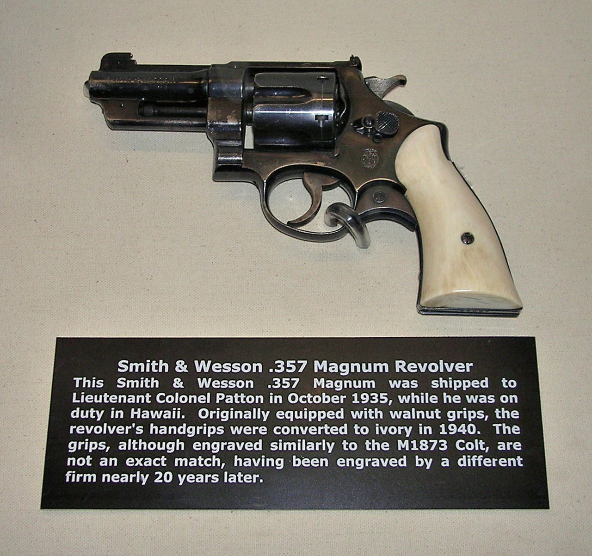
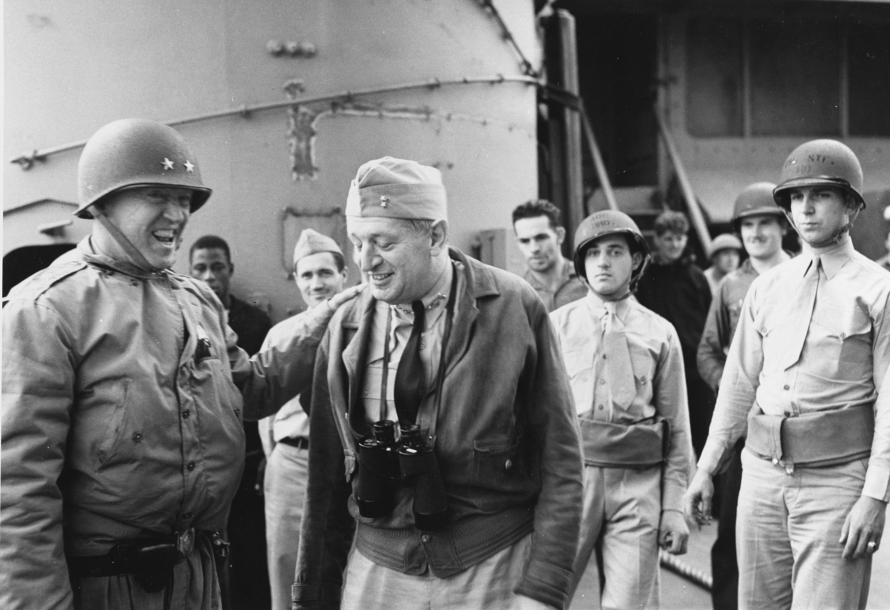
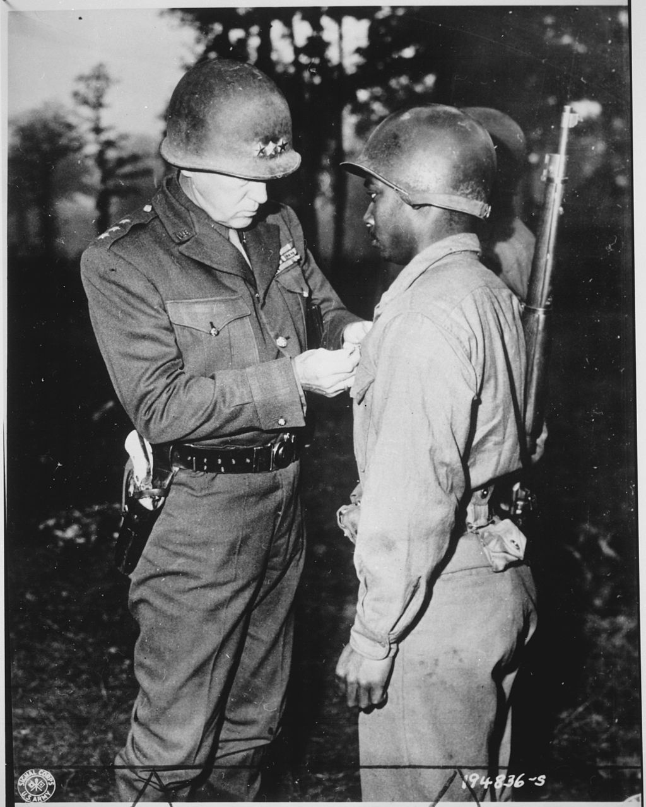
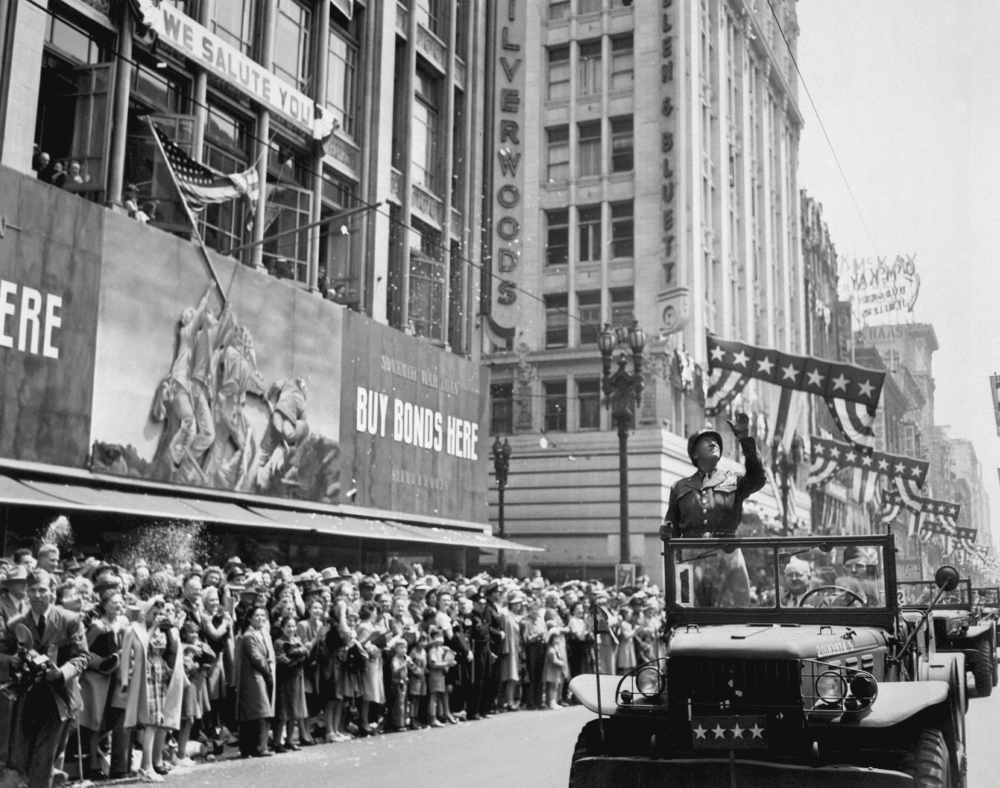

## nnnn姓名（资料）

适合所有人的历史读物。每天了解一个历史人物、积累一点历史知识。三观端正，绝不戏说，欢迎留言。 

巴顿小传：参加奥运会的运动健将，满嘴脏话的血胆老将

【1945年12月21日】 72年前的今天，满嘴脏话、攻入德国本土的传奇上将巴顿因车祸逝世

巴顿（George Smith Patton，1885年11月11日－1945年12月21日），美国陆军四星上将，在第二次世界大战的欧洲战场，先后指挥美国陆军第7集团军和第3集团军。在击败纳粹德国的战斗中，起到了至关重要的作用。虽然盟国领袖对巴顿持有不同的看法，而他的德国对手却都给予他高度评价。

他因多姿多彩的形象、难以驾驭的个性而闻名。他在战场上身先士卒，善于利用“粗俗”演讲来激励部下，这已经成为美国军官队伍中的领导哲学。巴顿因对战斗的热忱而得了一个“血胆老将”的绰号，有士兵调侃道：“我们的血，他的胆量”。尽管如此，巴顿广受部下的爱戴，将士们亲昵地称他“那个老家伙”。

1970年上映的美国传记电影《巴顿将军》获得了很大成功，在第43届奥斯卡金像奖角逐中，夺得了包括最佳影片在内的7项大奖，将巴顿转变为一位美国民族英雄并带入流行文化中。

【西点军校的富家子弟】

巴顿于1885年11月11日在加利福尼亚州的一个农场出生。巴顿家世显赫，从小生活在800公顷大的庄园中。

中学毕业后，就读维吉尼亚军事学校，在入学考试中表现优秀，得以推荐进入西点军校。然而由于数学没能及格，以致第一年就不得不留级。巴顿利用整个暑假进行学习，返校后成绩明显改善。巴顿在103名学员中，以第46名的成绩毕业，他于1909年6月11日被授予美国骑兵队少尉军衔，服役于第15骑兵团。

（就读于维吉尼亚军事学校时的巴顿）

【发明巴顿军刀的运动员】

由于在跑步和击剑方面表现突出，巴顿获选参加在瑞典举行的1912年奥运会现代五项的比赛，在43名参赛者中，巴顿在击剑第4、骑马第6、射击第21、4000米越野跑第3，游泳第7，总体成绩排名第5。其中射击被判有1枪脱靶，颇有争议。

奥运会结束后，巴顿到法国向“兵器大师”M·克莱里（M. Cléry）学习击剑技巧，巴顿回国后，设计了一种新式军刀。1913年，军队订制了两万把1913型骑兵军刀，俗称“巴顿军刀”。巴顿是陆军骑兵学校首位获得“剑术大师”称号的陆军军官。

（正参加1912年夏季奥林匹克运动会现代五项击剑比赛的巴顿）

【深入墨西哥的斩首行动】

1916年5月14日，为了报复入侵美国的墨西哥军队，巴顿首次出战，这也是美国军事史上的第一次机械化作战。巴顿带领第10名士兵乘坐3辆道奇兄弟游览车，进入墨西哥，突然袭击墨西哥军二号人物胡里奥·卡德纳斯（Julio Cárdenas），成功将其击毙。

这次行动，使巴顿赢得了远征指挥官潘兴的青睐，晋升为第10骑兵团中尉，还给他带来了媒体的关注，被誉为“强盗杀手”。

（巴顿广为人知的象牙手柄左轮手枪）

【不准投降的一战坦克军】

1917年（32岁），美国加入第一次世界大战，潘兴被任命为赴欧远征军指挥官，巴顿请求成为其部属加入战场。1918年8月，巴顿获命执掌美国第1临时坦克旅（后改名为“第304坦克旅”）。他下令任何一辆坦克都不准投降。

9月26日，巴顿的部队在凡尔登参加默兹-阿尔贡攻势，负责支援第1军，他亲自带领坦克部队穿过浓雾，挺进德军防线8公里深。在进攻中，被打中左脚大腿受伤。1919年，巴顿离开法国回到美国。

（1918年，巴顿在法国与一辆雷诺FT-17坦克合影）

【驱赶救命恩人的混乱生活】

1932年7月（47岁），巴顿担任第3骑兵队指挥官。在陆军总参谋长麦克阿瑟的命令下，前往华盛顿对付抗议的退伍军人。清场期间，军方调运来五辆雷诺坦克协助驱赶人群。被驱散的其中一位退伍军人正是在一战中救过巴顿性命的乔·安吉洛。事件发展到最后，有四人死亡，数百人受伤。

1934年后，由于对发展前景感到沮丧，巴顿开始酗酒，并发生了几场婚外情，后来还与自己21岁的侄女结婚。1938年7月24日，53岁的他被提升为上校。

【登上封面人物的装甲兵】

1940年，巴顿认识了后来被称作“美国装甲兵之父”的小阿德纳·霞飞，两人提出建立一支装甲部队的建议。霞飞被任命为这支部队的指挥官，建立了第1和第2装甲师。巴顿负责指挥第2装甲师的第2装甲旅。这个师是当时美国少数以大量坦克构成的部队之一，巴顿负责对其进行训练。

巴顿举办了一次高调的大规模演习，指挥1000辆坦克及车辆，从乔治亚州的哥伦布移动到佛罗里达州的巴拿马。一个月后，全师1300台车辆又再次出发行进一个来回。这次轰动的演习，让巴顿成为当年《生活》杂志的封面人物。

1941年4月4日（56岁），升为少将并担任第二装甲师师长。1942年1月15日，他成为第1装甲军指挥官。

（西点军校的一尊巴顿的雕像）

【不听从指挥的指挥官】

1942年夏，巴顿经艾森豪威尔指派在北非展开登陆。1943年3月6日，由于美国第2军在凯赛林隘口战役中被非洲军击败，巴顿成为第2军新任指挥官，同时晋升为中将。

西西里岛登陆战中，巴顿是第7集团军的指挥官，他带领9万名官兵登陆，攻下了墨西拿，支援从北面进攻的英国第8集团军（由伯纳德·蒙哥马利指挥）。巴顿在这次战役中的行为引发了一些争议。盟军曾下令暂缓对墨西拿的进攻，但巴顿声称这条信息“在传送过程中遗失”，直到攻下墨西拿后才找到。

【扇士兵两耳光的风波】

1943年8月（58岁），巴顿在医院掌掴了手下两名士兵，命令两人立即回前线，此事引发了很大的争议。在艾森豪威尔的谴责下，巴顿分别向两名士兵以及见证过事件的医务人员道歉。

但到了11月，记者德鲁·皮尔森将事件通过自己的广播节目抖了出来，引起美国国内渲染大波。许多人对巴顿提出了严厉的批评。公众对此事反应不一，最终战争部长表示巴顿必须留在指挥岗位上，但此后巴顿连续11个月没有再指挥军队战斗。

【坚忍行动欺敌计划】

1944年1月26日，巴顿被任命为美国陆军第3集团军的指挥官。这是一支刚刚到达英国的野战军，大部分士兵没有实战经验。巴顿的任务是训练这支部队，届时将与其他盟军部队一起发动诺曼底战役，对纳粹德国发起总攻。巴顿满嘴脏话的演讲，在士兵中流传，激励了他们的斗志。

德军非常重视巴顿，认为他将是盟军进军欧洲的核心。因此，盟军将计就计，设计了坚忍行动欺敌计划，把巴顿设为盟军进攻欧洲的关键人物。整个1944年，巴顿遵照上级命令保持低调，使德国人以为他一直在多佛尔，而他实际上正在训练第3集团军。

坚忍行动的效果卓绝，德国第15集团军一直在法国加来省等待着巴顿率军进攻，甚至在1944年6月6日盟军进攻诺曼底后还继续等著。

【拯救友军的奇迹】

登陆诺曼底后，巴顿的第3集团军形成了盟军地面部队的最右翼（西方）。

1944年12月16日，德军集结了29个师共25万人的兵力反攻盟军战线，这一战史称突出部之役。战局初期欧洲正值多年来天气最恶劣的一个冬天，德军取得了显著的进展，美军101空降师被包围。

巴顿接受了任务，他奇迹般地在几天内组织了6个师，前去救援。1944年12月26日，第3集团军的第4装甲师先锋部队，打开了一条救援被围美军的补给线，解救了101空降师，扭转了战局。这是他在二争期间，最卓越的成就之一。

【进军德国的上将】

从1月29日到3月22日，第3集团军攻入德国境内，打死打伤10万名德军，俘虏14万人，这几乎是德国第1和第7集团军的所有残部。

1945年3月26日，巴顿派出有314人、16辆坦克组成的鲍姆特遣队，前往德军战线后方约80公里的哈梅尔堡附近，突袭一个军官战俘营。因为其中一名囚犯是巴顿的女婿。然而这场突袭失败了，特遣队仅35人生还，其他人不是被杀就是被俘。

当艾森豪威尔得知这起秘密行动时，气疯了。巴顿之后报告这是自己在战争期间犯下的唯一错误，他觉得正确的做法应该是派出一个大上三倍的部队。1945年4月14日，巴顿升为上将。

（1945年4月12日，艾森豪威尔、布拉德利和巴顿视察集中营）

【没有了战争的失落】

1945年6月7日，巴顿在马萨诸塞州向包括400名退伍老兵在内的约20000名群众讲话。在这场演讲中，他影射死在战场上的人是“傻子”，真正的战斗英雄是那些伤兵，引起了少许争议。随后，巴顿被任命为德国巴伐利亚军政府首长，负责执行去纳粹化的任务。

在得知对日本的战争也已经结束后，巴顿特别心烦，他在自己的日记中写道：“又一场战争结束了，就像我对这个世界的作用一样。”

1945年10月，巴顿的军政府首长职务被解除，第3集团军指挥官也被解除，巴顿给出了自己的告别辞：“所有美好的事情总会结束。至今为止，我所经历过最美好的事物就是曾拥有指挥第3集团军的荣誉和特权。”

【与我的人埋在一起】

1945年12月9日11点45分，巴顿坐的卡迪拉克轿车上，与一辆小卡车相撞。12月21日18点左右，巴顿因肺水肿和心衰竭在睡梦中去世，享年60岁。

按照他“与我的人埋在一起”的遗愿，巴顿将军被葬在卢森堡哈姆区的卢森堡美军公墓和纪念馆，与第3集团军的其他阵亡将士们永远待在了一起。

