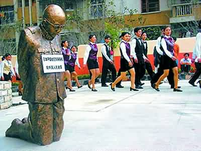
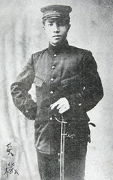
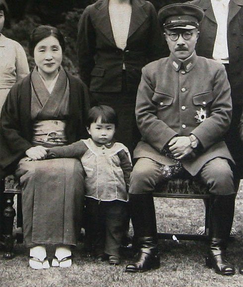
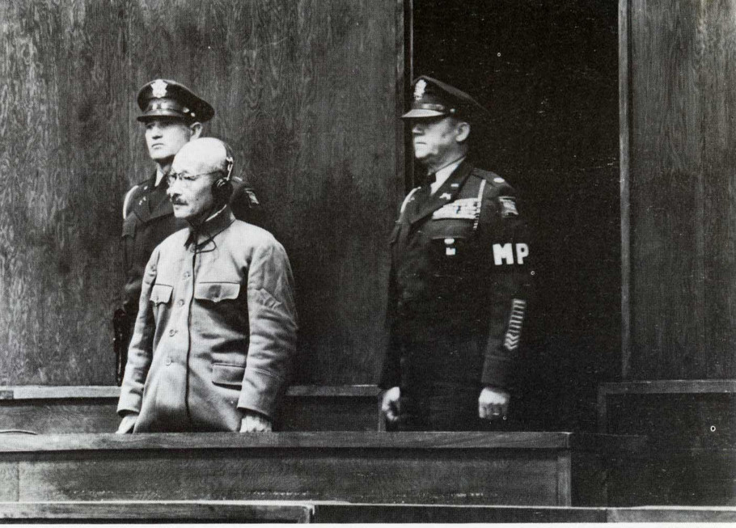
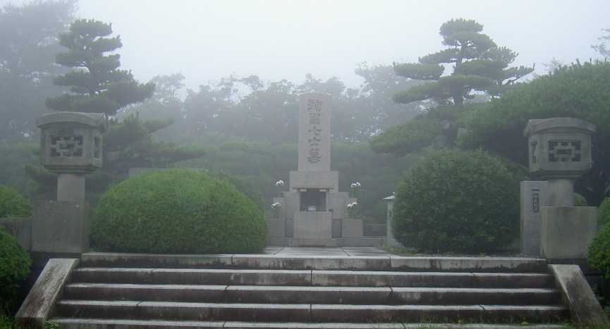

## nnnn姓名（资料）

适合所有人的历史读物。每天了解一个历史人物、积累一点历史知识。三观端正，绝不戏说，欢迎留言。  

### 成就特点

- ​
- ​

### 生平

东条英机小传：自杀未遂、被偷偷埋葬、供奉于靖国神社的头号战犯

【1948年12月23日】69年前的今天，自杀未遂的日本头号战犯东条英机被绞死

东条英机（1884年12月30日－1948年12月23日）日本军国主义的代表人物，头号甲级战犯。

【按部就班的军人世家】

1884年12月30日，东条英机生于日本东京，父亲是陆军中将。1899年，15岁的东条进入东京陆军幼年学校，1902年升入中央陆军幼年学校。1904年（20岁），入陆军士官学校第17期，1905年3月毕业。

1905年4月21日，授阶陆军步兵少尉，参加日俄战争，此时日本胜局已定，因此没有参与实质性作战行动。1907年12月，晋升为陆军步兵中尉。1912年（28岁）入陆军大学校第27期，1915年毕业，晋升为陆军步兵大尉。

1919年8月，以武官身份赴瑞士。1922年（38岁），担任陆军大学校的教官，次年转到陆军省做副官。1924年，晋升为陆军步兵中校。1933年（45岁），晋升为少将，被任命为陆军省军事调查部部长。

【东北的剃刀将军】

1935年9月21日，东条英机升任关东军宪兵司令。他在任期间，逮捕了大批从事共产国际活动的关东军军官。1936年2月26日，日本东京爆发二二六事件，他逮捕大量关东军内的参与者。这样，以东条英机为首的统制派，借机清理了皇道派的政治势力，进而上台执政。

因为他的残忍和嗜杀成性，所以被称为“剃刀将军”。1936年12月1日，晋升为陆军中将。1937年3月，任关东军参谋长。中日战争爆发的时候，东条英机被派任为哈尔滨派遣兵团的负责人。

【大政翼赞会的东条独裁】

在1940年，东条作为军事大臣代表日本与德国希特勒、意大利墨索里尼组成同盟，称为轴心国。到1941年东条英机出任日本内阁总理大臣兼内务大臣，已经是整个日本军队的最高指挥官。他同时担任大政翼赞会第2任总裁，“东条独裁”事实上已经形成。

大政翼赞会是日本在二战期间的一个政治团体，推动以一党专政的模式统治日本。虽然自认为是超越党派的组织，但战后被广泛被认为是与纳粹党、法西斯党相似的独裁政党。不同之处，只是大政翼赞会采取多数人决策，而非个人独裁。

与东条英机(左二) .jpeg)

【自杀未遂的人之道也】

1941年12月7日，东条下令日本舰队攻击珍珠港，太平洋战争爆发。1944年7月18日，日本海军在菲律宾海海战中被击溃，东条被迫下台。

战争结束后，东条英机自杀未遂（用柯尔特32口径手枪近距离射击胸膛，该枪现陈列在麦克阿瑟纪念馆），后在医院康复，然后被捕入狱，开始其战争罪行审讯。

东条英机被囚在狱中期间，引用孟子的话“诚者，天之道也；思诚者，人之道也”(《孟子·离娄上》)

【被绞死的头号战犯】

1948年11月12日，同盟国的东京军事法庭以甲级战犯，判处东条英机绞首死刑，关押在巢鸭监狱。1948年12月23日零时10分30秒，绞刑执行。

由于日本的大量战争罪行都是由东条英机授权的，因此被认为对战争负有最高责任。但也有人认为，日本天皇应负最高责任，由于盟军无法审判日本天皇，只能将东条英机列为头号战犯。

【偷偷埋葬的殉国七士庙】

尸体火化后， 部分骨灰被偷运隐藏。 1960年8月，骨灰被移到爱知县西尾市三根山的山顶并树起墓碑，与另外6名甲级战犯同葬于殉国七士庙。庙前墓碑高5米，碑上刻有由前首相岸信介手书的“殉國七士墓”。包括：

1、东条英机（首相、陆军大将）2、土肥原贤二（陆军大将）3、板垣征四郎（陆军大将）4、木村兵太郎（陆军大将）5、松井石根（陆军大将）6、武藤章（陆军中将）7、广田弘毅（首相）

【靖国神社中的甲级战犯】

1978年，东条英机与其他甲级战犯一起被供奉在靖国神社。

靖国神社是位于日本东京都千代田区九段坂的一座神社，奉明治天皇之谕而建。该神社供奉自明治维新以来为日本战死的军人及军属，大多数是在第二次世界大战（1937-1945）及太平洋战争（1941-1945）中阵亡的日军官兵及三万名台湾高砂义勇军等日本兵。

靖国神社在二战结束前一直由日本军方管理，是国家神道的象征。在二战后，遵循战后宪法政教分离原则，改组为宗教法人。自明治天皇开始，靖国神社成为日本天皇唯一鞠躬的对象。1978年之后，因14名日本甲级战犯入祠靖国神社引起争议，此后天皇从未前来参拜。

事实上靖国神社供奉的死者近250万人，所以并没有设置灵位，只有名册。

### 照片

