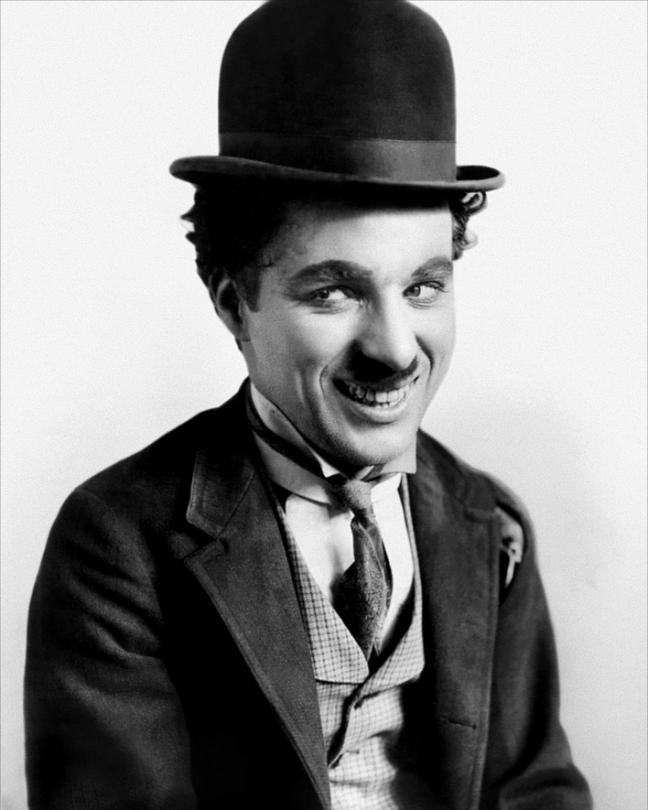
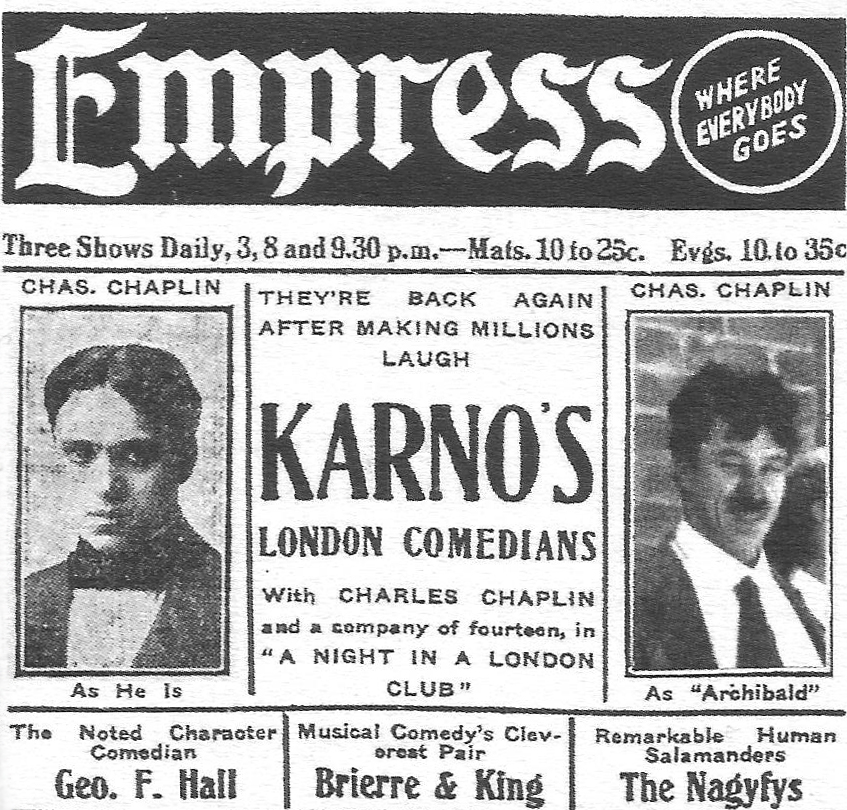
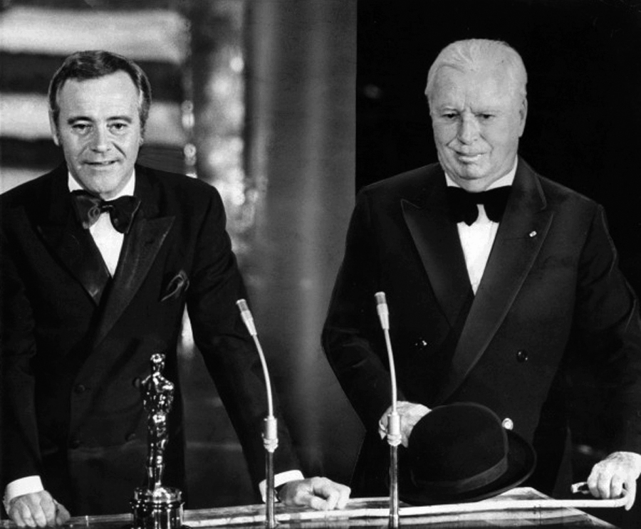
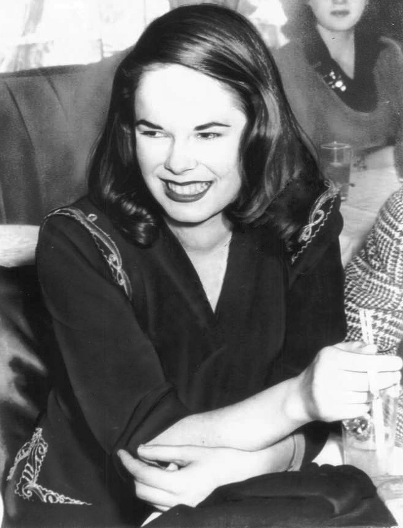

## 40年前，70多岁还能生子的喜剧演员卓别林逝世

适合所有人的历史读物。每天了解一个历史人物、积累一点历史知识。三观端正，绝不戏说，欢迎留言。  

卓别林小传：用流浪汉逗大家开心，用年轻演员来取悦自己

【1977年12月25日】40年前的今天，被逐出美国的第一位世界级喜剧明星卓别林在圣诞节逝世

卓别林（1889年4月16日－1977年12月25日），英国喜剧演员、导演，第一位世界级明星。

卓别林在好莱坞电影的早期非常成功。他奠定了现代喜剧电影的基础，被为“世界三大喜剧演员”之一。卓别林戴着圆顶硬礼帽和礼服的模样，几乎成了喜剧电影的重要代表。代表作包括：《城市之光》、《大独裁者》、《摩登时代》等等。

获得成功的卓别林，因有倾向共产党嫌疑，在63岁时，被逐出美国。直到20年后，获得奥斯卡荣誉奖重返美国，他赢得了奥斯卡金像奖历史上最长的起立致敬，在明星群聚的会场内观众整整起立鼓掌了五分钟。

他有多段与年轻女演员的感情经历。甚至有人认为他的故事，是著名小说《洛丽塔》的灵感来源。

【扮演报童的雾都孤儿】

卓别林于1889年4月16日出生于英国伦敦。从小父母分居，卓别林跟随母亲生活，被送入孤儿学校。12岁时，父亲酗酒去世，母亲患精神病被送入精神病院，卓别林成了“雾都孤儿”。

4岁时，卓别林在伦敦大剧院代替母亲首次登台表演。1903年（14岁），他获得了一个正式角色，扮演《夏洛克·福尔摩斯》中的一个报童，长达3年。此后，在卡尔诺喜剧团里扮演小丑。

（卓别林在福尔摩斯中的表演）

【第一个世界级明星】

1912年（23岁），卓别林跟随卡尔诺剧团进入美国，并留在了美国。1914年，他首次出演电影《谋生之路》，从此以精湛的默剧技巧、完美的银幕形象成为闻名世界的喜剧演员，事实上可以说他是第一个世界明星。

1918年，卓别林创建了自己的好莱坞公司。在此后的35年中，他创造了许多不朽的杰作，至今广为流传。其中包括喜剧《狗的生活》（1918年）、《发饷日》（1922年）、《从军记》（1918年）、《朝圣》（1923年）等。此外，还有他的无声电影经典，其中包括《寻子遇仙记》（1921年）、《巴黎一妇人》（1923年）、《淘金记》（1925年）和《马戏团》（1928年）。

（卓别林美国之旅的广告）

【讽刺希特勒的大师】

在有声电影发明后，卓别林拍了两部他最著名的无声电影《城市之光》（1931年）和《摩登时代》（1936年）。他的有声电影代表作：包括《大独裁者》（1940年）、《凡尔杜先生》（1947年）和《舞台生涯》（1952年）。

卓别林的第一部有声电影《大独裁者》，是专门针对希特勒和纳粹主义所制作。在当时的政治气候下，这部影片的表现相当大胆。它生动地表现纳粹主义的丑恶，并塑造出一个生动的犹太人角色，描写他遭受到的迫害。卓别林在这部电影中同时扮演希特勒和犹太理发师两个角色。

（《大独裁者》（1940）中希特勒玩弄地球仪的场景）

【逐出美国的亲共分子】

尽管卓别林非常成功，而且从1914年至1952年始终住在美国，但他是一直保持着他的英国国籍。在麦卡锡主义时期，他被指责从事“非美行为”，并怀疑倾向共产党。总统胡佛曾下令联邦调查局秘密收集卓别林的情报，并建立了一个秘密档案，试图将卓别林驱逐出境。

1952年（63岁），卓别林离开美国，他本来打算短暂访问英国。胡佛与美国移民局商议取消了卓别林的再入境许可。他决定留在欧洲，定居瑞士沃韦。期间游历各国，受到了毕加索、伊丽莎白二世、戴高乐、赫鲁晓夫、周恩来等人的接见。

20年后，1972年，83岁的他拿着为期两个月的一次性签证，回到美国来领取奥斯卡荣誉奖。他赢得了奥斯卡金像奖历史上最长的起立致敬，在明星群聚的会场内观众整整起立鼓掌了五分钟。

（1972年卓别林20年重返美国领奖）

【洛丽塔的灵感来源】

1918年10月23日，29岁的卓别林与16岁的《绿野仙踪》的女角米尔德里德·哈里斯结婚。两年后离婚。

1924年，在准备拍摄《淘金记》时，35岁的卓别林与16岁的丽泰·格雷发生了关系。格雷怀孕后，导致电影在拍摄六个月后更换女主角。不久两人结婚，生有两个儿子。1928年，两人离婚，卓别林向格雷付了当时破纪录的82.5万美元。这场公众瞩目的离婚，使得卓别林的头发都变白了。他的传记上写道：这场婚姻是纳博科夫的《洛丽塔》的灵感来源。

（丽泰·格雷）

【美满的婚姻和不说话的父女】

1932年起，43岁的卓别林与22岁的女演员保利特·戈达德之间有一段浪漫的和职业的关系。她在《摩登时代》和《大独裁者》中演女主角。1940年两人分手后，曾公开说他们于1936年秘密结婚。

1943年，54岁的卓别林遇到剧作家尤金·奥尼尔（获1936年诺贝尔文学奖）的女儿18岁的乌娜·奥尼尔，6月16日结婚。此后，奥尼尔的父亲再没有与女儿说过话。两人的婚姻生活非常长，也非常幸福。两人共有八个孩子，三个儿子和五个女儿。

（乌娜·奥尼尔）

（(1961年卓别林和妻子以及6个孩子）

1977年圣诞节，卓别林在瑞士沃韦中风（酒后服用镇静剂）逝世，享年88岁。乌娜·奥尼尔对卓别林之死，非常悲痛，开始酗酒。14年后去世，两人并排葬在一起。

（卓别林（右）与乌娜·奥尼尔的墓）

【卓别林剧照欣赏】

（1918年《狗的生涯》）

（1921年《寻子遇仙记》）

（1925年《淘金记》）

（1936年《摩登时代》）

