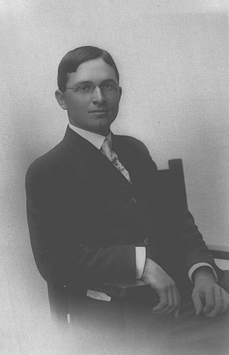
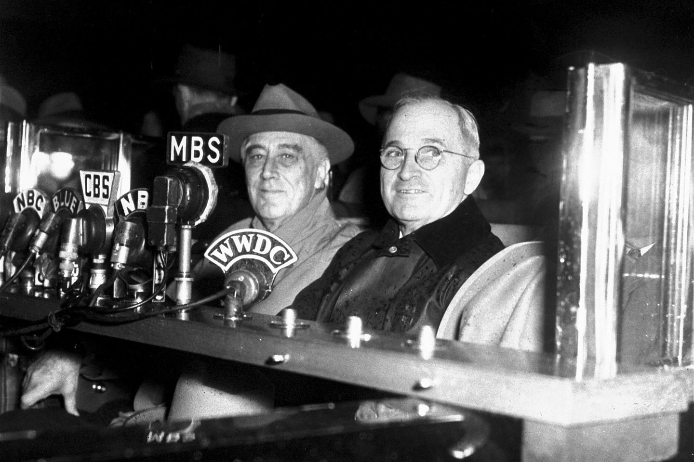
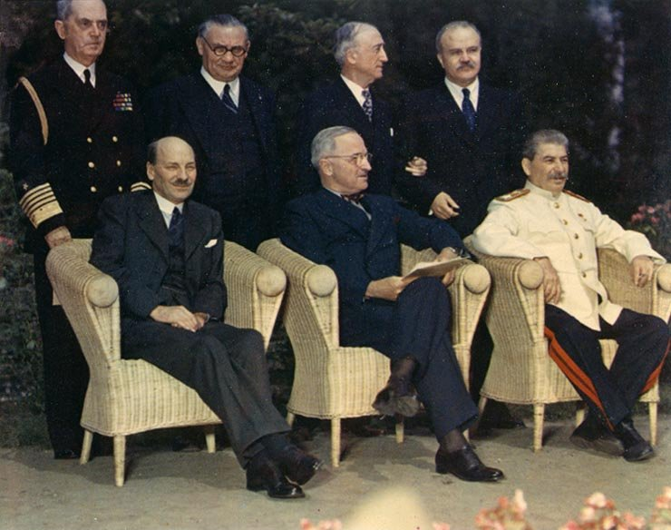
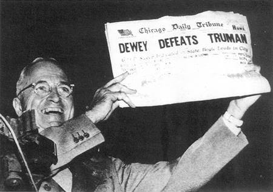
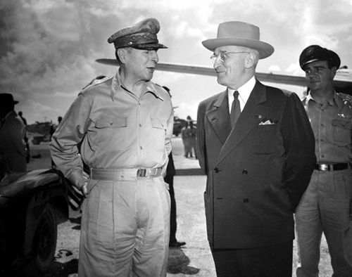

## 45年前的今天，下令用原子弹轰炸日本、最后一个没有读过大学的美国总统杜鲁门逝世

适合所有人的历史读物。每天了解一个历史人物、积累一点历史知识。三观端正，绝不戏说，欢迎留言。  

杜鲁门小传：下令扔下原子弹，最后一个没上过大学的美国总统

【1972年12月26日】45年前的今天，停止对国民党援助，朝鲜战争吃尽苦头的美国总统杜鲁门逝世

杜鲁门（1884年5月8日－1972年12月26日），美国民主党政治家，第33任美国总统（1945年－1953年）。他是最后一个没有读过大学的美国总统，也是一名共济会成员。

杜鲁门总统任内发生了不少世界大事，首先是盟军战胜纳粹德国、广岛与长崎原子弹爆炸、日本投降和第二次世界大战的正式结束；接着是联合国的成立、以重建欧洲为旨的“马歇尔计划”的落实、杜鲁门主义对抗共产主义、冷战的开始、中国国共内战、北约的成立以及朝鲜战争的爆发。

其中，朝鲜战争使美中韩三国付出沉重代价。在美国方面，战争使44,000名美军阵亡，并导致杜鲁门第二次连任失败，结束了民主党长达20年执政。

（杜鲁门在白宫宣布日本投降与二战结束）

【迎娶美女的大龄青年】

1884年5月8日，杜鲁门出生于密苏里州拉马尔。1901年，17岁的杜鲁门从高中毕业后，从事神职工作。1906年，他回到农场工作，结识了贝丝·华莱士，并在1911年向她求婚，以失败收场。此后，杜鲁门参加一战，获上尉军衔，回家后于1918年（34岁）如愿以偿，迎娶了一直深爱的贝丝·华莱士。

婚后一个月，杜鲁门与好友开办了一家专卖男装的店铺，三年后，服装店破产。杜鲁门把服装店倒闭归咎于共和党的财政政策，这是杜鲁门日后加入民主党的一大因素。

（1919年6月28日，杜鲁门夫妇结婚合影）

【没上过大学的政治家】

杜鲁门是最后一位没有大学学位的美国总统，但他曾经于1920年代在堪萨斯城法律学校读过两年的法律学位课程。在堪萨斯城民主党领袖汤姆·彭德格斯特的帮助下，杜鲁门于1922年当选为密苏里州杰克逊县法院的法官。其后，杜鲁门虽然在1924年竞选连任失败，可是他在1926年重新当选，并且在1930年连任。

在任期间，他十分勤奋，其中几项大型的公共建设项目，更为他获得不少赞誉，这些建设包括扩建道路和兴建新的县法院大楼。此外，他筹划在全国各地建造了十二座“圣母像”，以表彰杰出妇女对国家的贡献。

【时代风云人物】

1941年6月23日，即纳粹德国进攻苏联的第二天，当选为参议员的杜鲁门发表言论：“假如德国比苏联强，我们应该帮助苏联一方；但若果占优的是苏联，那我们便应该帮助德国，而且要尽量让他们大开杀戒，尽管我一直不愿看到希特勒在任何情况下取得胜利。”（载于1941年6月24日的《纽约时报》）

由于在战时，在杜鲁门的提议下，对军方实施“常识节流措施”，为军方总共节省了至少110亿美元。杜鲁门因此出现在了《时代周刊》的封面上。杜鲁门曾9次出现在《时代周刊》的封面，其中在1945年和1949年更被选为“风云人物”。

（杜鲁门于1940年7月参议院选举时发表演说）

【82天的副总统】

1944年的美国总统选举中，“罗斯福—杜鲁门”组合取得压倒性的胜利。1945年4月12日，当了82天副总统的杜鲁门突然被传召到白宫，第一夫人埃莉诺·罗斯福告诉他罗斯福已经身故。杜鲁门慰问可以为她做什么，但这位前第一夫人却反问道：“我们有什么事可以为你效劳吗？你现在可正身陷困境。”

【星星落在了身上】

杜鲁门曾告诉传媒听到罗斯福逝世的感受：“我的感觉就像月亮、星星和所有星球都要坠落到我身上。”以下摘录了杜鲁门上任后首五个月所发生的大事：

4月25日－各国代表在加里福尼亚州旧金山决议成立联合国
4月28日－意大利的墨索里尼被杀
5月1日－希特勒自杀身亡
5月7日－纳粹德国投降

7月17日至8月2日－盟国召开波茨坦会议，商讨重建战后秩序
8月6日－盟军在广岛投下原子弹
8月8日－苏联对日本宣战
8月9日－盟军在长崎投下原子弹
8月14日－日本同意投降，是为对日战争胜利纪念日
9月2日－日方在USS密苏里号上正式投降

（杜鲁门出席波茨坦会议，指令日本必须无条件投降）

【承认以色列独立】

二战后，杜鲁门意识到美国和苏联不再存在共同敌人和利益，在政策方针上明显有抗衡苏联的倾向。他发表了“杜鲁门主义”及落实了“马歇尔计划”。“杜鲁门主义”是美国实行“围堵政策”的开端，他先后请国会拨款4亿美元，支援希腊和土耳其对抗共产主义。而“马歇尔计划”的推出，是避免共产主义正在欧洲的落后地区兴旺发展。

杜鲁门签署了《1947年国家安全法案》，分别成立了国防部、中央情报局、美国空军和国家安全会议。1948年，在以色列单方面立国后的11分钟，杜鲁门即确认了其主权。这个决定，在国内外均引起很大争议。

【坐火车连任的奇迹】

在1948年美国总统选举中，竞争对手托马斯·杜威在民意调查中被认定稳操胜券。盖洛普民意测验在大选前两星期，在还剩14%的游离票时，停止了民意调查。结果出人意料，所有的游离票都投给了杜鲁门，他奇迹般从大选中胜出了。

杜鲁门站在守车车尾，沿着铁路穿州过省，到各地短暂停留，发表演说的竞选手法，在日后成为每届总统竞选必备的重要环节。

（杜鲁门兴奋地举起错刊自己竞选失败的报纸）

【停止对民国政府的援助】

在杜鲁门总统支持下，乔治·马歇尔下令自1946年7月29日起，美国政府对民国政府实行武器禁运，这对重新打起的国共内战起到了重要作用。

1949年8月5日，美国国务院发表《中美关系白皮书》，白皮书严词批蒋，表示中华民国在国共内战的失败应由国民党负全责。该书发表后，美国停止对中华民国军事援助。1950年1月5日，杜鲁门发表“不介入台湾海峡争端”声明。

杜鲁门试图在1949年与中华人民共和国建交。但1950年初，中国与苏联正式签订了新的《中苏友好同盟条约》，中国投入苏联怀抱。美国政府转而继续给国民政府有限的经济援助。

（杜鲁门总统签署一份指令美军加入朝鲜战争的文件）

【陷入泥潭的朝鲜战争】

1950年6月25日，朝鲜战争爆发。杜鲁门立即强烈要求联合国作出干预，并以麦克阿瑟指挥的联合国军在1950年10月成功把朝鲜人民军退回至中国边境一带。随后，中国志愿军参战，双方重新回到38线附近僵持。作为应对措施，杜鲁门派出美国海军第七舰队到台湾海峡。

麦克阿瑟公开表示，表示马歇尔使华是美国外交史上最大的失误之一，从而导致朝鲜战争的僵局，自由世界因此以鲜血和灾难付出代价。1951年4月11日，杜鲁门解除了麦克阿瑟的职务，并召他回国。此后朝鲜战争成为了僵局，直到艾森豪威尔上任总统后，方于1953年7月27日达成了停火协议。

（杜鲁门与麦克阿瑟）

【不受欢迎的总统】

由于造成这场原本可能不会发生的战争（朝鲜战争），杜鲁门在国内变得极不受欢迎。1952年3月，杜鲁门宣布放弃竞逐连任。

1972年12月26日，杜鲁门因肺炎引发肺气肿，器官衰竭逝世，享年88岁。他死后被安葬于他捐给联邦政府的杜鲁门图书馆。

（在1965年7月30日，见证签署《医疗保健法案》）

### 

