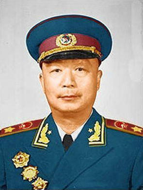
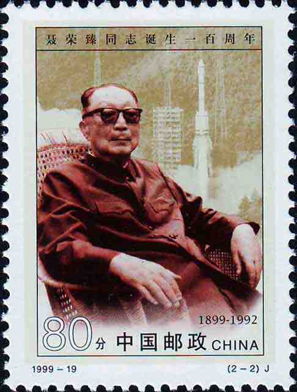
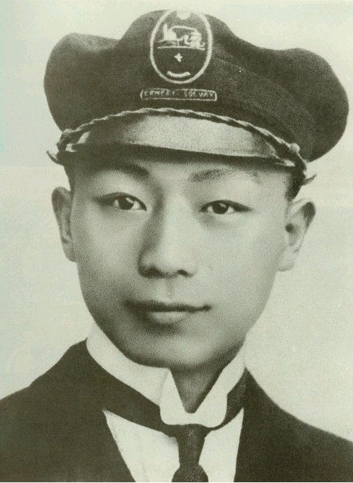
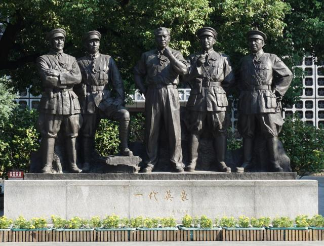
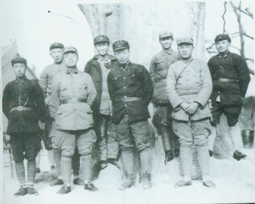
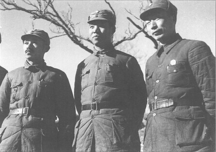

## 108年前，主持两弹一星研究工作的新鲁智深聂荣臻元帅出生于江津县

适合所有人的历史读物。每天了解一个历史人物、积累一点历史知识。三观端正，绝不戏说，欢迎留言。  

聂荣臻小传：主持两弹一星的“鲁智深”，最后离世的共和国元帅

【1899年12月29日】108年前的今天，负责导弹、原子弹、人造卫星的厚道人聂荣臻元帅生于重庆

聂荣臻（1899年12月29日－1992年5月14日），四川省江津县人（今重庆市江津区）。中华人民共和国十大元帅之一，参与领导南昌起义、广州起义，抗日战争中建立晋察冀根据地，解放战争中担任华北军区司令员，建国后主持导弹、原子弹、人造卫星的研究工作，取得卓越成绩。

1938年3月，毛泽东曾评价聂荣臻：“中国有一部很著名的古典小说，叫做《水浒传》，里面写了鲁智深大闹五台山的故事，五台山就在晋察冀。五台山，前有鲁智深，今有聂荣臻。聂荣臻就是新的鲁智深。”

1967年，毛泽东在研究出席“八一建军节招待会”人员名单时，说“聂荣臻是个厚道人”。魏巍1985年在写给聂荣臻的祝寿诗中也说：“一生厚道人称赞，千秋风流一元戎”。

【在法国勤工俭学】

1899年12月29日，聂荣臻出生于今重庆市江津区吴滩镇郎家村。

1919年，五四运动爆发后，聂荣臻积极参加当地学生运动。由于校方受到军警影响，无法继续就读，聂荣臻便决定赴法国勤工俭学。1920年1月14日，聂荣臻抵达法国马赛后，被分配到蒙塔尔纪中学学习法文，他在学校认识了蔡和森、蔡畅、向警予、陈毅等人。

1922年6月，经刘伯坚介绍，加入旅欧中国少年共产党。1923年春，聂荣臻经赵世炎和刘伯坚介绍，加入中国共产党。同年夏天，他以个人身份加入中国国民党，担任国民党驻巴黎通讯处处长。1924年秋，聂荣臻赴苏联莫斯科东方大学学习，后转入苏联红军学校中国班学习。

（1922年，聂荣臻在比利时沙洛格瓦劳动大学化学系学习时留影）

【南昌起义的军委书记】

1925年9月，聂荣臻回国，任黄埔军校政治部秘书兼政治教官。北伐战争开始后，聂荣臻任军委特派员、中共湖北省委军委书记。

1927年，四一二事件后，聂荣臻被派往上海，协助周恩来整顿遭受破坏的工人纠察队，处理善后工作。7月，聂荣臻任中共前敌军委书记，赴九江组织武装起义。南昌起义时，聂荣臻组织张发奎部第25师两个多团起义，后与军长叶挺率部南下。起义军队在潮汕失败后，聂荣臻和叶挺护送病中的周恩来转移到了香港。

1927年12月，他潜回广州参与领导广州起义。在起义军受挫的情况下，他与叶挺决定撤退。1928年，聂荣臻任中共广东省委军委书记。1930年5月到达上海，在中央特科从事地下工作。1931年，聂荣臻调任中共中央军委参谋长。

（南昌起义雕塑，左起刘伯承、叶挺、周恩来、贺龙、朱德）

【长征中的第一军团政委】

1931年4月，中共中央政治局候补委员顾顺章被捕变节，上海的中央机关被迫紧急迁移。1931年12月，聂荣臻撤离上海，前往中央苏区，担任红军总政治部副主任。1932年3月，调任红军第一军团政委，与林彪搭档。

1934年10月，聂荣臻率部参加长征。聂荣臻与林彪率红一军团担任掩护中央纵队、军委纵队的护卫任务，1935年10月，与林彪率先遣队进入陕北吴起镇，结束长征。

（1936年2月，红一军团、红十五军团部分领导干部在陕西淳化合影。前排左起：王首道、杨尚昆、聂荣臻、徐海东。后排左起：罗瑞卿、程子华、陈光、邓小平）

【抗日中的八路军少将】

1937年8月，聂荣臻任八路军115师副师长，获授国民革命军少将军衔。9月，与林彪共同指挥了平型关战斗，歼灭日军板垣师团一部1000余人。

1937年11月，聂荣臻任晋察冀军区司令员兼政委，率3000人在五台山区创建抗日根据地。先后开辟了冀中、冀东、平西、平北等根据地，到1939年，晋察冀根据地发展到拥有七十二个县、1200多万人口、主力部队近10万人。

1939年秋，在黄土岭战斗中，聂荣臻与杨成武指挥部队击毙日军阿部规秀中将。1945年，出席中共七大，当选为中央委员。

（1938年，组建中共中央北方分局时，关向应、彭真、聂荣臻三人合影）

【开国大典阅兵的总指挥】

1946年6月，第二次国共内战爆发。1947年11月，聂荣臻组织晋察冀野战军发起石家庄战役，首创解放军攻克大城市模范战例。1948年5月，中共中央抵达河北平山西柏坡。5月上旬，组建华北局和华北军区，聂荣臻任华北局第三书记、华北军区司令员。

1948年12月，平津战役开始后，林彪、罗荣桓、聂荣臻组成平津战役总前委，统一领导与指挥东北野战军与华北军区部队作战。1949年1月，北平和平解放后，聂荣臻兼任平津卫戍区司令，北平市市长、军事管制委员会主任。6月，聂荣臻任中国人民解放军副总参谋长。

1949年10月1日，聂荣臻作为中华人民共和国开国大典阅兵总指挥，陪同朱德检阅中国人民解放军部队。10月19日，聂荣臻任革命军事委员会副总参谋长、代理总参谋长。11月，聂荣臻当选北京市市长。

（1948年12月，平津战役总前委指挥部合影，左起：黄克诚、谭政、聂荣臻、萧华、罗荣桓、刘亚楼、高岗、林彪）

【主抓尖端武器的副总理】

1955年7月，陈云、聂荣臻、薄一波组成三人小组，负责指导原子能工业的筹建工作。9月，聂荣臻被授予中华人民共和国元帅军衔和一级八一勋章、一级独立自由勋章、一级解放勋章。

1956年5月10日，聂荣臻向中央提出《关于建立我国导弹研究工作的初步意见》。11月，被任命为国务院副总理，主管科学技术工作。1958年10月，聂荣臻担任国防科委主任、国家科委主任，主持导弹、原子弹、人造卫星的研究工作。

1959年9月，被任命为中共中央军委副主席，主抓尖端武器工作。1962年11月17日，中央决定成立15人专门委员会，领导国防尖端事业。周恩来为主任，聂荣臻为成员之一。1964年6月，中国成功发射了自行研制的第一枚中近程地对地导弹，1964年10月16日第一颗原子弹爆炸成功。

（1963年，陈毅、聂荣臻、郭沫若参加中国科大首届毕业生合影）

【酒泉卫星发射中心】

1966年，文化大革命爆发。1967年2月，聂荣臻、谭震林、陈毅、李先念等人发言怒斥文革小组，这次抗争被定性为“二月逆流案”。同年6月，聂荣臻赴核试验基地现场指挥中国首次氢弹试验。

1970年，林彪九一三事件爆发，不久陈毅去世，毛泽东在参加完追悼会后，为“二月逆流案”平反。1975年1月，他当选为第四届全国人大常委会副委员长。1977年8月，聂荣臻复任中央军委副主席。1987年，中共十三大上，聂荣臻正式辞去中央军委副主席，过着全退休生活。

1992年5月14日，聂荣臻因心力衰竭，抢救无效，享年92岁。他是十大元帅中最后逝世的。5月28日，聂荣臻元帅的遗体在八宝山革命公墓火化。按聂荣臻的遗嘱，他的部分骨灰被撒在八宝山革命公墓的一棵桧柏树下，另一部分骨灰被安葬在酒泉卫星发射中心的烈士陵园。

（1967年12月，聂荣臻副总理（中）与学部委员王淦昌（左）和朱光亚教授（右）在我国西部核试验基地）