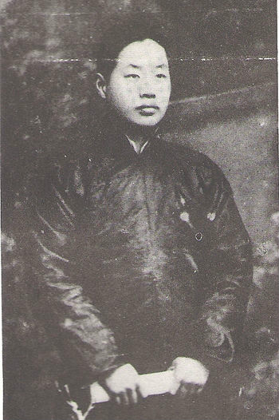
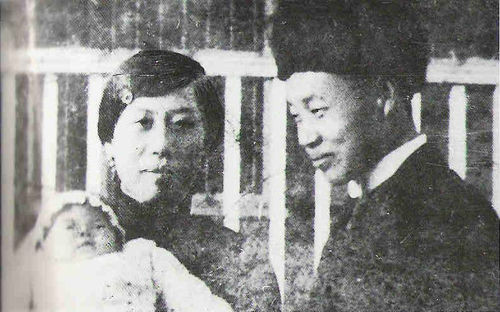
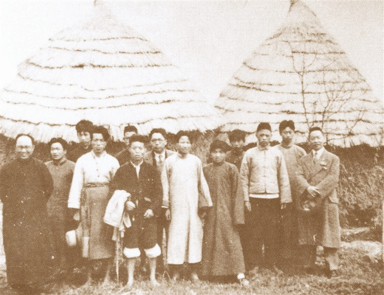
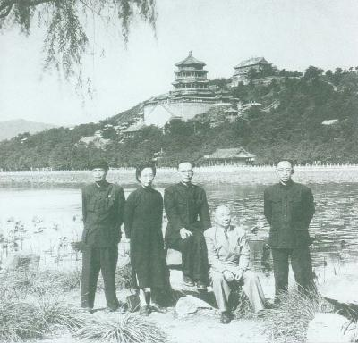

## 35年前的今天，倡导五指教育法和“活教育”的儿童教育家陈鹤琴去世

适合所有人的历史读物。每天了解一个历史人物、积累一点历史知识。三观端正，绝不戏说，欢迎留言。  

陈鹤琴小传：拿儿子做实验，在家创办第一个幼稚园的儿童教育圣人

【1982年12月30日】拿儿子做实验，推行活教育的儿童教育圣人陈鹤琴逝世

### 

陈鹤琴（1892年3月5日－1982年12月30日），浙江上虞人，儿童教育家、儿童心理学家，是中国现代儿童心理学和幼儿教育学研究的开创者。

他拿自己的儿子，作为观察实验对象，写出中国最早的儿童心理学著作《儿童心理之研究》。在自家客厅，创办中国第一家实验幼稚园。推行活教育：一切活动以儿童为中心。提倡健康、科学、社会、艺术、语文五方面共同发展的五指教育法。

有人问他活教育的目的，他说：“活教育的目的就是做人、做中国人、做现代中国人。”

陈鹤琴被誉为中国教育界的“四位圣人之一”：陶行知先生是乡村教育的圣人，晏阳初先生是平民教育的圣人，黄炎培先生是职业教育的圣人，而儿童教育的圣人就非陈鹤琴莫属了。

【五指教育与活教育】

陈鹤琴所倡导的五指教育法，认为幼教应当借着各种方式教导幼童健康、科学、社会、艺术、语文等五方面的知识，以达到完整教育的目的。

1、生命以健康为要，所以要有健康活动。
2、为要认识、了解自己、环境、自然、生活，需要具备探索精神及科学活动。
3、人不能离群索居，由个人扩大到群体生活，要有社会活动。
4、人是感情动物，生活富有情趣的，要有艺术活动。
5、与人交往需要使用语言、文字，及记录、整理、保藏，要有语文活动。

陈鹤琴认为要了解儿童心理，认识儿童，才能谈到教育儿童，这是“活的教育”，而不是死的教育。简单的说，活的教育，教材是活的，方法是活的，课本也是活的。 一切设施、一切活动以儿童为中心的主体，学校里一切活动都是儿童的活动。

有人问他活教育的目的，他说：“活教育的目的就是做人、做中国人、做现代中国人。”

为配合幼儿教育与儿童教育的需要，陈鹤琴创办了儿童玩具、教具厂。为丰富儿童的知识，编辑出版了不少儿童课外读物，如《中国历史故事丛书》、《小学自然故事丛书》等。并主编了多种辅导刊物，如《幼稚教育》、《儿童教育》、《小学教师》、《活教育》与《新儿童教育》等。创办了中国幼稚教育社、中华儿童教育社等。 

【美国教育家的弟子】

1892年3月5日，陈鹤琴出生于浙江省上虞县百官镇。1911年春（19岁），考入上海圣约翰大学，同年秋转入北京清华学堂（1928年改名清华大学）。

1914年，清华学校毕业后考取奖学金，赴美国留学，先在霍普金斯大学学习，获文学学士学位。1917年，入纽约哥伦比亚大学教育学院攻读教育学和心理学，师从克伯屈、保罗·孟禄、爱德华·桑代克、约翰·杜威等著名教育学家，获教育硕士学位。

（1912年，陈鹤琴在北京清华学校学习）

【观察儿子的心理学家】

1919年8月（27岁），陈鹤琴回国，担任南京高等师范学校（后更名国立中央大学）教育科（今南京师范大学）教授，讲授心理学、儿童教育学。1920年12月26日，其长子陈一鸣出生，陈鹤琴对他进行了808天的跟踪观察。以此为基础，于1925年发表了中国最早的儿童心理学著作《儿童心理之研究》。

1921年7月，与廖世承合著的《比奈西蒙智力测验法》。这是由法国心理学家于1905年编制，是世界上第一个智力量表。这个测验的目的是为了把异常儿童和一般儿童区分开来，并对其进行特别的教育。

1922年，出版《语体文应用字汇》，开创了中国汉字字量的科学研究。对编写小学课本和普及教育起了推动作用，也为陶行知、朱经农编写《平民千字课》课本提供了用字依据。

（陈鹤琴将儿子作为观察实验对象）

【中国第一所实验幼稚园】

1923年，陈鹤琴在自家客厅创建了中国第一所实验幼稚园，招收东南大学教授的子女12人。1925年，扩建为“南京鼓楼幼稚园”，正式对外招生。陈鹤琴任园长，邀请东大美籍讲师为顾问，鼓楼幼稚园成为中国最早的幼稚教育实验中心。在教具、教材、教法等方面的试验结果，成为国民政府教育部1932年颁布的《幼稚园课程标准》的基础。

1928年，陈鹤琴出任南京市特别教育局学校教育科科长。他在南京推行分区实验教育，创办了东西南北中区5个实验学校，并推行实验单元教学法。

（1978年，陈鹤琴（第二排中）在鼓楼幼儿园和小朋友一起欢度儿童节）

【上海租界的七所华人小学】

1928年9月，上海公共租界成立华人教育处，陈鹤琴出任处长，负责管理上海公共租界的华人教育。在其任职期间，共创办了7所华人小学，使华人儿童获得了较多的教育机会。

1929年，中华儿童教育社成立，陈鹤琴被选为主席。该社后来发展为中国最主要的儿童教育学术团体。

1937年，淞沪会战爆发，陈鹤琴出任上海国际救济会教育股主任，负责难民教育协会。孤岛时期，由于坚持升国旗仪式，受到日本方面压力，1939年被迫离开上海。

【活教育和五指教育法】

1940年2月，陈鹤琴应江西省主席熊式辉邀请，前往江西办学，并开始进行“活教育”实验。就是“一切设施、一切活动以儿童为中心”。“活教育的目的就是在做人、做中国人、做现代中国人。”

5月15日，在泰和县新池村创办南昌实小新池分校。10月1日，创办江西省立实验幼稚师范学校，这是中国第一所非教会的幼稚师范学校。这所学校很快赢得声誉，1943年，教育部长陈立夫批准将其改为国立学校。

1945年，陈鹤琴在上海创办国立幼稚师范专科学校，任内提出五指教学法，主张幼儿教育如同手指与手掌，应当涵盖健康、科学、社会、艺术、语文五种其本项目，要注意教材的连贯性及整体性。

（创办中国第一所公立幼儿师范学校）

【焚琴煮鹤】

1949年5月，曾因“赤化”遭国民政府逮捕，经上海五位大学校长联合营救获释。解放军占领南京后，中央大学改名南京大学，陈鹤琴出任南京大学师范学院院长。同年9月，陈鹤琴应邀前往北京参加首届全国政治协商会议。

1951年后，作为杜威教育思想在中国的代表，陈鹤琴开始受到当局的批判。1955年5月16日，陈鹤琴向高校教师代表发表演讲，愤怒声讨杜威，说杜威“在我心窝上打了三枪，使我受到了他的思想毒害，几乎不可救药”，“今天我要向杜威狠狠地回击三枪”。

（1949年，陈鹤琴（左四）参加第一届全国政协会议，在北京颐和园留影）

1958年，陈鹤琴被批为“冒牌学者”、“文化买办”，免去南京师范学院院长职务，入北京社会主义学院接受改造。1966年文革中受到迫害，1979年得以平反。1982年12月30日，在江苏省南京市病逝，享年90岁。

