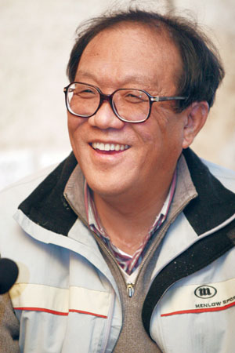
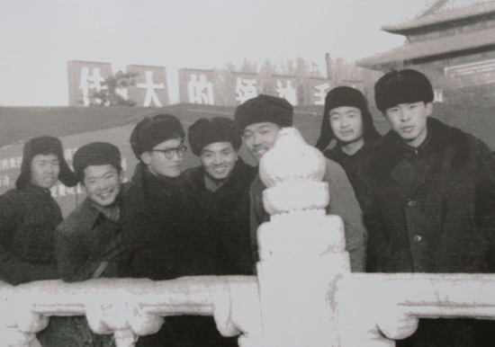
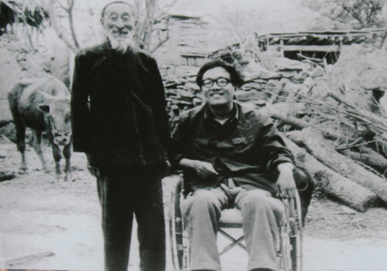
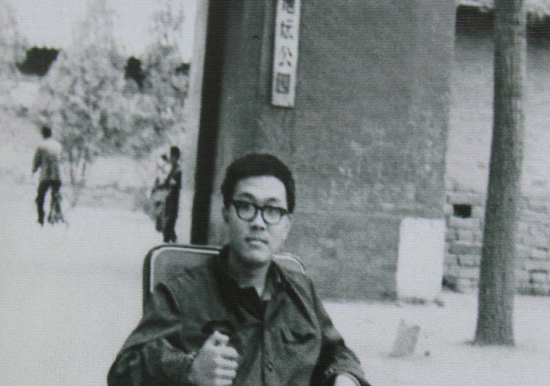
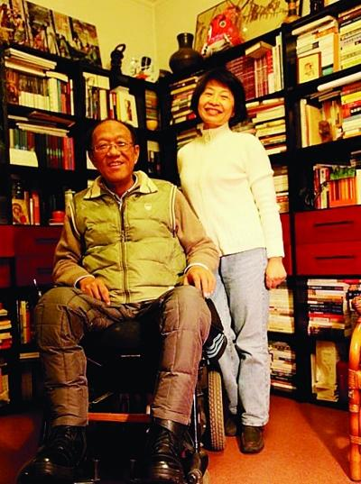
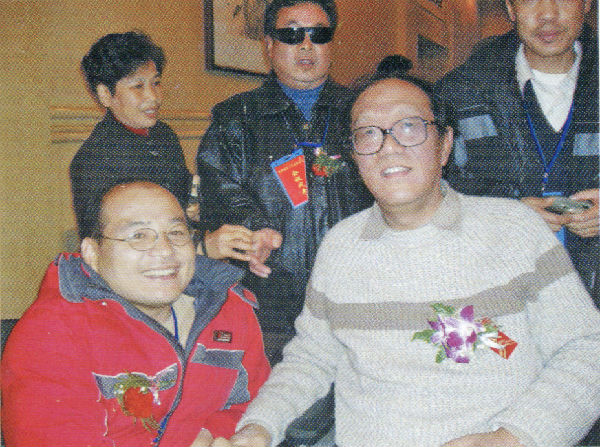

## nnnn姓名（资料）

适合所有人的历史读物。每天了解一个历史人物、积累一点历史知识。三观端正，绝不戏说，欢迎留言。  

### 成就特点

- ​
- ​

### 生平

史铁生小传：职业是生病，业余在写作，身残志坚的励志典范

【2010年12月31日】7年前的今天，不断追问人生，用生命来写作的史铁生病逝

史铁生（1951年1月4日－2010年12月31日），中国当代作家，作家协会副主席，中国残疾人联合会副主席。

史铁生年轻时就双腿瘫痪，后又患上尿毒症，需靠透析维持生命，自称是“职业是生病，业余在写作”。他的代表作有《我的遥远的清平湾》、《我与地坛》、《务虚笔记》、《病隙碎笔》等。他是“知青情结”的第一个代言人，也是身残志坚的励志典范，作品曾选入中学课本，非常受欢迎。

【年纪轻轻的轮椅生涯】

1951年1月4日，生于北京，从小跟奶奶生活。13岁，毕业于东城区王大人胡同小学，16岁，毕业于清华大学附属中学。

1969年1月，上山下乡运动展开，18岁的史铁生自愿到陕北延安农村插队。4月，因腰腿病返京治病，6月回村，生产队照顾他，让他担任饲养员，放牛喂牛。1971年9月，史铁生腰疼加重，回北京治病。1972年1月，住友谊医院，一年半后治疗结束，轮椅生涯开始。

（下乡插队前史铁生（右三）和同学们）

【知青情结的第一个代言人】

1974年，23岁时到街道工厂做工。1979年，发表第一篇小说《法学教授及其夫人》。1981年（30岁），因患肾病，回家疗养，开始写作。

1983年，出版成名作短篇小说《我的遥远的清平湾》，获1983年全国优秀短篇小说奖。小说描绘了黄土高原上的小山村和一个风趣的放牛倌的故事。小说以抒情散文的笔法，描绘了老知青对插队生活的回忆。他成为“知青情结”的第一个代言人，作品大受欢迎和推崇。

（1984年，史铁生回到清平湾）

【入选高中教材的《我与地坛》】

1984年，短篇小说《奶奶的星星》，获年度作家文学奖和全国优秀短篇小说奖。1989年，38岁的史铁生与陈希米结婚，两人相伴一生。

1991年，完成散文《我与地坛》。这部作品是是史铁生十五年来摇着轮椅在地坛思索的结晶，是他充满哲思又极为人性化的代表作之一。其前第一段和第二段被纳入人民教育出版社的高一教材中。

（80年代，史铁生在地坛公园）

【一念之间的《务虚笔记》】

1997年（46岁），长篇小说《务虚笔记》发表于1996年《收获》杂志上，获上海市长篇小说奖。这是他半自传式的作品。由二十二个段落合成，叙述了上世纪50年代以来的社会嬗变带给残疾人C、画家Z、女教师O、诗人L、医生F、女导演N等一代人的影响。

全部的内容只是为了告诉我们一件事，那就是生活的偶然性，很多时候，如果你打开的是另一扇门，走的是另一条路，生活的轨迹可能完全不同，而选择多数时候只是一念之间的偶然。

《务虚笔记》是中国文学中第一部真正的宗教哲理小说，有里程碑的意义，但此书反应零落，似乎读者不多。

（史铁生与妻子陈希米）

【是我赋予生命意义】

1998年，47岁的他被确诊为尿毒症，需隔日透析以维持生命，其费用主要由中国作协和北京市负担。同年，长篇小说《老屋小记》获首届鲁迅文学奖。

2002年，长篇随笔集《病隙碎笔》，获传媒文学杰出成就奖、老舍散文奖。2005年，《病隙碎笔》获第三届鲁迅文学奖。

本书中243则充满智慧与安详的随笔文字，是作者以生命的追问方式，来不断捕捉思想的火花，其过程长达三年多。由此，我们不难理解史铁生在书中所说的一句话：“生命本无意义，是‘我’使生命获得了意义。”

2010年12月31日凌晨3点46分，史铁生因突发脑溢血在北京宣武医院去世，享年59岁。根据他的遗愿，不举行遗体告别仪式，器官捐献给医学研究。31日凌晨6时许，其肝脏已移植给天津的一位病人。

（史铁生与邓朴方合影）

