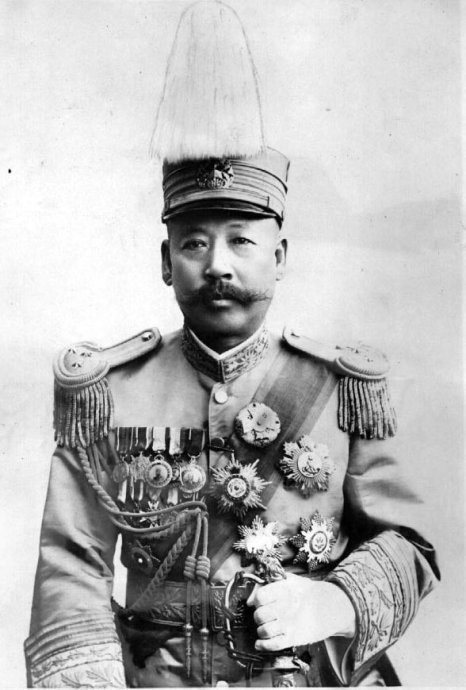
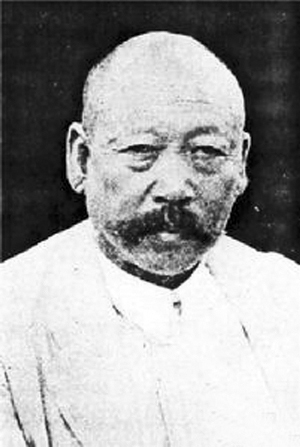
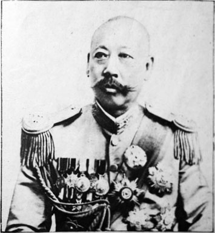
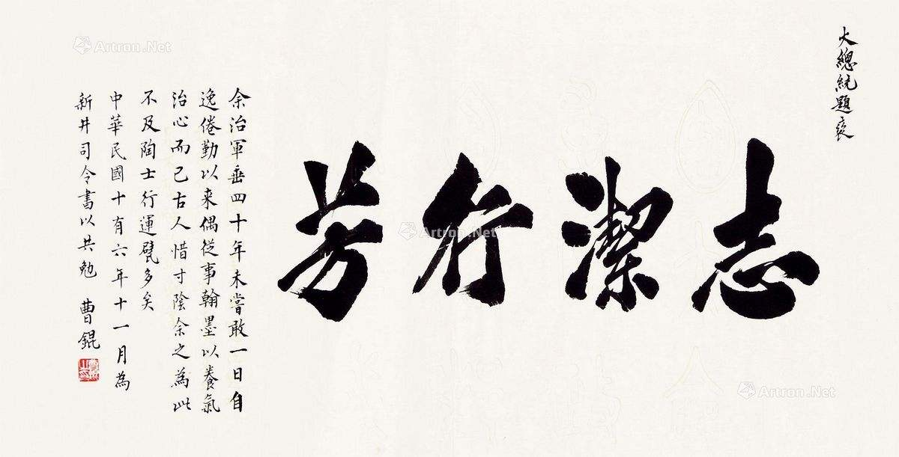

0517曹锟

 （万象特约作者：一一）

79年前的今天，1938年5月17日，拒绝与日本人合作的贿选总统曹锟在天津去世

 曹锟（1862年12月12日－1938年5月17日），天津大沽口人。中华民国政治军事人物，早年追随袁世凯起家，后来成为直系军阀的领导人之一。

1923年10月6日，曹锟靠贿选为第三任中华民国大总统，被讽刺为"贿选总统"。几天后，颁布了《中华民国宪法》，人称“曹锟宪法”，这是中国第一部正式颁行的宪法。1年后，冯玉祥发动北京政变，曹锟被软禁了两年。

曹锟晚年住在天津的曹家花园，抗战开始后，拒绝和日本人合作组织亲日政府，保持民族气节，被国民政府追赠为陆军一级上将，并发布褒扬令。

 （曹锟宪法纪念币）

  投奔袁世凯

1862年12月12日，曹锟出生于天津县大沽口一个贫穷的排船工（即造船工）家庭。年轻时，曹锟曾当布贩，四处贩布。1882年（20岁），投淮军当兵。1885年（23岁），入天津武备学堂。1890年（28岁）毕业后，任宋庆所部毅军的哨官。

1895年（33岁），转入天津小站投奔袁世凯，任营帮带。袁世凯任直隶总督后，1902年（40岁）曹锟被任命为直隶常备军右翼步队第十一营管带。1903年，任京旗常备军（后改为陆军第一镇）第一协统领。1907年（45岁），升任陆军第三镇统制。

1911年（49岁），曹锟授副都统。武昌起义爆发后，曹锟奉命率部进攻山西革命军。1912年1月，调防北京。1912年2月，曹锟改称陆军第三师师长，纵兵发动北京兵变，使得袁世凯拒绝赴南京就任临时大总统。

直系军阀首领

1914年4月（52岁），曹锟任长江上游警备司令。1915年，曹锟上书请改国体，拥袁称帝。1915年10月，获授将军府虎威将军。袁世凯称帝后，曹锟获封一等伯。1916年，率部赴四川镇压护国军。9月，任直隶督军。

1917年，参与张勋复辟，旋即又随段祺瑞讨伐张勋，任西路讨逆军总司令。7月，任直隶督军兼省长。1918年，奉命南下同护法军作战。

1919年12月（57岁），冯国璋逝世后，曹锟成为直系的首领。1920年7月，曹锟在直皖战争中击败皖系，同奉系共同掌握北京政府。1920年9月，任直鲁豫巡阅使。

 贿选大总统

1922年（60岁），第一次直奉战争，直系获胜，独自控制北京政府。此后，曹锟首先逼退大总统徐世昌，迎原任大总统黎元洪复职，并使其成为傀儡，北京政府六度更换国务总理。

1923年6月，曹锟派人对黎元洪进行恐吓，迫使他逃往天津，又派人将黎元洪乘坐的火车在天津杨村站扣住，直到交出大总统印并签署辞职书后才放行。曹锟利用内政总长高凌霨和议长吴景濂大批收买或威胁国会议员，于1923年10月6日当选为中华民国大总统，被讥为“猪仔总统”、“贿选总统”。

此后，由贿选国会起草并通过了一部《中华民国宪法》，人称“曹锟宪法”、“贿选宪法”。1923年10月10日，该宪法由曹锟颁布实施。这部宪法是中国第一部正式颁行的宪法。曹锟就任大总统后，直系的实权转由吴佩孚操控。

（1923年美国《时代》周刊刊登的曹锟照片）

被软禁的大总统

1924年10月，第二次直奉战争爆发。随后，冯玉祥等人发动北京政变，将曹锟软禁于中南海延庆楼。北京政府的主导权由直系改归奉系。1926年4月9日（64岁），冯玉祥的部下鹿钟麟发动兵变包围了临时执政府，段祺瑞逃走，同时鹿钟麟还释放了被软禁的曹锟。

（1924年5月10日《东方杂志：直奉战争》中刊登的曹锟照片）

获得释放后，曹锟到河南投奔吴佩孚。1927年后，寓居天津租界。1937年（75岁），卢沟桥事变后，日军占领天津，曾企图说服曹锟出面组织亲日政府，但遭到曹锟的拒绝。1938年5月17日（76岁），曹锟在天津因肺炎而病逝。

因其保持民族气节，国民政府主席林森在1938年6月14日发布训令，追赠曹锟为陆军一级上将，并发布褒扬令。

 