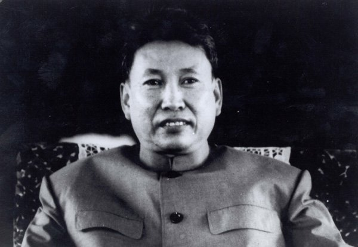

0519布尔波特

89年前的今天，1928年5月19日，消灭城市、消灭货币的柬埔寨华裔布尔波特出生。

布尔波特小传：制造了2万个万人坑的红色高棉领导人

 

波尔布特（1928年5月19日－1998年4月15日），柬埔寨华人后代， 红色高棉最高领导人、柬埔寨共产党总书记。

1975年，带领发动红色高棉运动，推翻原来亲美国的朗诺政权，建立一党专政的独裁政府，出任总理。他在执政期间，试图消灭城市，将所有城市居民强行驱赶到农村的集体农场劳动。

他取消货币，试图实现共产主义的理想。在他统治期间，被处死的、饿死的、屠杀的人约一百万到三百万人，占当时约八百万人口的四分之一。他的屠杀行径，引起柬埔寨和国际社会的谴责。

由于大量越南侨民被屠杀，越南以此为由，攻入柬埔寨，波尔布特败逃到山区。1997年，被公审，判处终身监禁。第二年，被软禁期间“突发心脏病”死亡。

（琼邑克杀戮战场的万人坑） 

**柬埔寨的华裔**

1928年5月19日，波尔布特出生于柬埔寨磅同省磅斯威县波列斯布村，家里是华人与柬埔寨人混血农民家庭。祖上姓吕。

1949年（21岁），波尔布特以良好的学习成绩获得到法国留学的奖学金，在巴黎读书期间开始接触到马列主义，并成为坚定的共产主义者。

（波尔布特的出生地，磅同省磅斯威县波列斯布村）

**柬埔寨共产党领袖**

印度支那是对中国和印度的结合部中南半岛的叫法，包括老挝、越南、柬埔寨三个国家。第二次世界大战后，1946年开始，反对法国殖民的第一次印度支那战争爆发。

1954年（26岁），日内瓦会议达成《印度支那停战协定》，7年的战争结束。波尔布特转入地下，领导金边等地群众运动。1957年（29岁），参加柬埔寨共产党建党筹备工作。

1960年（32岁），在党的第一次代表大会上当选为中央委员会常委。1961年，任中央委员会副书记。1962年，任代理总书记。1963年，柬共二大当选为中央委员会总书记。会后进入丛林，领导建设农村革命根据地和建军工作。

1968年（40岁），兼任东北根据地党委书记，领导农民革命运动和游击战争。1970年，任全国军事指挥部主席，领导各战场进行反对朗诺集团的斗争。

（西哈努克和布尔波特）

 **恐怖的红色高棉**

1976年4月（48岁），任民主柬埔寨（被称为红色高棉）政府总理，以法属时期的金边总督府为官邸。在任期间，民柬政府把城市居民撤到农村，编入农业合作社从事生产，把工厂、商店全部收归国有，取消国内市场和货币，实行全民供给制。

红色高棉执政期间，波尔布特认为城市是资本主义的丑恶象征，它会腐化干部和群众。要建设理想社会，就必须消灭城市。红色高棉宣布要在十到十五年内使国家实现现代化，把柬埔寨变成一个农业社会后，它着手推广原在解放区实行的合作社制度。取消货币和市场，实行按需分配和全民供给制。男女老少在集体农场集体劳动，在公共食堂集体就餐。

红色高棉禁止私人拥有财产，取消家庭，甚至婚姻也由组织安排，婚后夫妇要分开居住。禁止人们从事宗教活动，勒令僧侣还俗。视科学文化知识为罪恶，不设正规学校，禁用书籍和印刷品。人们不能自由流动。全国没有邮政电信，也没有医院。领导红色高棉共产主义政权在1975年至1979年期间对柬埔寨进行种族灭绝的事件，据估计造成了150万至300万柬埔寨人的死亡，史称红色高棉大屠杀。

  

（红色高棉大屠杀的死难者骸骨）

**公开审判**

1979年1月7日（51岁），越南攻入柬埔寨后，在全国境内发现了超过两万个万人坑，这些地方后来被人称为“杀戮战场”。波尔布特率民主柬埔寨军队退入山区，坚持抗越斗争。12月，辞去总理职务，出任民主柬埔寨国民军最高委员会主席兼总司令。

1985年8月（57岁），波尔布特宣布辞去民主柬埔寨国民军总司令的职务，由宋先接任。退休后，任民柬最高国防研究院院长。1986年，波尔布特前往中国大陆接受肠癌治疗，1988年离开中国大陆。

1997年6月（69岁），波尔布特以间谍罪处死红色高棉国防部长宋先和妻子云雅，此举激起众怒，红色高棉总司令塔莫逮捕了波尔布特。

1997年7月25日，红色高棉在安隆汶基地举行公审波尔布特大会，并宣布波尔布特因“背叛民族”、“杀害同志”，被判终身监禁。1998年4月15日，波尔布特因心脏病在泰柬边境逝世。

（波尔布特墓）

