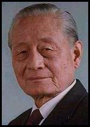

0521赵朴初

（万象特约作者：一一）

17年前的今天，2000年5月21日，20年中国佛教协会会长赵朴初逝世于北京

 

赵朴初（1907年11月5日－2000年5月21日），安徽省太湖县人，中国社会活动家、宗教领袖、诗人、书法家、佛教居士。曾任中国佛教协会会长，此外还担任中日友好协会副会长、中国红十字会名誉会长、中国人民争取和平与裁军协会副会长。

1935年秋天，经圆瑛法师介绍，赵朴初皈依佛门，成了在家居士。抗日战争开始后，赵朴初担任上海文化界救亡协会理事，1945年创立民主促进会。1953年，中国佛教协会成立，圆瑛法师为会长，赵朴初担任副会长兼秘书长。文革结束后，赵朴初于1980年开始担任中国佛教协会会长，直至2000年在北京逝世。

赵朴初逝世后，佛学大师学诚法师有如下评价：从普通衲子到高僧大德，从一般信徒到学界巨擘，从广大民众到党政领导，从港澳台同胞到国际友人，依然深深追思缅怀，感念他深远广大的菩提心和济世利人的菩萨行。哲人已逝，“峨峨若千丈松崩”，德音未远，神理绵绵。

赵朴初书法作品

**从世家子弟到居士**

1907年11月5日，赵朴初出身于太湖县四世翰林赵家，五世祖赵文楷为嘉庆元年状元，元祖赵畇、曾祖赵继元、伯祖（祖父之兄）赵曾重皆为进士出身。1926年（19岁），就读于江苏东吴大学，开始学佛。

毕业后担任上海江浙佛教联合会秘书、上海市佛教协会秘书。1935年秋天（28岁），经圆瑛法师介绍，赵朴初皈依佛门，成了在家居士。佛教传入中国后，居士一般指隐居不仕之士、佛教居家修行人士、所有非出家的学佛人士。

1936年（29岁），赵朴初在上海成立了“中国佛教护国和平会”的救亡组织，参加抗日救亡活动。1937年，抗日战争开始，以至1945年的八年抗战期间，赵朴初先后担任上海文化界救亡协会理事，上海市佛教协会秘书、主任秘书，及上海慈联救济战区难民委员会常务委员、兼难民收容股主任，上海净业社儿童教养院副院长，上海少年村村长等职务。1939年，参加民主促进运动。1945年抗战胜利，参与发起组织中国民主促进会，担任上海分会副主任。

1930年代，赵朴初走上佛教之路，成为一名虔诚的佛教徒

**创立佛教协会**

1949年10月（42岁），中华人民共和国成立，赵朴初代表上海佛教界，参加中国共产党在北京首次召开的中国人民政治协商会议第一届全体会议。1950年，赵朴初任华东军政委员会民政部副部长、人事部副部长，上海市人民政府法律委员会副主任。1952年10月（45岁），在北京召开的亚洲及太平洋区域和平会议上，赵朴初代表中国佛教界，将一尊古铜佛像赠送日本佛教界。

1952年11月4日和5日，赵朴初等二十人在北京广济寺召开发起人会议，发起组织中国佛教协会。会中通过发起书，决定由赵朴初等组成中国佛教协会筹备处，赵朴初担任筹备处主任。

经过半年的筹备，1953年5月30日至6月3日，在北京广济寺举行中国佛教协会成立会议。出席会议者包括汉族、藏族、蒙古族、傣族、满族、苗族、撒里维吾尔等七个民族的活佛、喇嘛、法师、居士代表一百二十人。

会议中通过了《中国佛教协会章程》和有关决议；会中推选达赖喇嘛、班禅额尔德尼、虚云法师、查干葛根为中国佛教协会的名誉会长，选举圆瑛为会长，赵朴初为副会长。会中并产生了中国佛教协会理事和中国佛教协会常务理事会，及以赵朴初为秘书长。此后赵朴初的副会长、秘书长职务，连任至1980年。

与毛泽东.jpg)

赵朴初(中)与毛泽东

 

**复兴中国佛教**

“文化大革命”期间中国佛教受极严重摧残，中国佛教协会也停止活动。1978年（71岁），中共十一届三中全会后，在宗教政策方面，采行“文革”前的温和路线，有限度的容许宗教存在。1980年12月16日，中国佛教协会召开了第四届全国代表会议。赵朴初在工作报告中称：

“中国佛教协会第三届全国代表会议，是一九六二年二月召开的，到现在，已经历时十八年又九个月了。在这十八年期间，我们国家经过了一个剧烈的历史大动荡时期，走过了一段艰难曲折的道路。在党的领导下，粉碎了林彪、江青反革命集团，拨乱反正，祖国大地，又重见光明，今天，我们在渡过十八年的沧桑岁月以后，大家聚会一处，济济一堂，共同举行这个全国性佛教代表会议，抚今追昔，感慨无量……”

在这一次大会中，改选了中国佛教协会理事会，赵朴初当选为会长，负起了领导中国佛教协会、重新建设中国佛教的重任，对劫后中国佛教的复兴，贡献其一生。

1980年以后，赵朴初除了领导中国佛教协会外，还担任中国书法家协会副主席，中国民主促进会中央常委、副主席、中央参议委员会主任，及中国民主促进会中央名誉主席，第六、七、八届全国政协副主席。

赵朴初在90岁以后健康状况不佳。2000年5月21日在北京病逝，享年93岁。

（赵朴初临终偈）