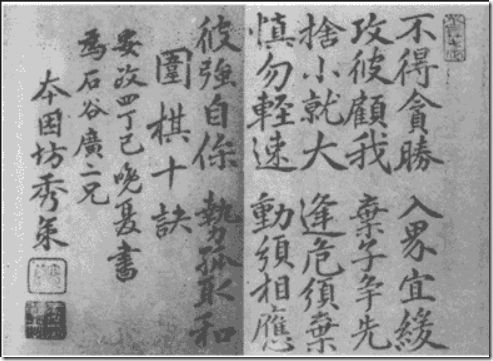
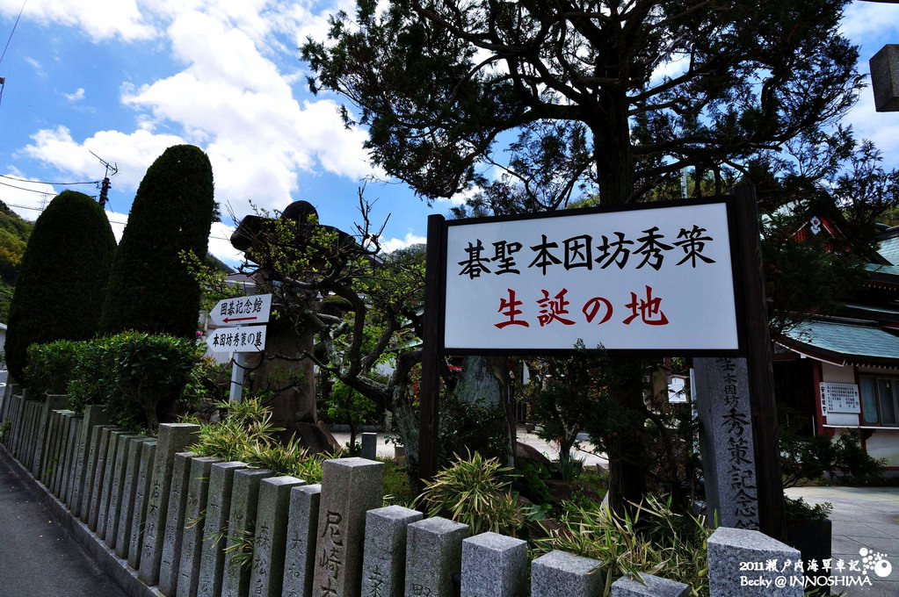
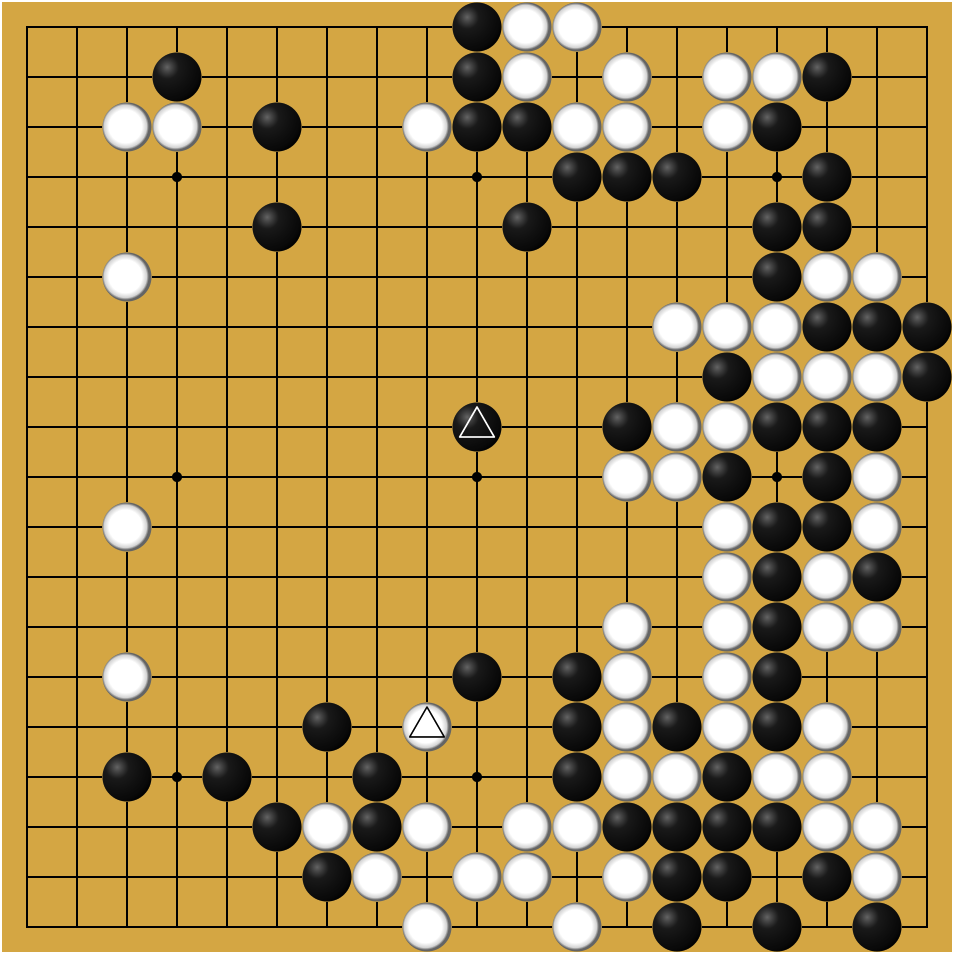
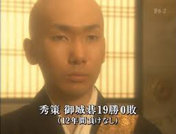
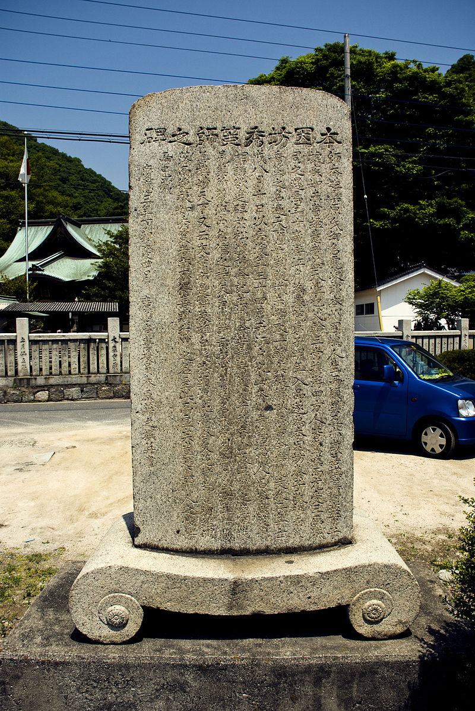

0606本因坊秀策

188年前的今天，1829年6月6日，执黑从无败绩，堪称阿尔法狗的本因坊秀策出生

本因坊秀策（1829年6月6日－1862年9月3日），（日文：ほんいんぼう しゅうさく）日本著名围棋手。

小和尚少年成名，进入本因坊。参加一年一度的顶级赛事御城战，13年里，在强者林立的比赛中，进入保持全胜19战19胜。他执黑从无败绩，堪称150年前的阿尔法狗。不知他挑战今日阿尔法狗，胜败又会如何呢？

秀策的棋非常平和，讲究全局的平衡和谐，以不战屈人的方式战胜对手。他的棋法很有一种顺水推舟的味道，从这个角度讲，他的棋最符合围棋的本质规律。在当代棋手中，依然最被推崇。

（秀策书写的围棋十诀）

**安艺小僧**

1829年6月6日，本因坊秀策出生于今日本广岛县尾道市的因岛。6岁，跟老师学习围棋，8岁，以分先（轮流执黑）打败初段的老师，被誉为神童。其后拜竹原宝泉寺住持为师，习围棋、汉文与儒家文化。

后被推荐，跟随江户的本因坊丈和学习，进步神速。11岁，取得初段。一日，与著名棋手幻庵的徒弟偶然相遇，受让二子四局全胜，自此“安艺小僧”的名号便传开（安艺是他家乡的地名），连仁孝天皇都有所耳闻。

（秀策出生地）

**耳赤之局**

随后，改拜大9岁的师兄，少年天才本因坊秀和为师。他每年升一段，15岁升为四段。16岁，得到秀和允许，获得“秀”字辈，取名秀策。18岁，再遇幻庵的徒弟，先相先（三局一次执黑）连赢4盘，于是改为分先（轮流执黑）。秀策也得以与幻庵对弈，结果完全一面倒，幻庵连败。

其中有一盘在普通茶院进行，秀策一开始落下风，下到天王山第127手时，有位不懂棋的医生说：“黑棋赢定了。”大家都不信，医生说：“刚刚黑棋那手下完后，幻庵的耳朵整个红掉了，显见被黑棋下到了要点。”果然最后黑三目胜。这一局就称为“耳赤之局”。幻庵叹道：“这个天才没多久就可以统一天下碁坛了。”

（秀策和幻庵的“耳赤之局”）

**13年御城战全胜**

1849年（20岁），秀策升为六段，被立为本因坊秀和的继承人，并娶了丈和女儿为妻，并开始在御城战中出场。

御城战是日本德川幕府年代的一项传统顶级围棋赛事，每年一度在江户二条城幕府将军面前举行。参赛者必须是本因坊家、井上家、安井家、林家的掌门或继承人，是围棋四家交锋的最重要舞台。

谁也没有想到，从此13年里，秀策竟在强者林立的御城棋战中保持全胜，19战19胜！而且，败在他手下的各家棋士，无不输得心悦诚服。如此神乎其技，令人不禁联想到150年前棋圣道策的14胜2败相提并论（道策两败为让两子局，均一目败）。

（日本电视剧中的秀策）

**30番棋降级大战**

数年间秀策将天下数名好手都降级（当双方对局纪录中，甲方胜场多于乙方四场时，则可将乙方“降级”。降级后，表示水平不如，有先行或受让子的优待）。根据级别差别，可以：分先=轮流执黑；先相先=三局一局执黑；定先=让先=不执黑；受二子=让二子；等等。

当时众人都认为秀策是未来的名人（围棋第一高手）。当时有一个没被降级的棋手太田雄藏，对此不以为然。1853年（24岁），在众人的安排下，举行分先（轮流执黑）三十番棋，直到第17盘才将雄藏降级。之后，下到第22盘又多赢了2盘，第23盘雄藏弈出了生涯杰作，以白和棋。此局被誉为“雄藏的真面目”，是日本棋界的名局。可惜雄藏后来远游，病死他乡，三十番碁只下了23盘。

（名局”雄藏的真面目“棋谱）

**英年早逝**

雄藏死去后，天下能与秀策称的上是“敌手”的，只剩小他九岁的师弟村濑秀甫，两人并称为坊门龙虎双弟子。两人曾下让先（不执黑）十番棋，秀甫六胜三败一和，秀甫后来常以此战绩为荣。秀和、秀策、秀甫合称本因坊三秀。

1862年（33岁），日本尊王攘夷的呼声越来越高，幕府已经完全无法支撑，于是上百年的御城战从此停办。而当时霍乱流行，秀策回乡探望亲友，却因此染病。9月3日，去世，年仅33岁。他被誉为“为御城战而生的棋士”。

（本因坊秀策师之碑）

**执黑不败的大师**

秀策的棋风，是众人皆知的秀策流，重视实利和求坚实反击。秀策流布局，也称135布局，在第1、3、5手取得三个小目的有利情势，再以逸待劳，稳稳地推向胜利。那时，黑棋不贴目，秀策执黑，就从来没有输过。曾经秀策下完一盘棋，旁人问他谁赢，秀策说“我执黑”。

秀策的棋重视全局利益，非常平和，讲究全局的平衡和谐，以不战屈人的方式战胜对手。只要是不影响全局，他就可以下出别人看来不能忍受的棋。他的棋法很有一种顺水推舟的味道，从这个角度讲，他的棋最符合围棋的本质规律。这也是他在当代棋手中依然最被推崇的原因。

（秀策流布局）

