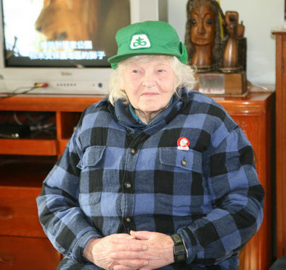
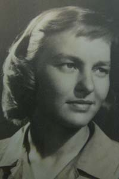
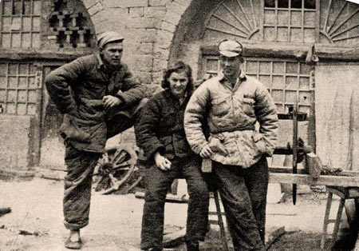
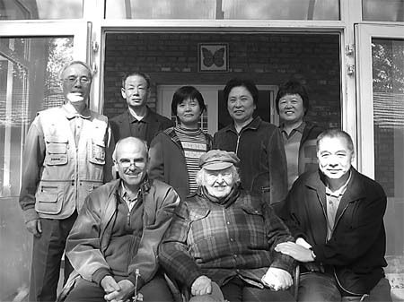

0608寒春

（万象历史特约作者：东西望）

7年前的今天，不在美国研究原子弹，却来中国养奶牛的寒春去世

 

寒春（1921年10月20日－2010年6月8日），《牛虻》作者伏尼契的孙女，长年定居于中国，是第一个拿到中国“绿卡”的美国人。

她曾参与原子弹研发的曼哈顿计划，是其中少数的女科学家之一，却追随未婚夫奔赴延安，来到中国后养了一辈子奶牛。她与杨振宁是同学，当时谣传她泄露了原子弹的秘密给中国，但事实上她并没有参与任何原子弹的工作。

1996年，接受CNN采访时，回忆在华近50年的生涯，寒春表示：“我们从没想过要在中国住那么久，只是当时的中国太吸引人了以至于不想离开。”而谈及中国改革开放，则表示他们“目睹了自己社会主义梦想的崩溃”。他们自称是“解放全人类的世界公民”。

（寒春与她的哥哥韩丁在北京的农场，摄于1993年）

**研发原子弹的女专家**

1921年10月20日，寒春生于美国芝加哥，本名Joan Hinton，是小说《牛虻》作者伏尼契的孙女。芝加哥大学核子物理研究所研究生，女核物理学家，曾与杨振宁是同学。

她是参与原子弹研发的曼哈顿计划中少数的女科学家之一，在洛斯阿拉莫斯（Los Alamos）武器试验室工作，是美国知名核物理学家费米的助手。然而，当蘑菇云升起时，同事慨然：“这是日本人的骨头和肉！”寒春思想产生了巨大变化。

（青年时期的寒春）

**到延安去养牛**

她的哥哥韩丁，大学学习农业。1943年，韩丁阅读了埃德加·斯诺的《西行漫记》，受到强烈震撼。1945年，韩丁以美国战争情报处分析员的身份来到中国。重庆谈判期间，韩丁结识了国共双方很多要员，包括毛泽东、周恩来、宋庆龄等。

（1966年，韩丁写的长篇纪实文学《翻身》）

1946年，韩丁的同学Erwin Engst以联合国善后救济总署畜牧专家身份来华。同年10月，到延安。因此前新闻记者羊枣死于国民政府监狱，有人便给他取了一个谐音的名字“阳早”。

1948年3月（27岁），寒春到达延安，与未婚夫阳早一起在陕西定远县三边牧场，从事奶牛养殖工作。1949年（28岁），两人结婚。1955年（34岁），两人又转到西安草滩农场，从事奶牛品质改良及农机具革新工作。两人在这里，工作了10年。

（阳早与寒春在陕北）

**一张大字报**

1966年4月（45岁），回北京，两人被分配到做翻译。8月29日，两人与另两个美国人合写了一张大字报：反对给外国人特殊待遇。这张大字报迅速传播开去，影响波及全国。毛泽东批示：“我同意这张大字报”。

随后参加了造反派的战斗队。因为不习惯城市生活，他们多次打报告要求回农场。1972年，两人调到北京市红星公社，从事农业机械改良和奶牛饲养机械化工作。

**安心于奶牛事业**

1979年10月17日，作为农机部顾问阳早、寒春兼任中国农机院畜禽机械研究所副所长。1982年，住在北京沙河镇小王庄，在农机院农机实验站，从事牛群饲养和改良的工作。

1982年3月，两人负责的《牛奶管道的自动洗涤与消毒》项目获北京市科学技术成果二等奖。1988年12月，阳早、寒春主持的《奶牛成套设备研究、牛场设计与中间试验》项目被机械电子工业部授予科学技术进步二等奖。

寒春负责的牛奶冷冻奶罐的研发项目，达到了美国同类产品先进水平，并在上海华冠机械厂等工厂生产，替代了进口产品，占领了中国市场70%以上的份额。1993年1月18日，上海市市长黄菊授予寒春“白玉兰荣誉奖”。

（寒春88岁生日合影）

**解放全人类的世界公民**

1996年，接受CNN采访时，回忆在华近50年的生涯，寒春表示：“我们从没想过要在中国住那么久，只是当时的中国太吸引人了以至于不想离开。”而谈及中国改革开放，她和丈夫阳早表示他们“目睹了自己社会主义梦想的崩溃”。

2003年1月，中国农机院授予阳早、寒春“个人贡献奖（金牛奖）”。2003年12月，阳早在京病故，享年85岁。他在中国养了一辈子的牛。他称自己是“解放全人类的世界公民”。

（三个土生土长的“中国”孩子）

2004年8月15日，中国实施《外国人在中国永久居留审批管理办法》以来，寒春是第一个获得中国“绿卡”的外国人。两人有三个土生土长的“中国”孩子，长子阳和平 (Fred Engst) 在中国北京的对外经贸大学国际经济贸易学院；次子阳建平 (Bill Engst) 在美国新泽西州的 Marlboro；女儿阳及平 (Karen Engst) 在法国 Pau。

2010年6月8日凌晨，寒春因病在北京协和医院逝世，享年89岁。寒春逝世后，国务院总理温家宝、副总理李克强等领导人，均致电表示沉痛哀悼。她和她的丈夫阳早、哥哥韩丁均被称为“中国人民的好朋友”，“国际友人”。

（寒春是第一位获得永久居留证的外国人）