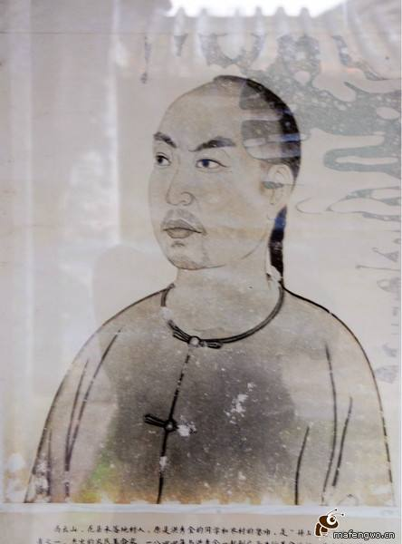
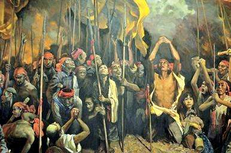
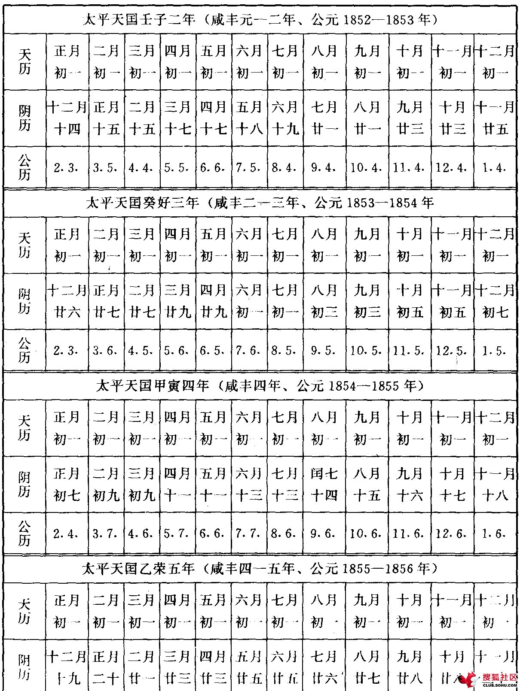
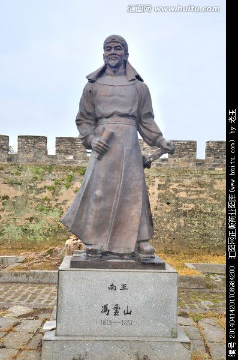

0610冯云山

165年前的今天，太平天国第一人，七千岁南王冯云山中炮阵亡

太平天国第一人

有他才有太平天国

没有他，洪秀全就只是个渣

冯云山（1815—1852年），拜上帝会的始创人之一，太平天国运动初期的重要领袖之一。他与洪秀全是同学好友，共同创建了上帝会。独自一人在广西，深入深山传教，发展教众数千人，奠定了太平天国的核心骨干。完全可以说，没有他就没有太平天国。

他是太平天国初期的事实领袖。在狱中，创造了中国第一个阳历——天历。也正是在这段没有首领的时间，杨秀清天父上身、萧朝贵天兄上身，成为另两个重要首领。可惜金田起义后，不久就中炮身亡。倘若他能活到天京，太平天国恐怕会有另外一番风貌。

去广西传教

1815年，冯云山出生于广东花县禾落地村（今广州花都区），与洪秀全的官禄村相邻。冯云山和洪秀全从小是同学，后来又一同做蒙馆塾师，两人十分志气相投。

1843年（28岁），冯云山和洪秀全共同创立拜上帝教，先在广州附近发展教众。1844年，教众发展不顺，两人一起去广西贵县投奔洪秀全的表兄。因表兄家太穷，洪秀全不久回广东，冯云山不甘心，选择了留下。

（穿山透地不辞劳，到底方知出处高。溪涧焉能留得住，终须大海作波涛。）

平在山的烧炭工

冯云山独自一人，前往广西贵平县的紫荆山区传教。他在平在山，边教书边传教，发展了一批教众，以烧炭工为主。包括杨秀清、萧朝贵、韦昌辉、石达开等人，这些人就是太平天国的骨干，后来称他们为“平在山勋旧”。

冯云山有文化、有毅力、吃苦能干，极受信徒尊重，是真正的领袖。冯云山宣传洪秀全是奉天下凡诛妖，树立起他救世主的形象。1847年，3年后，洪秀全来到广西，突然有上千教众对自己顶礼膜拜，令他喜出望外。

狱中创造天历

1848年十二月（33岁），因与当地的地主团练发生冲突，冯云山被捕，投入桂平县监狱。冯云山在狱中，潜心研究历法，创造出一种以四季划分一年、用立春为岁首、算数简单整齐、接近理想标准的新历法——天历。

就是在冯云山被捕期间，没有了领袖，杨秀清天父上身、萧朝贵天兄上身，稳定了教众。然后发动教众们，在饥寒交迫的情况下，每卖出100斤炭就抽出一点钱，竟攒了一大笔款。1848年五月，冯云山获救，从此拜上帝会的发展更加迅速。

（太平天历对照表）

南王七千岁

1851年（36岁），洪秀全、杨秀清、萧朝贵、冯云山、韦昌辉、石达开等人在广西金田村组织团营，发动了金田起义。后建国号“太平天囯”，起义军为太平军，开始了轰轰烈烈的太平天国运动。冯云山被封为前导副军师、后军主将。

1851年9月，太平军攻克广西永安（今蒙山）后，相继建立各项制度。确定官制，冯云山被封为南王，称七千岁；颁行天历，废除清朝纪年。这是中国第一次使用阳历，也是世界用四季历法的首创。该历法1952年后在太平天国内广泛使用，影响很广。

太平天国第一人

1852年5月24日（37岁），太平军路经桂林全州时，守城清军遥见敌军中的黄轿，便开炮攻击，竟命中，冯云山受重伤，太平军愤而攻城。6月3日，攻克。6月10日，冯云山重伤而死，葬于全州蓑衣渡。

得知南王冯云山殉难，天王洪秀全大哭道“天不欲我定天下耶，何夺我良辅之速也”。《李秀成自述》曾提到：“谋立创国者出南王之谋，前做事者皆南王也。”论其智谋器度，实为太平天国第一人。

