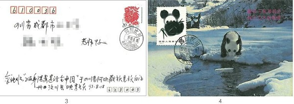
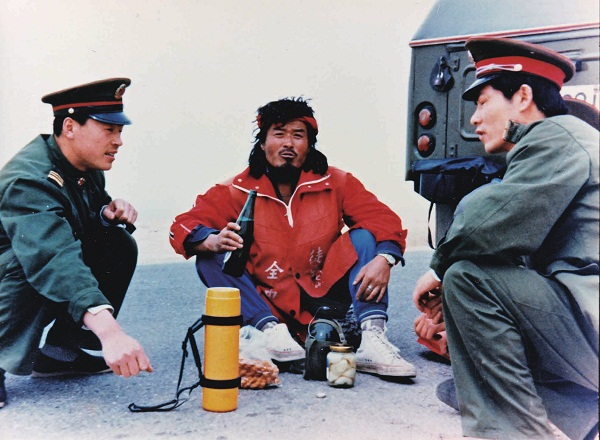
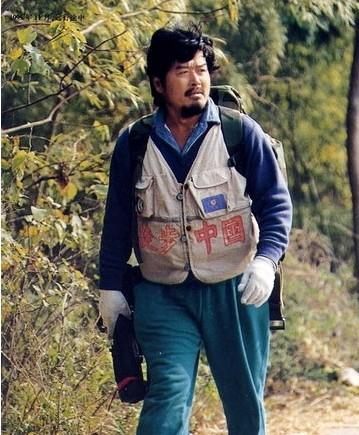

0613余纯顺

21年前的今天，第一个徒步征服西藏的孤胆英雄余纯顺不幸遇难

余纯顺（1951年12月1日－1996年6月13日），上海人，中国探险家。

一个坐了10年牢的小偷，一个在街边修伞的工人，与妻子离弃后，孤苦地离家出走。开始了“孤身徒步走访全中国”的宏伟计划。他踏遍23个省市自治区，行程达4万多公里，尤其他走过了川藏、青藏、滇藏、新藏、中尼5条天险公路。他创造了人类历史上第一个孤身徒步考察完“世界第三级”西藏的奇迹。

1996年6月13日，在穿越新疆罗布泊时，不幸遇难。他的事迹轰动全国，激励了无数男女青年踏上了旅行之路。值得一提的是，在16年前的1980年6月17日，彭加木在罗布泊失踪，也曾轰动一时。

（余纯顺在藏北高原）

被关了10年的小偷

1951年12月1日，余纯顺出生于上海，父母都是工厂工人。6岁那年，余纯顺母亲突患精神分裂症；10岁那年，比他大1岁的姐姐也患上了精神分裂症。15岁时，余纯顺因偷窃被抓捕。文化大革命时，他被分配到安徽一个农场10年，期间认识了一些被打为右派的人，介绍他读文学方面的书，他最喜欢的是美国作家杰克·伦敦（Jack London）的作品。

1979年（28岁），回到上海后，他先是在路边修雨伞，后顶替父亲进入工厂工作。经过努力，获得了上海教育学院的本科文凭。但在妻子产下死婴后，本来不太好的婚姻关系更加崩溃。

（1993年8月18，余纯顺抵达汶川）

孤身徒步的壮举

1988年7月1日（37岁），余纯顺挥手告别上海，从此踏上万里征程，“孤身徒步走访全中国”。他有一个宏伟的计划，打算用10年时间将中国55个少数民族聚居地走访一遍，并完成80项探险。他最终在8年里，完成了59项探险，去了33个少数民族聚居地。

1988年8月26日，抵达河北秦皇岛，参观了誉为“天下第一关”的万里长城山海关和老龙头。1989年2月25日，抵达黑龙江与乌苏里江汇合处的“乌苏镇”，中国的最东面。6月21日，徒步抵达黑龙江省漠河县漠河镇北极村。

（余纯顺在漠河）

征服西藏的奇迹

1991年4月12日（40岁），余纯顺应邀到成都20中学后，踏上了“走遍雪域西藏，访问藏族家园” 的万里征程。在一年半的时间，他的一双大脚走过了川藏、青藏、滇藏、新藏、中尼5条天险公路的全程，穿破57双鞋。

（“走遍西藏”在0公里处壮行）

余纯顺有多次临近死亡的经历。在阿里无人区，余纯顺忍受着高寒缺氧的考验，呼吸困难，脸色青紫，仍坚持背负30公斤重的行装，每天向前走，原先85公斤的体重降至60公斤，最后是边防军和游牧的藏民救了他。他创造了人类历史上第一个孤身徒步考察完“世界第三级”西藏的奇迹。

从此在8年里，余纯顺的足迹踏遍23个省市自治区，行程达4万多公里，发表游记40余万字，沿途拍摄照片8千余张，为沿途人们作了150余场题为“壮心献给父母之邦”的演讲。他每到一个地方，就会写日记，加盖邮戳纪念。

（余纯顺在西藏阿里无人区）

葬身罗布泊

1996年6月6日下午，余纯顺沿新疆的孔雀河北岸徒步向罗布泊出发。按原订计划，应该在6月12日到达172公里外的兵团农二师32团场。但他并未有按计划完成行程，6月18日，救援直升机发现了余纯顺的尸体，确认已死亡五天。值得一提的是，16年前的1980年6月17日，彭加木在罗布泊失踪也轰动一时。

在湖心岛丁字路转向时，本该转向正西，此处埋有饮水、干粮，但他却走向了东南，最后倒在丁字路口东南1.3公里处。死前他用藏刀挖出两个约一米深的大坑，似乎是在找寻水源，身旁放了半袋牛肉干，葬于罗布泊湖心。

在《关于对余纯顺尸体检验报告》中，结论为：“……余纯顺的死因，系在高温环境下缺水而引起急性脱水，全身衰竭而死亡。”解剖后：“胃内未见食物残留及胃液，胃粘膜有小片状褐色出血。”这说明，余纯顺自6月11日早饭后只补充了少量的水，而没有补充任何食物。

一年后，为摄制纪录片到达余纯顺墓地，发现他的墓已被盗。

男女青年的榜样

余纯顺是一个十分看重名声的人，也许这同长期受到歧视和压抑有关，他太想出人头地了。他想体面地生活，想改变自己的命运。但自学考到大学也没人用他，妻子又同他离了婚，自卑到了极点。他想通过非常的举动，非凡意志力来证明他作为男子汉的存在价值。

余纯顺长长的胡须，红而发亮的脸膛，说话坦率流畅而富有激情。他似乎有一种天生的征服欲望，是有史以来第一个走遍西藏的人，非常了不起。也许余纯顺多次死里逃生使他变得过于自信，以至于夸大了一个人的生存能力。

余纯顺是一位诚实的旅行家，走了8.4万里，没有一点虚头，他的脚从41码变成43码就是最好的见证。他作为旅行探险家，当之无愧。他的事迹轰动全国，激励了无数男女青年踏上了旅行之路。

（余纯顺与中学生）