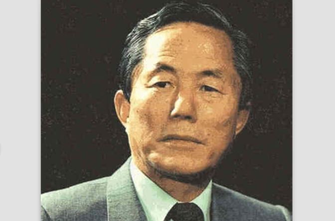
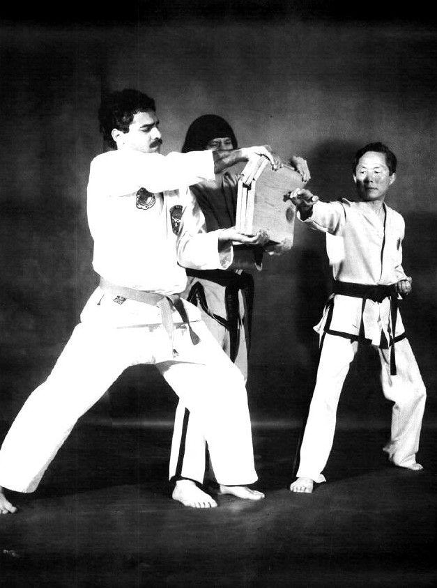
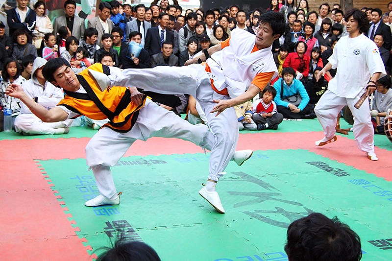
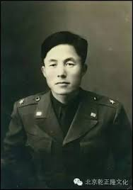
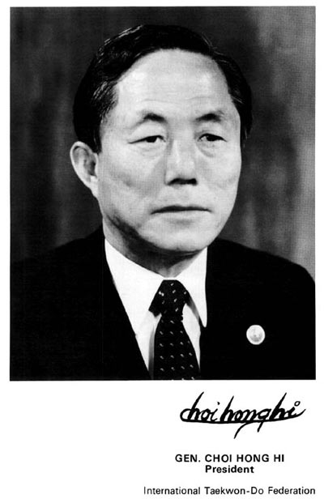

0615崔泓熙

15年前的今天，2002年6月15日，统一韩国武术，创建跆拳道的崔泓熙将军逝世

崔泓熙（최홍희，1918年11月9日－2002年6月15日），跆拳道创始人，也是韩国军队的创始人之一。

他创建了跆拳道，统一韩国武术界，在韩国军队中普及，并逐渐推广到东南亚和全世界。成立国际跆拳道联盟（ITF），任总裁。跆拳道融合了韩国的哲学思想和历史文化。

后因政见不合被逐出韩国。韩国另建世界跆拳道联盟（WTF），为国际奥委会成员。在WTF的宣传里，跆拳道的历史中没有提及崔泓熙。他病逝后，要求在棺木上只刻三个字：跆拳道。

韩国和日本的武术

1918年11月9日，崔泓熙生于今天朝鲜咸镜北道的一个小村庄里。小时候，跟随一位老师学习书法，老师同时精通朝鲜古典武术跆跟，时常教崔泓熙武术，助其增强体质。跆跟，古称脚戏，是朝鲜半岛古代的一种传统武术。跆跟以腿脚为主，注重利用对方弱点或借对方之力反击并使其摔倒，是一种柔中带刚的武艺。

1937年（19岁），崔泓熙赴日求学，在日本中央大学学习。期间，学习空手道，获得了松涛馆空手道二段段位。1943年（25岁），崔泓熙被编入日军前往平壤守卫。不久因策划暴动，事败被捕。1945年6月，被判服刑7年。仅仅入狱两个月，日军战败投降，8月16日，崔泓熙重获自由，前往汉城（首尔）组织学生兵团。

（朝鲜古典武术跆跟）

在军队中普及

1946年2月（28岁），从军事英语学校（今大韩民国陆军士官学校）毕业，崔泓熙作为韩国国军的创建者之一获少尉军衔，并开始在军队中教授武术。1949年，升为大校，赴美国陆军综合学校高等军事班学习，后因朝鲜战争回到韩国。

1953年（35岁），崔泓熙创设了29师团，在全军普及武术。1954年，升为少将，创建了名为吾道馆的唐手道武馆，也任韩国有名的武馆青道馆的名誉馆长。

创建跆拳道

1955年4月11日（37岁），在朝鲜民族武术的名称制定委员会上，跆拳道名称获得通过，自此韩国国内的各种武术得到统一。其中“跆”指踢击、“拳”指拳击，“道”则是代表道行、对礼仪的修练。

1959年（41岁），成立了大韩跆拳道协会，崔泓熙任会长。从此，他开始了普及跆拳道的事业。3月，崔泓熙将军带领韩国国军跆拳道队前往越南与台湾巡回表演，这是跆拳道第一次走出韩国本土。台湾媒体称之为劈掌术。

（大韩跆拳道创立时留影）

跆拳道的国际化

1961年（43岁），朴正熙发动军事政变上台。崔泓熙任首任驻马来西亚大使，借此机会进一步推广跆拳道运动到东南亚地区。

1963年（45岁），跆拳道最后一式“统一”正式完成。（即现今ITF所沿用）经多次挑选后，崔泓熙终于选定二十四式特尔（即套路）作为跆拳道的代表及考试套路，特尔名称反映了朝鲜的历史和文化，如重根是刺杀日本首相的安重根；忠武是打败丰臣秀吉侵略军的李舜臣将军的雅号。

1965年（47岁），崔泓熙率领韩国政府的跆拳道代表团，访问了德国，意大利，土耳其，埃及，马来自亚和新加坡，帮助各国成立跆拳道协会。

1966年3月22日，由韩国，越南，马来西亚，新加坡，德国，美国，土耳其，意大利，埃及的九个协会在首尔正式成立了国际跆拳道联盟(ITF)，崔泓熙被选为总裁。跆拳道运动进一步国际化。

政治斗争的跆拳道

1972年（54岁），由于与朴正熙总统政见不合，崔泓熙离开韩国，流亡加拿大直至辞世。1973年，韩国重新建立了世界跆拳道联盟（WTF），金云龙任总裁。WTF以官方的正式身份加入国际奥委会。在WTF的宣传里，跆拳道的历史中没有提及崔泓熙。

2002年（84岁），崔泓熙因胃癌在平壤动了手术。2002年6月15日，崔泓熙因胃癌晚期病逝，葬于平壤爱国者烈士陵园。临终前，他希望在自己的棺木上只写下“跆拳道”这三个字。遗言也很简短——“在离开这个世界前，能够做完想做的事情，这样的人是最幸福的！”

近乎宗教的跆拳道

外人会认为跆拳道近乎宗教而多于武术。最能反映跆拳道哲学的，包括跆拳道誓章及跆拳道精神。

跆拳道誓章：
I shall observe the tenets of Taekwon-Do. 我应当遵守跆拳道精神。
I shall respect the instructor and seniors. 我应当尊重师长和前辈。
I shall never misuse Taekwon-Do. 我绝不滥用跆拳道。
I shall be a champion of freedom and justice. 我应当成为自由与公平的倡导者。
I shall build a more peaceful world. 我应使世界更和平。

跆拳道精神：
一礼义、二廉耻、三忍耐、四克己、五百折不屈。

