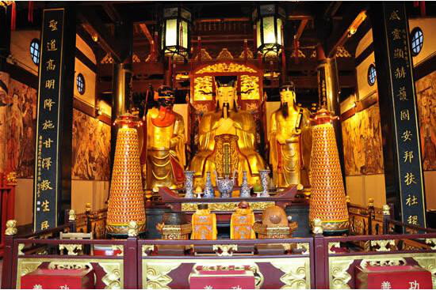
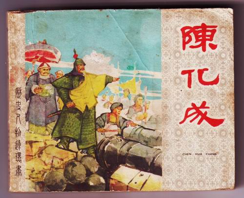
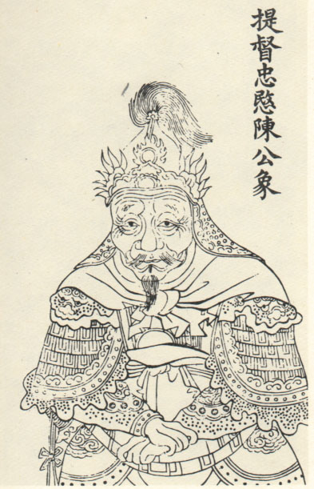
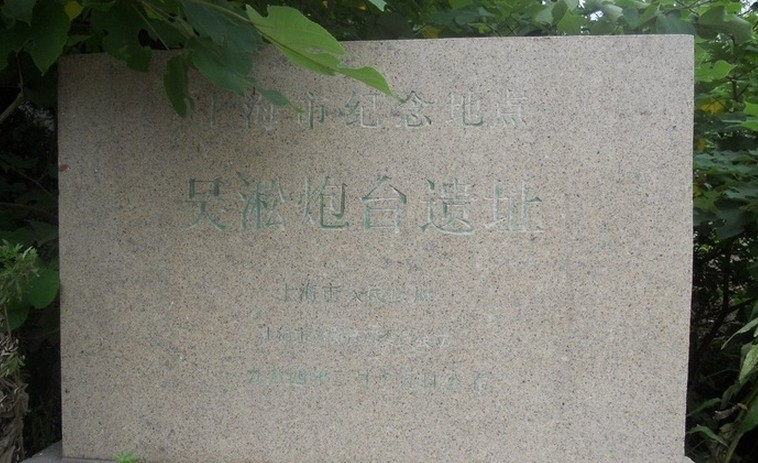
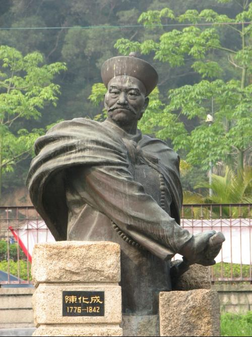
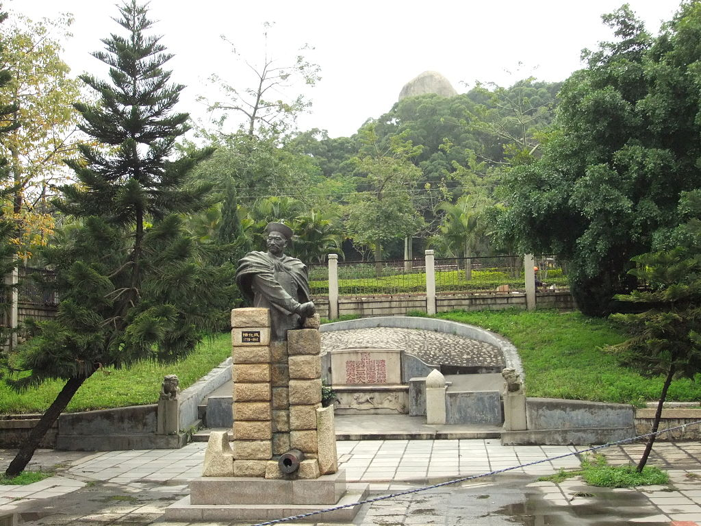

175年前的今天，江南提督、民族英雄陈化成在鸦片战争中牺牲。

万象特约作者：一一

陈化成（1776年－1842年6月16日），生于福建同安（今福建厦门），清朝高阶军官，曾任台湾总兵、福建水师提督、江南提督等要职。

鸦片战争爆发后，英军攻打吴淞炮台，66岁的陈化成拒绝议和主张，坚守炮台，不做逃兵，后中弹牺牲，被视为民族英雄。上海人将其供奉在城隍庙中，成为三大城隍之一。

军旗手

1776年，陈化成生于福建同安（今福建厦门）。早年父母双亡，幼年移居台湾，于淡水厅兴直一带（今台北新庄）一带成长。后入行伍，勇敢战斗多年，历任把总、千总、参将、副将、总兵等职，一路擢升至金门总兵。

据说，陈化成因身高在军中担任军旗手。一日，清军与匪兵交战失利，正等候援军。陈化成突然发现别在腰间的草鞋不见了，急忙回去找。清军见军旗奔向前线，以为援军已到，士气大振，人人冒死前进，大获全胜。

江南提督

1830年（54岁），任福建水师提督，驻守厦门，在闽浙总督邓廷桢的支持下多次击退来犯的英国舰队。

1840年（64岁），调任江南提督，这时第一次鸦片战争已经爆发，陈化成在两江总督裕谦支持下，完善了位于长江和黄浦江江口吴淞炮台的防御措施，誓死保卫长江水道。1841年，英军占浙江舟山定海，裕谦、葛云飞等牺牲。

吴淞炮台战死殉国

吴淞炮台经过整修加强兵力部署后，当时驻扎于吴淞镇和宝山县的总兵力在5000人左右。沿吴淞镇至宝山县，长达七里左右的堤岸上，大炮总计154门守军1300人，此处称之为西炮台。由江南提督陈化成亲自坐镇。另外东炮台阵地，有守军1000人和大炮50门；宝山县城作为后方阵地，由两江总督牛鉴领2000余人驻守，并配备大炮50多门。

1842年6月13日，英军由鸡骨礁抵达吴淞口外长江江面，双方进入临战状态。6月16日晨6时，英军发动进攻信号，康华丽号等三艘军舰按原计划驶抵西炮台附近水域，结果遭到陈化成守备的西炮台的阻击。这场炮战持续了4个小时，康华丽号被击中多次，死伤20余人。英军军舰暂时撤退调整。

当西炮台展开炮战时，4艘轻型英军舰船突破吴淞口，向吴淞镇附近进行炮击，当时吴淞镇附近的炮台仅有10门大炮，难敌英军火力。不久，英军陆军登陆，占领吴淞，并从侧后方陆路向西炮台进军。西炮台孤立无援，已经处于英军四面包围的境地。

在此情形下，西炮台也出现了兵士逃跑的现象，陈化成一边指挥炮战，一面阻止逃兵。但逃走现象愈演愈烈，最终只剩80余人坚守西炮台。最终，陈化成等人战死殉国。

上海三大城隍之一

陈化成在吴淞炮台阵亡后，安徽武进士刘国标将其遗体抢出藏于芦苇荡中。8天后，将陈化成遗体寻出运往嘉定县城，嘉定县令为陈化成拭去血污，并按遗容绘制遗像，灵柩随后运回福建。

1937年，抗日战争爆发后，上海老百姓将当年抗击英军侵略、战死于吴淞炮台的民族英雄陈化成将军的神像抬进城隍庙，加以供奉，希望他能保佑上海一方平安。陈化成得以与霍光、秦裕伯合称为“上海三大城隍”。上海宝山区有陈化成纪念馆和化成路，松江区有陈化成祠。在福建厦门金榜山，有陈化成墓。

