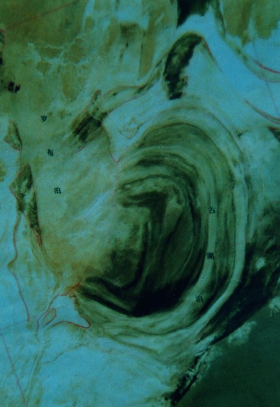
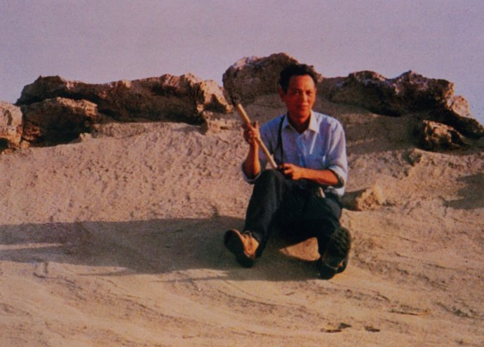
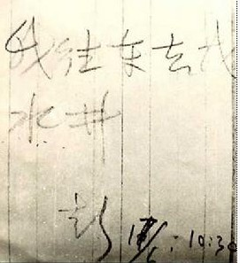
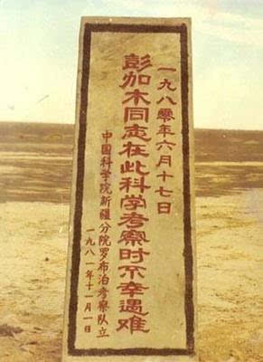

0617彭加木

37年前的今天，三次进入原子弹爆炸区域罗布泊的彭加木离奇失踪

彭加木（1925——1980年6月17日（失踪）），从事植物病毒研究及防治工作的科学家。

在中国第一颗原子弹在罗布泊爆炸成功前，他曾进入罗布泊地区进行科学考察。15年后，因电视节目再次进入。半年后，第三次进入，由北向南纵贯450公里干涸的湖底，却留下“我往东去找水井”的纸条后，一去不返。

消息传出后，引起了全国人民关注，国家主席华国锋发出批示，要求空军配合搜寻。然而，官方和民间的多次寻找，结果都是一无所获。他早年曾说：“我准备用自己的骨头，让新疆的土壤多添一点有机质。”一语成谶。对他的失踪，全国曾风传过各种说法和猜测，成为谜团。

植物病毒科学家

1925年，彭加木生于广东番禺。1947年（22岁），在南京国立中央大学农学院毕业后，到北京大学农学院任教，专攻农业化学。1949年，新中国成立后，在中国科学院生理生化研究所助理员、助理研究员。1954年（29岁），加入中国共产党。

20世纪50年代开始，彭加木参加科学院综合考察委员会的工作，十余次进入新疆协助建立科研基地，后筹建中国科学院新疆分院，为新疆的研究起到巨大的推动。1961年（36岁），任中国科学院上海生物化学研究所副研究员、研究员。1979年（54岁），兼任中国科学院新疆分院院长。主要从事植物病毒研究及防治工作。

（1956年彭加木（左）在罗布泊南部考察米兰和流域）

原子弹和罗布泊

1964年3月5日─3月30日（39岁）， 彭加木和几个科学工作者环绕罗布泊一周，采集了水样和矿物标本，对当时流入罗布泊的三条河流（塔里木河、孔雀河、车尔臣河）河水中的钾含量做了初步的研究，认为罗布泊是块宝地，可能有重水等资源。

1964年10月16日，中国第一颗原子弹在罗布泊爆炸成功，楼兰成为军事禁区。

（罗布泊全景的卫星照片）

再次进入罗布泊

15年后，彭加木再次进入罗布泊。1979年11月15日和12月20日，经国务院批准，中日两国电视台组成《丝绸之路》摄制组，到罗布泊实地拍摄，聘请彭加木为顾问，先期到罗布泊进行了细致的科学考察。

他说：“我彭加木具有从荒野中踏出一条路来的勇气，我要为祖国和人民夺回对罗布泊的发言权”。此行取得了许多骄人的科研成果，为国家寻找到了许多稀有的宝藏。这次科学考察发掘填补了我国一些重大科研领域的空白，纠正了外国探险者的一些谬误。

（彭加木帮维吾尔族大爷劈柴）

三入罗布泊

仅仅半年后，1980年5月8日至6月17日，彭加木任中国罗布泊科学考察队长，第三次进入罗布泊。6月5日，考察队在彭加木的率领下，由北向南纵贯450公里干涸的湖底，终于按计划到达本次考察的终点——米兰。这是考察队首次纵贯罗布泊湖底。

6月11日，考察队在米兰农场小憩后，准备沿古丝绸之路南线再次横贯罗布泊地区，然后取道敦煌去乌鲁木齐，以结束这次两个多月的野外考察工作。

（彭加木在罗布泊南部）

离奇失踪

6月16日下午2时许，考察队来到库木库都克以西8公里处。此时，车上所带的汽油和水都几乎耗尽，按计划，还有400公里路程。晚上，开会决定，向当地驻军发电求援。彭加木亲自起草了电报稿：“我们缺水和油，剩下的水和油只能维持到明天。” 

6月17日，彭加木留下字条：“我往东去找水井。彭。6月17日10时30分。”从此一去不回，离奇失踪。他早年曾说：“我准备用自己的骨头，让新疆的土壤多添一点有机质。”一语成谶。

（彭加木最后的字条）

徒劳无功的搜寻

6月18日下午6点，中国科学院新疆分院得到了彭加木失踪的消息。立刻连夜赶往马兰基地，组织救援。从6月18日到6月21日，由基地派出直升飞机，配合地面考察队搜寻，可经过四天紧张的寻找，结果没有发现任何踪迹。

6月22日到6月30日，9天时间出动10架直升飞机继续对疏勒河故道进行深入细致地寻找。与此同时，又组建了一支由28人组成的地面寻找分队，开赴出事地点。

6月23日，全国各大报纸广播发了新华社记者赵全章从马兰基地发出的消息，引起了国内外的震惊。党和国家主席华国锋发出批示：“方毅、李昌同志：彭加木同志失踪尚未找到，他们要求中央下令派出飞机十五架次，此事请和新疆取得联系并和总参、空军研究如何派出飞机配合地面搜找。华国锋	6月23日”

7月初，第三次更大规模的寻找又开始了。在前后一个多月的大规模的寻找中，人们对库木库都克东西长二百公里，南北宽二十到三十公里的地方，进行了寻找，有些重点的可疑地区还进行了反复多次的寻找。结果依然一无所获。

（彭加木纪念碑处，妻子的亲笔信）

风传猜测的失踪之谜

1981年11月，中国科学院新疆分院专门为彭加木组织了一场隆重的祭奠活动，人们再次来到了彭加木出事的地点，把一块石碑立在了那里，上书“中国科学院新疆分院副院长彭加木同志遇难地。”

之后，有多次发现怀疑是彭加木的干尸，但最终确认并非他本人。对他的失踪，全国曾风传过各种说法和猜测。常见的有以下各种：

第一种：被外星人接走
第二种：被双鱼玉佩复制后政府为封锁消息而宣布其失踪
第三种：被直升机接到原苏联
第四种：逃往美国
第五种：被与彭加木有分歧的同行人员杀害
第六种：迷失方向找不到宿营地
第七种：被突然坍塌的雅丹地貌砸住
第八种：被狼群吃掉
第九种：不幸陷入沼泽被吞没
第十种：芦苇包中躲避炎热晕倒，风沙掩埋

