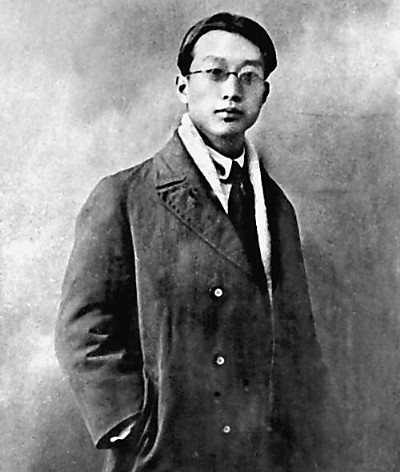

（万象特约作者：一一）

82年前的今天，1935年6月18日，第一个翻译《国际歌》、认为中国的豆腐世界第一的革命家瞿秋白牺牲

瞿秋白（1899年1月29日－1935年6月18日），生于江苏常州。他曾两度担任中国共产党实际最高领导人（1927年7月—1928年7月；1930年9月—1931年1月），是中国共产党早期领袖和缔造者之一。

他的俄语水平在当时数一数二的，因此被派到莫斯科，曾担任陈独秀的翻译，第一个把《国际歌》翻译成中文。陈独秀停职后，他一跃成为中国共产党的最高领导人。

红军长征时，多次要求参加长征，最终被留守根据地，不久被捕，身份泄露。狱中写下《多余的话》说：他只是一个半吊子的文人，参与政治运动，乃至成为中国共产党的领袖完全是一个“历史的误会”。还说：“中国的豆腐也是很好吃的东西，世界第一，永别了!"

（1935年6月18日，在福建长汀准备就义的瞿秋白）

母亲自杀的青少年

1899年1月29日，瞿秋白生于江苏常州，祖籍江苏宜兴。由于瞿秋白头发生有双旋，小名阿双。10岁时，考入常州府中学堂（现江苏省常州高级中学）。辛亥革命后，瞿秋白家陷入经济困境，被迫搬到瞿氏宗祠居住，靠典当、借债度日。

1915年冬（16岁），因交不起学费，瞿秋白被迫辍学。1916年2月7日，母亲金璇用了半瓶虎骨酒吞服了剥好的火柴头丸自尽。瞿秋白含悲写下了一首七绝《哭母》：亲到贫时不算亲，蓝衫添得泪痕新。饥寒此日无人管，落上灵前爱子身。

瞿母死后，瞿父借了100多元买了一口棺材，又因无钱安葬，暂时寄存在当地瞿氏宗祠里。十几年后，棺材被搬到常州城东郊乱坟堆中草草地掩埋了。直到1962年，瞿秋白的夫人杨之华拿出300元作为经费，在常州市人民政府的主持下，才将瞿母迁到常州西郊公墓，墓碑上刻着“瞿秋白烈士母亲金夫人之墓”。

（瞿秋白故居）

五四运动的学生领袖

1917年春（18岁），堂兄瞿纯白调外交部任职，瞿秋白也随同北上到北京，参加普通文官考试未被考取。随后，在北京大学旁听。同年9月，考入外交部办的俄文专修馆（免费入学），学习俄文。

1919年5月4日（20岁），五四运动爆发后，他以极大的热情投入北京爱国学生运动，被选为专修馆学生总代表，参加了北京大中学校学生联合会，成为北京学生爱国运动的领导人之一。8月，参加了中南海总统府前抗议马良祸鲁的请愿活动，遭到逮捕，旋即被释放。1920年初，参加了李大钊、张崧年发起的马克思主义研究会。

莫斯科生涯

1920年8月（21岁），瞿秋白被北京《晨报》和上海《时事新报》聘为特约通讯员抵达莫斯科。在苏俄两年时间里，他先后撰写了《共产主义人间化》、《苏维埃俄罗斯经济问题》等数十篇通讯和《俄乡纪程》、《赤都心史》等著作，以自己的亲见亲闻，客观介绍俄国十月革命后苏俄的真实情况。他是最早向中国描绘列宁形象的人，也是中国记者中唯一与列宁交谈过的人。

1921年秋（22岁），东方大学开办中国班，瞿秋白进入该校任翻译和助教，开始接触马克思主义的理论书籍。1922年2月，瞿秋白由同乡张太雷介绍加入中国共产党。1922年底，陈独秀代表中国共产党到莫斯科，瞿秋白担任他的翻译。1923年6月15日，第一个把《国际歌》翻译成中文。

（1922年陈独秀、瞿秋白等在共产国际四大）

最高领导人

1927年7月12日（28岁），陈独秀被停职，由张国焘临时代理主持中央工作。8月7日，新来到的共产国际代表罗明纳兹主持召开会议（八七会议），正式将陈独秀（缺席）免职，并指定瞿秋白担任临时中央政治局常委，并主持中央工作。他成为继陈独秀之后，中国共产党第二任最高领导人。

瞿秋白的领导方式与作风强势的陈独秀不同，只发表一般政治主张，对组织和军事完全放权。在此次会议中，确立了土地革命和武装反抗中国国民党政府的总方针。在瞿秋白主持中央政治局的近一年期间（1927年8月-1928年5月），策划了三次暴动，1927年11月11日的武汉暴动、12月10日的长沙暴动、12月11日的广州暴动，均以失败告终。

被解除中央领导

1928年（29岁），瞿秋白从上海经海路抵达大连，又改乘火车沿中东铁路北上，通过满洲里的秘密通道出境进入苏联。6月，瞿秋白在莫斯科郊外召开中共六大。“六大”之后，瞿秋白继续留在莫斯科，担任中共驻共产国际的代表团团长。这两年内，国内的实际领导人是李立三和向忠发。

1930年（31岁），瞿秋白携妻子离开苏联回国。在9月底，召开六届三中全会，批判“立三路线”。但由于瞿秋白“没有认出立三路线和国际路线的根本不同”，对立三路线的批判不够彻底。12月，共产国际在莫斯科举行会议，点名批评了瞿秋白。

1931年1月7日（32岁），共产国际代表米夫及王明等人主持在上海召开的中共六届四中全会，将瞿秋白定为“左”倾教条主义者，不仅开除了李立三的中央委员，瞿秋白也被解除中央领导职务，不再担任中央政治局委员。此后瞿秋白到上海养病（肺结核），进行文艺创作和翻译，与茅盾、鲁迅并肩战斗，结下深厚友谊，一起领导左翼文化运动。

（瞿秋白家庭照，1929年摄于莫斯科）

留守根据地被捕就义

1934年，瞿秋白离开上海抵达瑞金，任中华苏维埃共和国中央执委会委员、人民教育委员会委员、中华苏维埃共和国中央政府教育部部长等职。红军长征前夕，瞿秋白再三请求参加长征，但最终中央决定把他留下。中央苏区陷落后，1935年2月24日，在福建省长汀县水口镇被国民政府军逮捕。

在被押期间，瞿秋白写下了《多余的话》，表达其由文人从政曲折的心路历程。他只是一个半吊子的文人，参与政治运动，乃至成为中国共产党的领袖完全是一个“历史的误会”。《多余的话》的结尾戏剧性的说到：“中国的豆腐也是很好吃的东西，世界第一，永别了!"。

蒋介石见多次劝降不成，即下令处决瞿秋白。瞿秋白写下了绝笔诗：“夕阳明灭乱山中，落叶寒泉听不穷；已忍伶俜十年事，心持半偈万缘空。”

1935年6月18日，负责羁押瞿秋白的国民党军第三十六师师长宋希濂，是瞿秋白在上海大学任教时的学生，为表示对老师的尊重，宋希濂送瞿秋白出监房到中山公园凉亭前拍照。随后，瞿秋白从容就义，年仅36岁，遗骸被埋葬在罗汉岭盘龙岗。

