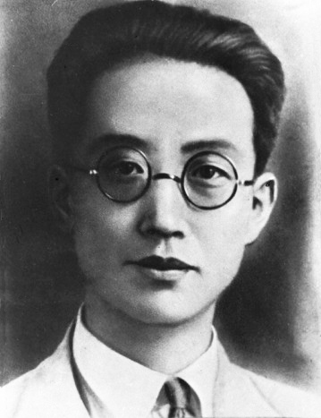

82年前的今天，第一个翻译《国际歌》、认为中国的豆腐世界第一的革命家瞿秋白牺牲

万象特约作者：一一

瞿秋白（1899年1月29日－1935年6月18日），原名双（或霜、爽），号熊伯（或雄魄），生于江苏常州，散文作家，文学评论家。他曾两度担任中国共产党实际最高领导人（1927年7月—1928年7月；1930年9月—1931年1月），是中国共产党早期领袖和缔造者之一。1935年在福建长汀被南京国民政府逮捕并枪决。江苏常州现有瞿秋白纪念馆。

瞿秋白的杂文锐利而有才气，俄语水平更是当时数一数二的。他翻译了许多俄语文学、政治著作，并于1923年6月15日第一个把《国际歌》翻译成中文。瞿秋白作为一个典型的文人参与到政治中去，遭到排挤冷落直至牺牲，这被人们视作一个悲剧。其曲折的心路历程在《多余的话》中有着真诚的表达。根据他临终前的自述，他只是一个半吊子的文人，参与政治运动，乃至成为中国共产党的领袖完全是一个“历史的误会”。《多余的话》的结尾戏剧性的说到：“中国的豆腐也是很好吃的东西，世界第一，永别了!"。

瞿秋白与鲁迅有着很深的交往。瞿秋白曾到鲁迅家中避难，鲁迅把瞿看作知己，曾写过“人生得一知已足矣，斯世当以同怀视之”一联赠予。瞿秋白也写过 《〈鲁迅杂感选集〉序言》，对鲁迅的杂文创作作了中肯的评价。瞿秋白被捕后鲁迅曾想方设法委托人营救。瞿被处决后，鲁迅叹息良久，说过：“瞿若不死，译这种书（指《死魂灵》）是极相宜的，即此一端，即是判杀人者为罪大恶极”，并带病编校了瞿的遗著《海上述林》。此外瞿秋白还留有《赤都心史》、《俄乡纪程》等著作。

母贫自杀

瞿秋白祖籍江苏宜兴，1899年1月29日下午18时，生于江苏省常州府城内东南角的青果巷（今82号）一座名为八桂堂的花园住宅内的天香楼二楼（今瞿秋白故居）。
瞿家是一个书香门第，世代为官，由于瞿秋白头发上生有双旋，父母为其取名双（或同音字霜、爽）、小名阿双、霜。
1909年春天，10岁的瞿秋白考入常州府中学堂（现江苏省常州高级中学）。辛亥革命后，瞿秋白的伯父瞿世琥停止了对瞿秋白一家的资助。于是瞿秋白家陷入经济困境，被迫搬到城西庙沿汀瞿氏宗祠居住，靠典当、借债度日。

1915年冬，因交不起学费，瞿秋白被迫辍学。

1916年2月7日（农历正月初五），母亲金璇用了半瓶虎骨酒吞服了剥好的火柴头丸自尽。床头，整齐地摆放着各种借据、欠账、当票，她平时爱读的书籍和手迹。还有前一夜为小儿子精心赶制的一顶狗头帽，上面缝钉了福、禄、寿、喜4个银铸的字。瞿母死后，瞿父借了100多元买了一口棺材，又因无钱安葬，暂时寄存在当地瞿氏宗祠里。瞿秋白含悲写下了一首七绝《哭母》：亲到贫时不算亲，蓝衫添得泪痕新。饥寒此日无人管，落上灵前爱子身。十几年后，棺材被搬到常州城东郊乱坟堆中草草地掩埋了。直到1962年，瞿秋白的夫人杨之华从《瞿秋白文集》稿费中拿出300元作为经费，在常州市人民政府的主持下，才将瞿母迁到常州西郊公墓，墓碑上刻着“瞿秋白烈士母亲金夫人之墓”。

莫斯科生涯
1917年春，堂兄瞿纯白调外交部任职，瞿秋白也随同北上到北京，参加普通文官考试未被考取。随后，在北京大学旁听。同年9月，考入外交部办的俄文专修馆（免费入学），学习俄文。
1919年5月4日，五四运动爆发后，他以极大的热情投入北京爱国学生运动，被选为专修馆学生总代表，参加了北京大中学校学生联合会，成为北京学生爱国运动的领导人之一。8月参加了中南海总统府前抗议马良祸鲁的请愿活动，遭到逮捕，旋即被释放。1920年初参加了李大钊、张崧年发起的马克思主义研究会。

1920年8月，瞿秋白被北京《晨报》和上海《时事新报》聘为特约通讯员到莫斯科采访，想“为大家辟一条光明的路”。在苏俄两年时间里，他作了大量考察、采访和写作，先后撰写了《共产主义人间化》、《苏维埃俄罗斯经济问题》等数十篇通讯和《饿乡纪程》、《赤都心史》等著作，以自己的亲见亲闻，客观介绍俄国十月革命后苏俄的真实情况，告诉中国人民，十月革命是“二十世纪历史事业之第一步”，莫斯科已成为全世界无产阶级“心海中的灯塔。”产生了广泛的影响。是最早向中国描绘列宁形象的人，也是中国记者中唯一与列宁交谈过的人。
1921年秋，东方大学开办中国班，瞿秋白作为当时莫斯科仅有的翻译，进入该校任翻译和助教，开始接触马克思主义的理论书籍。
1922年2月，瞿秋白在莫斯科由同乡张太雷介绍加入中国共产党。1922年底，陈独秀代表中国共产党到莫斯科，瞿秋白担任他的翻译。

最早领导人

1927年7月12日，陈独秀被停职，由张国焘临时代理主持中央工作。8月7日，新来到的共产国际代表罗明纳兹主持召开会议（八七会议），正式将陈独秀（缺席）免职，并指定瞿秋白担任临时中央政治局常委，并主持中央工作，成为继陈独秀之后，中国共产党第二任最高领导人。瞿秋白的领导方式与作风强势的陈独秀不同，只发表一般政治主张，对组织和军事完全放权。在此次会议中，确立了土地革命和武装反抗中国国民党政府的总方针。在瞿秋白主持中央政治局的近一年期间（1927年8月-1928年5月），策划了三次暴动，1927年11月11日的武汉暴动、12月10日的长沙暴动、12月11日的广州暴动，均以失败告终。

1928年4月，瞿秋白从上海经海路抵达大连，又改乘火车沿中东铁路北上，通过满洲里的秘密通道出境进入苏联。5月中旬，瞿秋白抵达莫斯科。6月，瞿秋白在莫斯科郊外的兹维尼果罗德镇主持召开中共六大，“六大”之后，瞿秋白继续留在莫斯科，担任中共驻共产国际的代表团团长两年时间，实际在国内直接领导中共的是李立三和向忠发。
在莫斯科中山大学内，校长米夫，以及追随米夫的王明等人说中山大学有一个由俞秀松、董亦湘、周达文等人组织的“江浙同乡会”，是托洛茨基同伙的一个小组织，因此有学生被捕、被开除。中共驻共产国际的代表团团长瞿秋白听取了学生意见，并到学生中间调查，最后认为中山大学不存在“江浙同乡会”。就这样，瞿秋白与米夫、王明等人之间的矛盾开始产生并慢慢激化。
1930年7月，瞿秋白由于立场调和，被当地的党部指为机会主义和异己分子的庇护者，撤销了中国共产党驻莫斯科代表的职务，携妻子离开苏联回国，8月中旬回到上海，主要任务是在9月底召开六届三中全会，批判“立三路线”。但由于瞿秋白“没有认出立三路线和国际路线的根本不同”，对立三路线的批判不够彻底。1930年12月，共产国际执行委员会主席团在莫斯科举行会议，会议上点名批评了瞿秋白。1931年1月7日，共产国际代表米夫及王明等人主持在上海召开的中共六届四中全会，将瞿秋白定为“左”倾教条主义者，不仅开除了李立三的中央委员，瞿秋白在被王明错误打击，也被解除中央领导职务，不再担任中央政治局委员。此后瞿秋白到了白色恐怖笼罩的上海养病（肺结核），进行文艺创作和翻译，与茅盾、鲁迅并肩战斗，结下深厚友谊，一起领导左翼文化运动。

最后生涯

1933年底，瞿秋白被要求离开上海去中央苏区。1934年2月5日抵达瑞金后，在中华苏维埃共和国人民委员会教育部视事，任中华苏维埃共和国中央执委会委员、人民教育委员会委员、中华苏维埃共和国中央政府教育部部长等职。
中央红军长征前夕，瞿秋白再三请求参加长征，但当时的中央决定把他留在即将沦陷的中央苏区。
1935年2月，在中央苏区陷落前夕，中央分局书记项英派便衣队100多人护送瞿秋白、何叔衡等不便打游击的人向闽西突围，想从那里再化装去上海。途中，他们遇国民党保安团截击，何叔衡壮烈牺牲，瞿秋白于1935年2月24日在福建省长汀县水口镇被国民政府军逮捕，因叛徒出卖瞿秋白的真实身份暴露，营救瞿秋白的计划彻底破灭。
在被押期间（5月23日），瞿秋白写下了《多余的话》，表达其由文人从政曲折的心路历程。蒋介石见多次劝降不成，即下令处决瞿秋白。
6月18日8时，国民党军第三十六师特务连连长走进囚室，向瞿秋白出示枪决命令。瞿秋白伏案挥笔写下了绝笔诗：
“	夕阳明灭乱山中，落叶寒泉听不穷；已忍伶俜十年事，心持半偈万缘空。	”
— 瞿秋白临刑前绝笔诗
瞿秋白一边写诗，一边镇静地对旁边的人说：“人生有小休息，有大休息，今后我要大休息了。”负责羁押瞿秋白的国民党军第三十六师师长宋希濂，是瞿秋白在上海大学任教时的学生。为表示对老师的尊重，宋希濂送瞿秋白出监房到中山公园凉亭前拍照，也就是现今见到的瞿秋白就义前的那幅珍贵的遗照：瞿秋白上身穿着黑色中式对襟衫，下身穿着白布抵膝短裤，黑线袜，黑布鞋，背着两手，昂首直立。宋希濂还为老师瞿秋白置办了酒席。据天津《大公报》报道：瞿秋白来到公园，“全园为之寂静，鸟雀停息呻吟。信步至亭前，已见菲菜四碟，美酒一瓮，彼独坐其上，自斟自饮，谈笑自若，神色无异”。
餐毕，瞿秋白走出中山公园，慢步走向二华里之外的长汀西门外罗汉岭下蛇王宫养济院右侧的刑场。沿途瞿秋白手挟香烟，缓缓而行，而且用俄语唱《国际歌》、《红军歌》，高呼“中国共产党万岁”，“中国革命胜利万岁”，“共产主义万岁”等口号。到达刑场后，瞿秋白盘膝坐在草坪上，对刽子手微笑点头说：“此地很好！”然后平静地让刽子手从脑后开枪。瞿秋白从容就义，年仅36岁，当日下午，瞿秋白遗骸被埋葬在罗汉岭盘龙岗。

