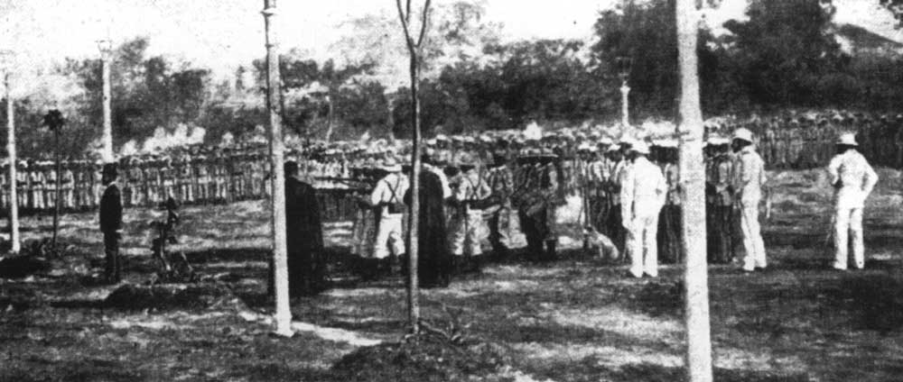

0619黎刹

156年前的今天，第一个菲律宾人，有中国血统的菲律宾国父黎刹出生

黎刹（西班牙语：Rizal，1861年6月19日－1896年12月30日）是菲律宾的民族英雄。华人，柯姓闽南人后裔。他的尊称有“马来人之骄”、“马来伟人”、“第一个菲律宾人”、“菲律宾国父”、“革命弥赛亚”、“万世英雄”和“救赎弥赛亚”等。

黎刹是一名眼科医生，宣传菲律宾脱离西班牙，组织非暴力的改革社团，后被捕流放4年。刚获释放，因国内武装起义爆发，受到牵连，在西班牙再次被捕，押回国后处决，年仅35岁。处决之日（12月30日），被今菲律宾政府定为国定假日：黎刹日。

2010年8月23日，在黎刹公园，来自香港的旅游巴士被劫持，事件持续12小时，导致15名人质中7名受伤、8名死亡，匪徒被击毙死亡。该事件一度造成，中国、香港与菲律宾关系紧张。

在菲律宾的华裔

1861年6月19日，黎刹出生于菲律宾内湖省卡兰巴镇。祖籍福建省晋江市罗山镇上郭村，祖上姓柯，爷爷的爷爷时已移居菲律宾。当时菲律宾是西班牙殖民地，黎刹是西班牙名Rizal的音译。

1875年，年仅14岁的黎刹获得文学学士学位，随后进入菲律宾圣道顿马士皇家教会大学（University of Santo Tomas），主修哲学，兼修美术。后因母患眼疾，黎刹改读医科。

（黎刹的父亲）

香港的眼科医生

1879年（18岁），黎刹发表爱国诗篇《给菲律宾青年》，此诗获全国诗歌比赛一等奖，被誉为“菲律宾青年诗人”。 1882年（21岁），黎刹赴欧洲加入共济会，在西班牙马德里康普顿斯大学、法国巴黎大学以及德国海德堡大学深造。1885年（24岁），他取得医学博士学位，并留校执教。

1887年（26岁），黎刹用西班牙文创作了《社会毒瘤》（也译做《不许犯我》）一书，揭露西班牙殖民统治的残酷真相。该书的续篇《起义者》也于1891年出版。1891年12月（30岁），黎刹抵达香港，当眼科医生，他与家人居住在列拿士地台门牌第二号。

（黎刹（厘沙路）医生在香港使用的名片）

小镇流放四年

1892年6月，黎刹回到菲律宾，建立一个非暴力的改革社团菲律宾联盟。仅一个月后，7月6日被捕，随后被流放到棉兰老岛的达必丹小镇（Dapitan），一个非常荒芜的小地方。

黎刹被捕后，菲律宾革命之父博尼法西奥秘密成立名为“卡蒂普南”的革命社团，目标是以武装革命的方式推翻西班牙统治，建立统一、独立的菲律宾。黎刹在那里流放了四年，帮助小镇建设学校、医院等设施。期间，在香港的爱尔兰裔未婚妻难产，孩子未能存活。

（宣传菲律宾运动的早期领袖，黎刹（左））

菲律宾万岁的暴力革命

1896年5月2日，卡蒂普南派人去见被流放的黎刹，希望得到黎刹的全力支持。然而黎刹不愿意发生流血事件，坚持应采取非暴力的方式。卡蒂普南派人访日，游说日本天皇支持，最后成功购买10万枝枪械和150门大炮。

1896年8月，卡蒂普南发动起义，口号“菲律宾万岁”和“不战胜毋宁死”。获释的黎刹，前往西班牙，准备转往古巴行医。菲律宾总督认为，黎刹是革命领袖，必须为菲律宾革命负责。

（卡蒂普南会员的佩刀）

刑场上的婚礼

10月3日，黎刹乘船抵巴塞罗那，马上变成阶下囚，并被押回马尼拉，囚禁在圣地亚哥堡。12月30日凌晨，西班牙当局以“非法结社和文字煽动叛乱”的罪名在马尼拉将黎刹处决。

临刑前，应未婚妻的要求，黎刹与她举行了刑场上的婚礼，最后写下绝命诗《永别了，我的祖国》。他的壮烈牺牲使菲律宾人意识到除了脱离西班牙独立外别无选择，随后爆发了菲律宾革命。

（黎刹的刑场照）

菲律宾的革命

1897年，卡蒂普南分为两派，互相内斗，被西班牙政府镇压。1898年4月，美西（美国西班牙）战争爆发，革命趁机再起。6月12日，革命军在甲米地发布《独立宣言》，宣告菲律宾独立。1899年1月，颁布宪法，建立了全亚洲第一个民主共和国，史称菲律宾第一共和国。

1899年初，西班牙退败，美军遂入驻马尼拉。随后，菲律宾第一共和国向美国宣战，美菲战争爆发。12月10日，美国获胜，取得了菲律宾统治权。1901年3月21日，菲律宾全境落入美军手中，革命覆灭。

（卡蒂普南革命者）

菲律宾国父

黎刹被认为是菲律宾的民族英雄。他的尊称有“马来人之骄”、“马来伟人”、“第一个菲律宾人”、“菲律宾国父”、“革命弥赛亚”、“万世英雄”和“救赎弥赛亚”等。12月30日，今菲律宾政府讲黎刹被处决的日子定为国定假日“黎刹日”。

在马尼拉的黎刹公园，是菲律宾举行官方仪式的重要场地；1946年的菲律宾独立庆典，2010年7月1日菲律宾总统阿基诺三世就职等重大活动都在此公园进行。

2010年8月23日，在黎刹公园，来自香港的旅游巴士被劫持，事件持续12小时，导致15名人质中7名受伤、8名死亡，匪徒被击毙死亡。该事件一度造成，中国、香港与菲律宾关系紧张。

（黎刹纪念碑）