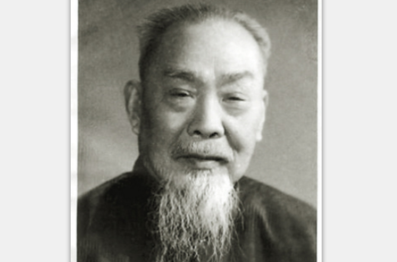
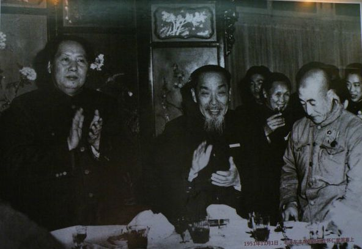

46年前，不当次长当校长的史学家陈垣逝世于北京

（万象特约作者：一一）

46年前的今天，当了45年北师大校长的国宝级史学家陈垣逝世

陈垣（1880年11月12日－1971年6月21日），广东新会人。中国宗教史研究巨匠，在宗教史、校勘学、考古学方面均有相当成就，与钱穆、吕思勉、陈寅恪并称为“现代四大史学家”。

从辅仁大学（今北京师范大学）起，一直担任校长直至死亡，长达45年。在国宴上，毛泽东向别人介绍说：“这是陈垣，读书很多，是我们国家的国宝。”

众议院议员

1880年11月12日，陈垣出生于广东省新会县石头乡，家里为药商。曾参加科举不中。1905年（25岁），在民主革命的影响下，与朋友在广州创办了《时事画报》，议论时政，鼓吹革命思想。

1911年（31岁），辛亥革命后，他又创办《震旦日报》，积极宣传反清。1913年（33岁），被选为国会众议院议员。后因政局混乱，潜心于治学和任教。

受洗基督教

他曾在一段时期内接触基督教，1917年，写成《元也里可温教考》。他认为，中国基督教初为唐代的景教，然后是元代的也里可温教、明代的天主教、清以后的耶稣教。所谓“也里可温”，是元代基督教的总称，元亡后就绝迹了。

1919年（39岁），在北京缸瓦市教堂受洗加入基督新教。1921年，出任中华民国教育部次长。此后，他又先后写成专著《开封一赐乐业教考》（1919）、《火祆教入中国考》（1922）、《摩尼教入中国考》（1923）。合称为“古教四考”，使陈垣登上史坛，走向世界。

45年的北师大校长

1926年（46岁），任辅仁大学校长（今北京师范大学），从此一直任校长直至去世，长达45年。1948年3月，当选中央研究院院士。他继续在宗教史、校勘学、考古学方面均有相当成就。

写成《回回教入中国史略》、《元西域人华化考》、《基督教入华史略》、《元典章校补释例》、《旧五代史辑本发覆》、《中国佛教典籍概论》、《中西回史日历》、《二十史朔闰表》、《史讳举例》等等。

陈垣没有受过正规的史学教育，全靠自己的勤奋，著作宏富，成就斐然。在中国宗教史、元史、中西交通史及历史文献学等领域的研究作出了开创性的贡献，成为世界闻名的史学大师。严耕望称，他与钱穆、吕思勉、陈寅恪并称为“现代四大史学家”。

国家的国宝

1949年1月31日，北平和平解放，陈垣与学生上街欢迎解放军入城，从兴化寺街5号步行到西直门，逾十多华里。5月11日，他在《人民日报》发表致胡适公开信，信中称：“虽然你和寅恪先生已经走了，但是青年的学生们却用行动告诉了我，他们在等待着光明。”

1950年12月8日，陈垣在《人民日报》发表文章《美国从来就是我们的敌人》响应三视教育运动，即“仇视”、“鄙视”及“蔑视”美帝国主义的政治思想教育运动。文章指出：“凡是‘崇美’的，是因为没有民族的自尊心。凡是‘恐美’的，是没有民族的自信心。”

1951年11月，全国政协一届三次会议后，毛泽东在怀仁堂举行国宴时，与陈垣同席。毛泽东向别人介绍说：“这是陈垣，读书很多，是我们国家的国宝。”

桃李满天下

1952年，他续任北京师范大学校长，与在中山大学的陈寅恪并称南北二陈。1959年（79岁），他加入中国共产党。文化大革命期间，赋闲在家。1971年（91岁），在家中逝世。

陈垣的学生有姚从吾、黄现璠、郑天挺、方国瑜、蔡尚思、邓广铭、单士元、柴德赓、白寿彝、牟润孙、赵光贤、陈述、启功、史念海、周祖谟、刘乃和、史树青等。

（陈垣校长和启功先生）