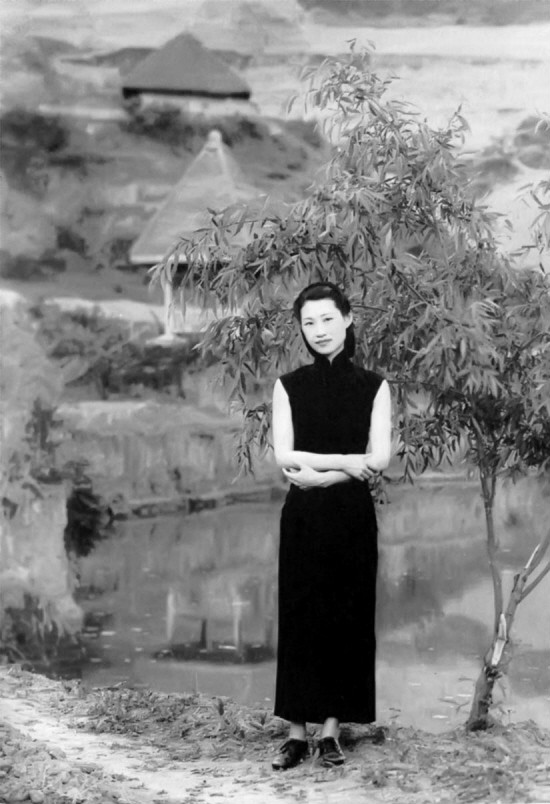
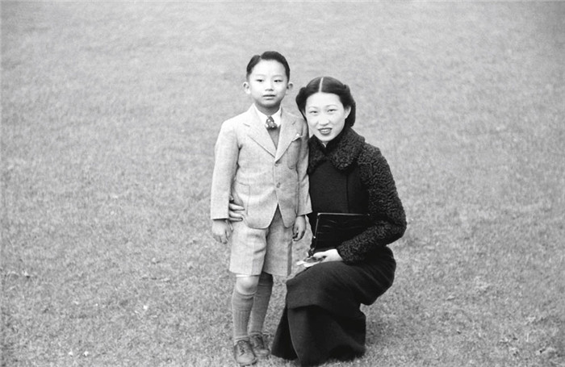
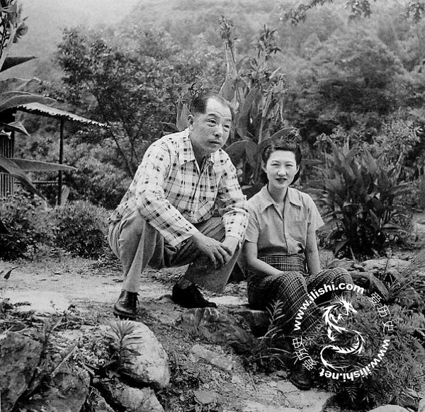

0622赵一荻

（万象特约作者：东西望）

17年前的今天，2000年6月22日，不要父亲也不要儿子，只要少帅的赵四小姐病逝

赵一荻（1912年5月28日－2000年6月22日）人称赵四小姐，又名绮霞。16岁私奔大11岁的少帅张学良，被父亲登报断绝父女关系，逐出家族。

成为张学良没有名分的私人秘书后，生下一子。张学良被幽禁后，毅然放弃年幼的儿子，前去陪伴。从此，两人一同被幽禁，到42岁时，有情人才终成眷属。88岁的赵四小姐去世后，第二年100岁的张学良追随而去。

（在台湾幽禁期间的张学良与赵一荻吃早餐）

赵四小姐和画报女郎

1912年5月28日，赵一荻出生于香港，又名绮霞，因东方天际出现一片绮丽多彩的霞光而得名。赵一荻名字的来历是由于她的英文名是EDITH。因排行第四（幺女），家人亲昵地称她为赵四小姐。

她出身于一个颇有名望的官宦之家。父亲赵庆华，在北洋政府时代，历任铁路局局长，官至交通次长。1928年（16岁）（一说1927年），在天津蔡公馆舞会时初识大11岁的张学良。两人时常到香山饭店的高尔夫球场打球，一同去北戴河避暑。

（1928年12月2日出版的《北平画报》）

断绝父女关系的私奔

1929年3月（17岁），张学良时任东北边防司令长官后，电话邀请赵四小姐到奉天（沈阳）来旅游。赵四小姐到沈阳后便安顿在北陵别墅，对外称为少帅的“私人秘书”。“赵四小姐私奔奉天”在当时造成轰动，成为小报的头条。

从1929年9月25日到29日，赵庆华在天津《大公报》上连续五天公开发启事：“四女绮霞，近日为‘自由平等’所惑，竟自私奔，不知去向。查照家祠规条第十九条及第二十二条，应行削除其名，本堂为祠任之一，自应依遵家法，呈报祠长执行。嗣后，因此发生任何情事，概不负责，此启。”

没有名分的私人秘书

赵庆华将她从赵氏宗祠开除，断绝一切往来，并引咎从此不再为官。此后直到1952年，赵庆华病逝于北京，父女二人再未相见。1930年11月（18岁），张学良和赵四小姐的儿子张闾琳出生。

张学良的原配夫人于凤至接纳了这位“小妹”，张学良称于夫人为大姐，称赵四小姐为小妹。赵四小姐无夫人的名分，对外则称为私人秘书，长期陪伴左右。1933年3月11日，张学良通电下野后，陪其由上海乘启程赴欧洲考察。

（张学良与赵一荻）

将儿子托付给他人

1936年12月12日（24岁），张学良发动西安事变，随后，被长期幽禁。于凤至和赵四小姐轮流陪伴。1940年（28岁），于凤至因患乳腺癌去美国治病。在香港的赵四小姐接到张学良的电报后，将幼子托付给美国朋友，只身前往，从此再也没有离开张学良。

1941年5月（29岁），张学良患急性阑尾炎，赵四小姐陪他到贵州中央医院做手术，出院后被幽禁在贵阳黔灵山麒麟洞、开阳刘育。1944年冬，迁至贵州桐梓天门洞，一直软禁到抗战胜利。1946年（34岁），移居到重庆歌乐山松林坡，不久被押往台湾新竹井上温泉。

（赵四小姐与儿子张闾琳在香港）

有情人终成眷属

1964年（42岁），张学良早已皈依基督教，想要受洗，按教义一名男子不能同时与两名女子保持夫妻关系，就必须在于凤至和赵四小姐之间作出选择。1964年3月，于凤至的离婚手续，从美国寄到张学良手中。

1964年7月4日，张学良与赵一荻正式结婚，结婚典礼在台北市杭州南路朋友寓所举行，来宾有宋美龄、张群、王新衡、何世礼、张大千等人，由陈维屏牧师证婚。由于赵四小姐在台湾没有长辈为她主婚，因此恳请黄仁霖代表。

（台湾报纸报道张学良与赵一荻结婚的消息）

（幽禁期间的张学良和赵四小姐）

无尽等待的自由

1975年4月5日，蒋介石逝世。1988年1月13日，蒋经国逝世。1990年6月1日，在圆山饭店，台湾各界人士为张学良重获自由并九十寿辰举行隆重庆祝。张学良说道，自己虚度了90年、对国家社会人民毫无建树，惭愧万分，哪有什么寿可以做？

1993年12月，张学良夫妇定居夏威夷。2000年6月22日，赵四小姐在夏威夷逝世，享年88岁。2001年10月14日，张学良逝世，享年100岁。

（老年赵四小姐和张学良）