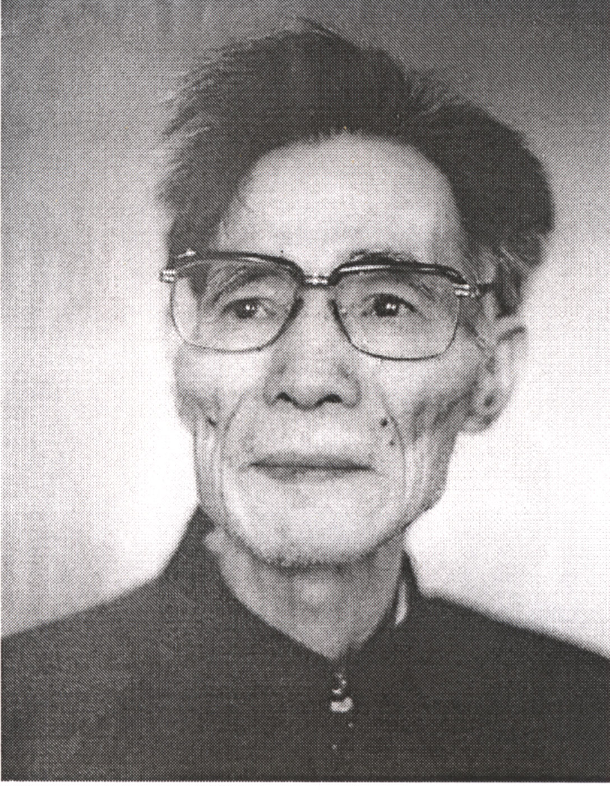
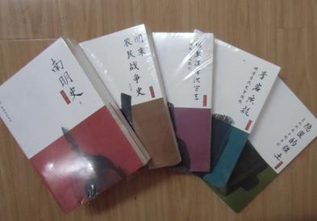
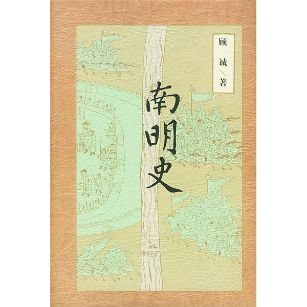

万象特约作者：一一

言必有据，无一字无出处，苦行僧，夜猫子，明史专家，历史学家

安眠药，文章不写一句空

14年前的今天，2003年6月25日，言必有据，无一字无出处的夜猫子历史学家顾诚逝世

顾诚（1934年11月28日－2003年6月25日），江西南昌人，当代明清史专家。著有《明末农民战争史》、《南明史》等专著，均为明清史研究领域最高学术水平的著作。

考入北京师范大学历史系后，终生都在北师大任教。他学识渊博，学风严谨，喜欢夜里工作、白天睡觉，与浓茶、抽烟、失眠、安眠药相伴，过着苦行僧似的生活。《南明史》一书“凡例”中指出，全书不仅要做到“言必有据”、“无一字无出处”，而且“力求在史实上考订准确“。

他认为李自成的失败，不是因为进入北京后快速腐化，而是继续打击官绅的战略错误。认为荥阳大会是虚构的，李岩也是虚构的。认为史可法是“成事不足，败事有余”，经营一年有余的扬州城，一天就被攻破。认为郑成功私心自用，拖延与李定国会师，错失南明反攻良机。

（顾诚著作全集）

一生的北师大历史系

1934年11月28日，顾诚出生于江西南昌。15岁前，分别就读于江西省立吉安中学、南昌一中。1957年9月（23岁），考入北京师范大学历史系。从此，一生献给了北师大历史系。

1961年（27岁），毕业留系任教，此后历任讲师、副教授、教授、博士生导师，兼任中国农民战争史研究会副理事长，中国明史学会常务理事。

虚构的荥阳大会

顾诚一直专注于明史的研究。1982年（48岁），出版著作《明末农民战争史》，荣获了北京市哲学社会科学优秀成果二等奖。

该书否定了郭沫若对于李自成失败的观点，《甲申三百年祭》认为李自成的失败在于进入北京之后的快速腐化。顾诚却认为“大顺政权之所以站不住脚，不是因为领导层变质，失去贫苦群众的支持；恰恰相反，由于它尚未完成质变，继续执行打击官绅地主的政策，引起缙绅们的强烈不满，因而不可能稳定自己的统治区，把汉族各阶层人士结成抗清的一致势力。”

一直被津津乐道的各路农民军首领聚会的“荥阳大会”，顾诚先生明确说道：“所谓荥阳大会召开的起因和议题，同基本的历史事实凿枘不相容，显然出于好事之徒的附会，荥阳大会是一个虚构事件。”也认为李岩也是个虚构人物。

南明史的里程碑

1997年（63岁），他耗费十余年功夫的呕心沥血之作《南明史》正式出版。该书引用方志达237部，引用书目达579种，几乎遍查南明义军所至的每一州县，注释如天上繁星。他在“凡例”中指出，全书不仅要做到“言必有据”、“无一字无出处”，而且“力求在史实上考订准确。该著作被誉为南明史研究的里程碑，荣获中国国家图书奖和北京市哲学社会科学优秀成果一等奖。

南明史一书有诸多创新见解。如：被史家称誉的史可法却被顾诚贬低，顾诚认为史可法是“成事不足，败事有余”，经营一年有余的扬州城，清军只用了一天时间就占领了扬州城。他还认为：南明并非反攻无望，在张献忠死后，李定国、孙可望占据云南，多次重挫清军。而郑成功私心自用，一再拖延会师，造成李定国功亏一篑。孙可望野心太大，企图篡位，从而失去了机会。

专开夜车的苦行僧

顾诚喜欢夜里工作、白天睡觉，并与浓茶、抽烟、失眠、安眠药相伴，过着苦行僧似的生活。久而久之，生物钟完全颠倒，形成了晚上工作、上午睡觉的习惯。系里知道顾诚先生的这种习惯，把他的课都安排在下午或晚上来上，以免影响他的休息。

任何学者的每一项成就，都离不开“刻苦”二字。但顾诚先生的治学，不是一般的刻苦，而是长年累月、异乎寻常的刻苦。顾诚全身心地投入他所钟爱的史学研究之中，治史之外，别无所求。他在明史、南明史等领域的学术成果在明清史学界具开创和奠基意义。

2003年6月25日11时10分（69岁），因肺癌在北京去世。

