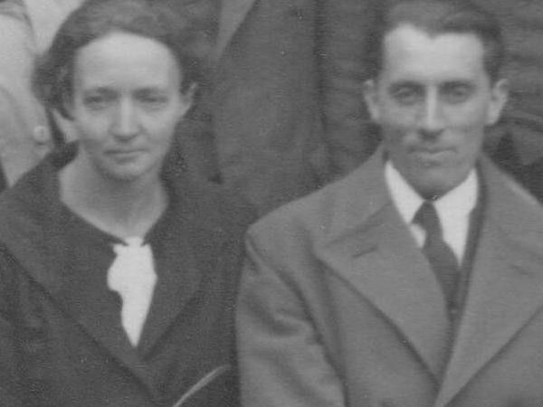
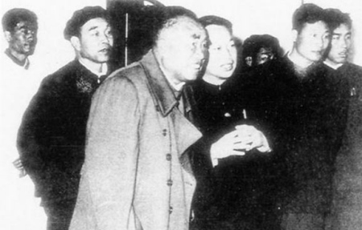
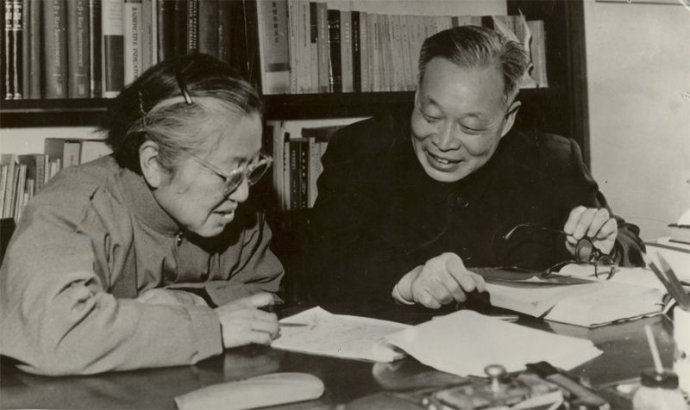

25年前，中国两弹一星元勋、三钱之一的钱三强逝世于北京 

25年前的今天，妻子是中国的居里夫人，中国原子弹之父钱三强逝世

万象特约作者：一一 

钱三强（1913年10月16日—1992年6月28日），核物理学家，中国原子能事业的创始人，“两弹一星”元勋。钱三强与钱学森、钱伟长并成为科学界“三钱”。

上了北大预科后，却上了清华大学的物理系。物理系里难得一见的一个女生，在14年后，成了他的妻子，被称为中国的居里夫人。两人还真的曾在居里夫人的女儿和女婿（曾获得了1935年诺贝尔化学奖）的实验室里工作。

夫妻回国后，一直从事原子能的研究。在苏联撤出技术人才的极度困难下，得到海外学子的大力支持，不懈努力。1964年10月16日，中国第一颗原子弹爆炸成功，这一天正是钱三强的51岁生日。钱三强也被称为：中国原子弹之父。1999年，死后7年，被追授了由515克纯金铸成的“两弹一星功勋奖章”。

少见的物理系女同学

1913年10月16日，钱三强出生于浙江绍兴，他的父亲钱玄同是中国近代著名的语言文字学家，少年时随父在北京生活，就读于蔡元培任校长的孔德中学。

1929年（16岁），考入了北京大学理科预科。1932年（19岁），从北京大学预科毕业后，没有上北京大学，却考入清华大学物理系。 同班有位少见的长辫子女同学，名叫何泽慧。

1936年（24岁），毕业后，经吴有训教授的推荐，到北平研究院物理研究所著名的物理学家严济慈所长的手下作助理员，从事分子光谱方面的研究工作。而何泽慧前往德国柏林高等工业大学技术物理系学习实验弹道学。

.jpeg)

（1936年，清华大学毕业照，后排左一为钱三强，前排左四为何泽慧）

在居里夫人的实验室

1937年9月（24岁），在严济慈的引荐下，到巴黎大学镭学研究所居里实验室攻读博士学位，导师是居里夫人的女儿和女婿，两人因为对人工放射性的研究而获得1935年诺贝尔化学奖。

钱三强同时在法兰西学院原子核化学研究所学习。1939年（26岁），完成了博士论文——《α粒子与质子的碰撞》，获法国国家博士学位，并留在实验室继续工作。

（1934年，居里夫妇合影）

中国的居里夫人

1946年4月（33岁），向一直保持着通信联系的何泽慧求婚成功，两人在巴黎结婚。婚后二人一同在实验室里工作。何泽慧后来被人称为"中国的居里夫人"。

或许是爱情的力量，钱三强经过反复实验，发现了铀核的三分裂和四分裂。导师骄傲地说：“这是第二次世界大战后，他的实验室的最重要的成果。”

1946年底，荣获法国科学院亨利·德巴微物理学奖。1947年，升任法国国家科学研究中心研究员、研究导师，并获法兰西荣誉军团军官勋章。

 

中国核计划的制定人

1948年（35岁），两人一同回到中国。1949年，新中国建立起，钱三强便全身心地投入了原子能事业的开创。他在中国科学院担任了近代物理研究 所（后改名原子能研究所）的副所长、所长，并于1954年加入了中国共产党。

 1955年（42岁），中央决定发展本国核力量后，他成为规划的制定人，被选聘为中国科学院院士（学部委员）。1956年，钱三强带领40多名科学工作者在苏联实习考察。刚从美国回国的钱学森，也来到苏联和钱三强一同考察。

1956年11月，成立主管原子能工业的第三机械工业部（1958年2月11日改为二机部），宋任穷任部长，钱三强被任命为副部长。聂荣臻曾经对钱三强说：“搞原子能，你是行家，就请你提建议，我们大家商讨决定。”

 

（钱三强和朱德） 

在没有苏联的日子

1958年（45岁），他参加了苏联援助的原子反应堆的建设，并汇聚了一大批核科学家（包括他的夫人何泽慧），他还将邓稼先等优秀人才推荐到研制核武器的队伍中。

1959年，苏联拒绝提供原子弹的有关资料及教学模型，单方面终止了两国签定的新技术协定，撤走了全部专家。在极度困难下，周光召等国外数十名海外专家，回国支持，大家一起不懈努力。

中国原子弹之父

1964年10月16日，中国第一颗原子弹爆炸成功，这一天正是钱三强的51岁生日。钱三强也被称为：中国原子弹之父。1967年6月17日，氢弹又爆炸成功，于敏被称为中国氢弹之父。

“文革”中，科学院各学部被迫停止一切活动。“文革”后，钱三强被任命为中科院党组成员和副院长，立即着手恢复学部的工作。1980年7月24日，钱三强在中南海以《科学技术发展的简况》为题讲课。 

1992年6月28日，在北京病逝，终年79岁。1999年，被追授了由515克纯金铸成的“两弹一星功勋奖章”。

