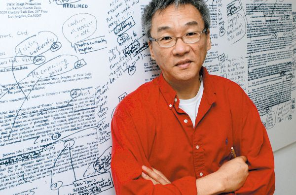
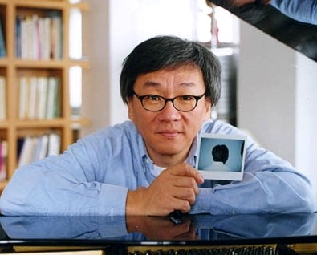
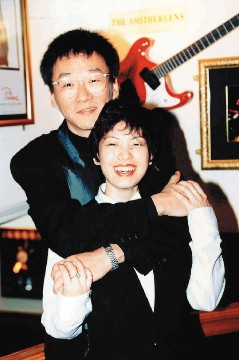
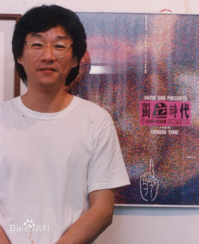
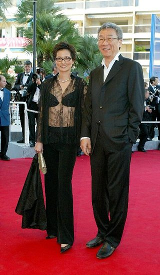

（万象特约作者：一一）

10年前的今天，蔡琴前夫、从资深码农成为最好中文电影导演的杨德昌在美国逝世

杨德昌（Edward Yang，1947－2007），台湾电影导演及编剧。

留学美国，做了7年的资深码农，却最终钟情于拍电影。一生拍的电影不多，却部部经典，获得大奖，令人敬佩。与歌手蔡琴的10年无性婚姻，曾轰动一时。后与钢琴家彭铠立低调成婚，老年得子。

代表作有《恐怖分子》、《牯岭街少年杀人事件》、《一一》等。其作品深刻、理性，有强烈的社会意识，被称作“台湾社会的手术刀” ，享有盛誉。2007年获得台湾金马奖终身成就奖。

（杨德昌自画像）

普通的台北青少年

1947年11月6日，杨德昌出生在上海，祖籍广东梅县人。1岁时，随父母迁到台北。1959年（12岁），考上建
国中学。1965年（18岁），通过大学联考，以班上第45名的成绩（全班只有53人）考上了位于台湾新竹的国立交通大学控制工程系。1969年（22岁），大学毕业。

杨德昌自小酷爱漫画，尤其喜欢手冢冶虫的作品，深受其对于人性光辉的信念，以及悲剧结局中对人性
肯定的影响。也喜爱看电影，尤其喜欢《阿拉伯的劳伦斯》（Lawrence of Arabia）和《汤姆·琼斯》（Tom Jones）﹐以及看了很多遍后才明白的《八又二分之一》。

资深码农和电影之间

1970年（23岁），留学美国，在佛罗里达大学电子工程与计算机系学习。1974年，硕士毕业后，在南加州大学学
习了一年的电影课程。

随后以电脑工程师身份，在美国西雅图华盛顿大学从事计算机微处理器与软件设计，工作了7年，成为资深码农。在西雅图，杨德昌从德国新电影四杰之一赫尔佐格的《阿基尔，上帝的愤怒》得到启示：精彩的电影可以一个人做而不必倚赖巨大投资。杨德昌萌生继续拍电影的梦想。

1981年春（34岁），杨德昌回到台湾，在电影《1905年的冬天》中担当编剧制片助理和演员，影片入围了当年戛纳电影节“一种关注”单元。随后参加张艾嘉制作的台视节目“十一个女人”系列剧集，导演其中“浮萍”单元，颇受好评。

新电影的开山之作——《光阴的故事》

1982年（35岁），由台湾中央电影公司策划，由四名导演合作拍摄了《光阴的故事》（In Our Time 1982）。影片用四段人生不同阶段的故事，表现人际关系与男女关系的演变、人的成长和台湾30年来社会形态的变迁。由此突破了台湾政治宣传片和琼瑶爱情剧的局面，开创关注社会和家庭生活、充满情趣的实验电影时代。《光阴的故事》被称作台湾新电影的开山之作。杨德昌凭借第二段《指望》一鸣惊人，走上了台湾新电影的舞台。

社会变迁中的女性处境——《海滩的一天》

1983年（36岁），杨德昌任导演和编剧，拍摄了《海滩的一天》。影片通过两个女人（由张艾嘉、胡茵梦饰演）的一场对话，交代出30年来整个台湾社会的面貌，对爱情、婚姻、亲情、事业等各方面都做了相当深刻的探讨。复杂的结构方法和开放式的结局都是台湾电影前所未有的创举，也奠定了杨德昌日后作品的基调。该片获得美国休斯敦国际影展评审团推荐金牌奖、第二十八届亚太电影展最佳摄影奖。

关注台北都市文化转型——《青梅竹马》

1985年（38岁），由杨德昌执导，侯孝贤和蔡琴担任男女主角的《青梅竹马》，是台湾新电影代表作之一。之后关注台北的都市生活和城市文化也成了杨德昌作品的一个明显特征（《牯岭街少年杀人事件》除外），与好友侯孝贤的乡土情怀形成鲜明对比。该作品获得瑞士洛迦诺国际电影节国际影评家协会奖。

1985年5月5日，杨德昌与蔡琴走进了婚姻殿堂。

异化都市生活的梦魇——《恐怖分子》

1986年（39岁），《恐怖分子》获第23届台湾金马奖最佳影片奖和第四十届瑞士洛迦诺国际电影节银豹奖，国际影评人奖和英国电影协会最具创意和想象力奖、第32届亚太电影节最佳编剧奖。

同年11月6日，在杨德昌家里，54名台湾青年电影人签订了“台湾电影宣言”，支持新电影运动。

青春是极其伤身的——《牯岭街少年杀人事件》

1989年（42岁），杨德昌成立“杨德昌电影”独立制片公司，开始独立电影创作工作。

1991年（44岁），其独立制片公司出品了《牯岭街少年杀人事件》（A Brighter Summer Day）。该片长达4个小时，描绘了20世纪60年代灯光昏黄的台北夜市。影片结构严谨、细节生动，有着庞杂但是清晰的人物关系、繁芜但不凌乱的叙事编排。这是杨德昌集十年大成的经典之作。

杨德昌说：“这不是一个单纯的谋杀案件，促成杀人事件的是整个环境，凶手是整个环境，甚至小明自己都是凶手。”

《牯岭街少年杀人事件》获第二十八届台湾金马奖最佳作品奖、最佳编剧奖，并获最佳导演提名。同时获第三十六届亚太电影节最佳作品奖、第十三届南特三大洲最佳导演 奖、第四届东京国际电影节评委会特别奖，新加坡国际电影节最佳导演奖。

儒者的困惑——《独立时代》

1994年（47岁），杨德昌编导的《独立时代》（A Confucian Confusion）获第三十一届台湾金马奖最佳编剧奖和最佳导演、最佳作品提名，被评为1994台湾十大华语片之一。

杨德昌说：“从文化角度审思，儒家文化并不鼓励创新，但是中国人不擅长找答案，而通常要等别人告诉我们答案。”

 1995年8月5日，蔡琴和杨德昌结束了10年的婚姻，后来爆出二人无性婚姻的事实，一时间闹得沸沸扬扬。杨德昌对这段婚姻的结论是“10年感情，一片空白。”而蔡琴则答：“我不觉得是一片空白，我有全部的付出。”

没有未来的都市——《麻将》

1996年（49岁），一部展现台北国际化的影片，影片语言特色很生活化，剧本沿袭杨德昌一贯的复杂化特点，人物众多，但是都很有特色，情节多线发展，深刻的描绘了失落的都市和幻灭的人群。该片获得柏林影展评审团特别奖。

里面一些对白很精彩：“人只有两种，一种是骗子，一种是傻子”，“人们都不知道自己该干什么，他们需要你告诉他们该干什么，因为他们害怕承担责任，你告诉他们干什么，他们即使做错了也可以说他们是被骗了”。

的海报.jpg)

生命的奥秘——《一一》

2000年（53岁），杨德昌执导的电影《一一》，承续以往擅长的多条叙述线、理性思辩的叙述风格，深刻检视当代的台北都会，被形容为“把生命的诗篇透过电影传颂吟唱”。 该影片获得当年戛纳国际电影节最佳导演奖，成为第一位获得这项殊荣的台湾导演。

2000年，杨德昌和钢琴家彭铠立的儿子出生。

2007年6月29日，杨德昌因结肠癌于美国洛杉矶比佛利山庄去世，享年60岁。2007年获得台湾金马奖终身成就奖。

