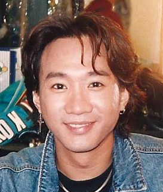
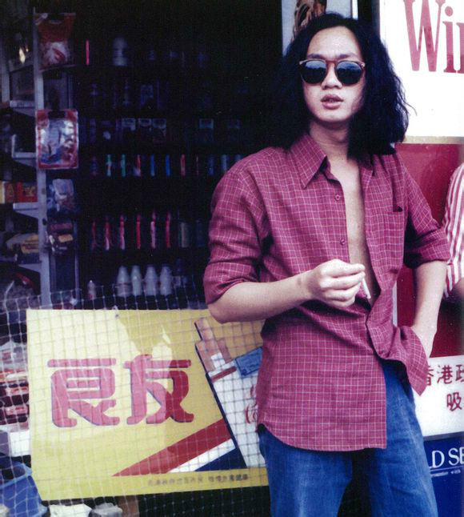
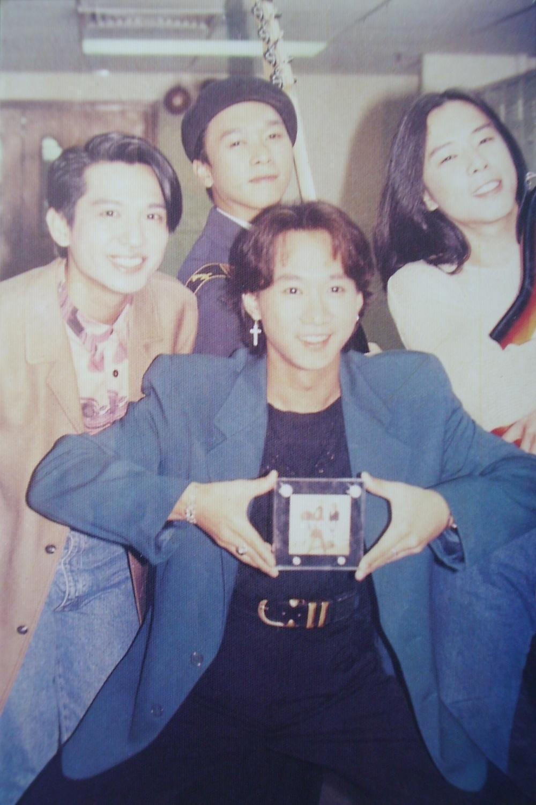
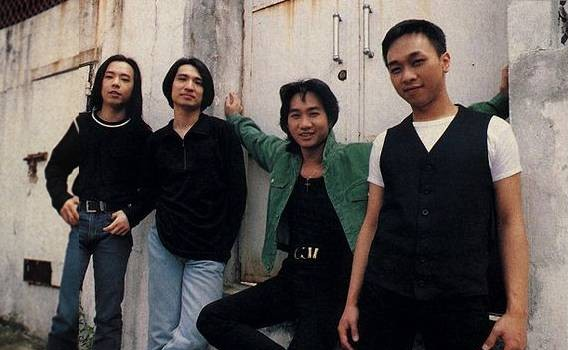
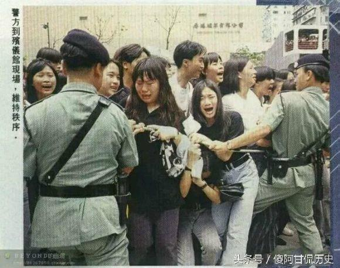

（万象特约作者：一一）

24年前的今天，Beyond乐队传奇巨星黄家驹在日本意外坠落

黄家驹（Wong Ka Kui，1962年6月10日－1993年6月30日），著名摇滚乐队Beyond的吉他手和主唱，香港乐坛的传奇人物。

一个中学毕业的蓝领工人，组建了Beyond乐队。“取名Beyond不是要超越别人，而是要超越自己。”他的吉他技术精湛，独特的沙哑嗓音，巧妙的尾音处理，有着令人着迷的魅力。

他创作的《大地》、《真的爱你》、《Amani》、《光辉岁月》、《长城》、《海阔天空》等歌曲家传户晓。其中《光辉岁月》是黄家驹为南非黑人领袖曼德拉创作的一首作品。

转投日本发展后，在参加游戏节目时，意外舞台崩塌，头部着地，不幸去世。

捡到吉他的蓝领少年

1962年6月10日，黄家驹生于香港，自小居住在九龙深水埗区苏屋邨。初中时受朋友影响爱上欧洲和美国的流行音乐，偶像是大卫·宝儿（David Bowie）。大约14岁那年，无意之中捡得邻居搬家遗留下的一把旧吉他，从此结下不解之缘。

在博允英文中学（已重建为朗逸酒店）毕业后，曾任职办公室助理、铝窗、五金、空调、水电工程、电视台布景员等工作，也曾加入乐队鼓手叶世荣任职的德高保险有限公司作保险推销员。

Beyond是要超越自己

1980年（18岁），与叶世荣相识，组成Beyond乐队的雏型。Beyond这个名字是第一代主音吉他手邓炜谦所取，意思是“超越”。叶世荣说：“取名Beyond不是要超越别人，而是要超越自己。”

1983年（21岁），Beyond正式组成，经过了几次人事变动。1983年底，黄家驹的弟弟黄家强加入，成为低音吉他手。1985年，主音吉他手黄贯中加入。同年，Beyond在明爱中心自资举办《永远等待演唱会》，第二年推出盒带《再见理想》，之后正式进入商业流行乐坛。

没有乐坛只有娱乐圈

经过多年努力打拼，Beyond成为香港最举足轻重的乐队。1988年（26岁），凭专辑《秘密警察》内的《大地》一曲夺得十大劲歌金曲，为乐队获得首个电子传媒奖项。

1989年（27岁），由黄家驹作曲，以歌颂母亲为题的《真的爱你》大热，成为家传户晓的歌曲，更夺得十大劲歌金曲及十大中文金曲两大奖项。

黄家驹是Beyond乐队的灵魂人物，时常包办作曲及填词。他的吉他技术精湛，独特的沙哑嗓音、巧妙的尾音处理，令人着迷。他果敢健谈，是乐队的发言人，不时发表大胆的言论，例如曾说过：“香港没有乐坛，只有娱乐圈。”

红磡体育馆的摇滚巨星

1990年（28岁），由黄家驹作曲及填词，以当时刚出狱的南非黑人民权领袖曼德拉为题材的《光辉岁月》大热，夺得十大劲歌金曲奖，黄家驹亦凭此曲夺得“最佳填词奖”。

1990年起（28岁），Beyond开始在台湾及日本等地发展，知名度渐渐提高。1991年（29岁），Beyond连续举办五场《生命接触演唱会》，成为第一支在香港红磡体育馆举行演唱会的摇滚乐队。

不是海阔天空的日本

由于对香港乐坛感到失望，加上希望乐队能冲出香港，Beyond往日本发展。1992年（30岁），Beyond签约华纳唱片，推出了两张日语专辑以及三张日语EP，不过成绩平平。

1993年5月（31岁），Beyond发行粤语专辑《乐与怒》 ，该专辑保持了Beyond一贯的原创性，并且回归到了摇滚曲风；其中由黄家驹作曲的歌曲《海阔天空》获得1993年十大中文金曲奖。

意外的想做什么就做什么

1993年6月24日凌晨1时（日本时间），为宣传即将发行的日语唱片，乐队应邀到富士电视台位于河田町的4号录影室拍摄游戏节目《小内小南的 想做什么 就做什么》。

游戏进行到15分钟时，黄家驹在狭窄并沾满水渍的台上奔跑时不慎滑倒，强大冲力使身旁3块布景板的固定装置脱落，布景板松开，黄家驹从2.7米的台上翻落。黄家驹头部朝下摔落，左边额头首先着地，随即昏迷。由于黄家驹头部严重受创，院方不敢轻举妄动，并未施动手术清走脑内瘀血。

永远的黄家驹

6月26日晚上，乐迷聚集香港商业电台停车场空地举行祝祷会，祈求黄家驹尽快康复。日本经理人公司请了一名中国气功师为他“发功”治疗，但并无起色。六天后，1993年6月30日下午4时15分，在东京女子医科大学医院逝世，终年31岁。院方公布死因为急性脑膜下血肿、头盖骨骨折、脑挫伤及急性脑肿胀。

7月2日，黄家驹的遗体运回香港。7月4日，于北角香港殡仪馆设灵，同日晚上香港商业电台举行“永远怀念家驹”悼念音乐会，全场坐满2,600人，哭泣声此起彼落。翌日中午大殓，灵车驶出殡仪馆，聚集在人行道上的数千名歌迷按捺不住情绪，场面一度混乱。遗体最后下葬于将军澳华人永远坟场15段6台25号。

