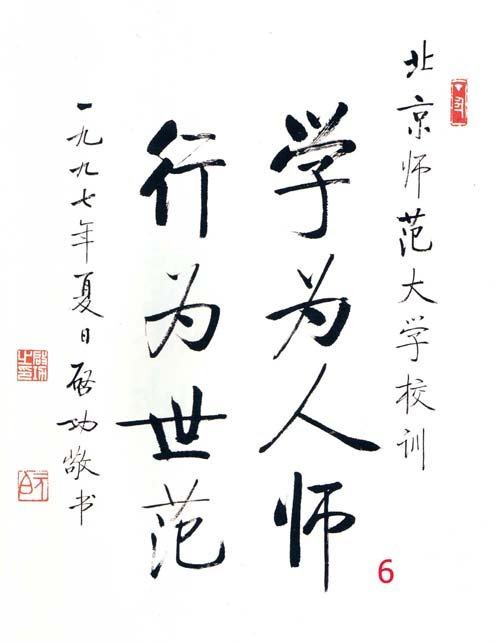
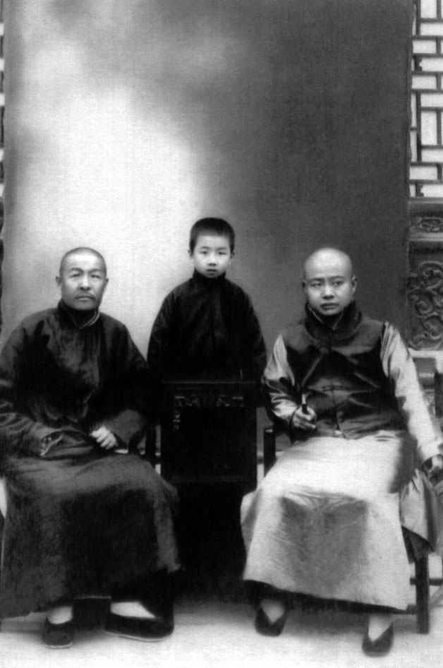
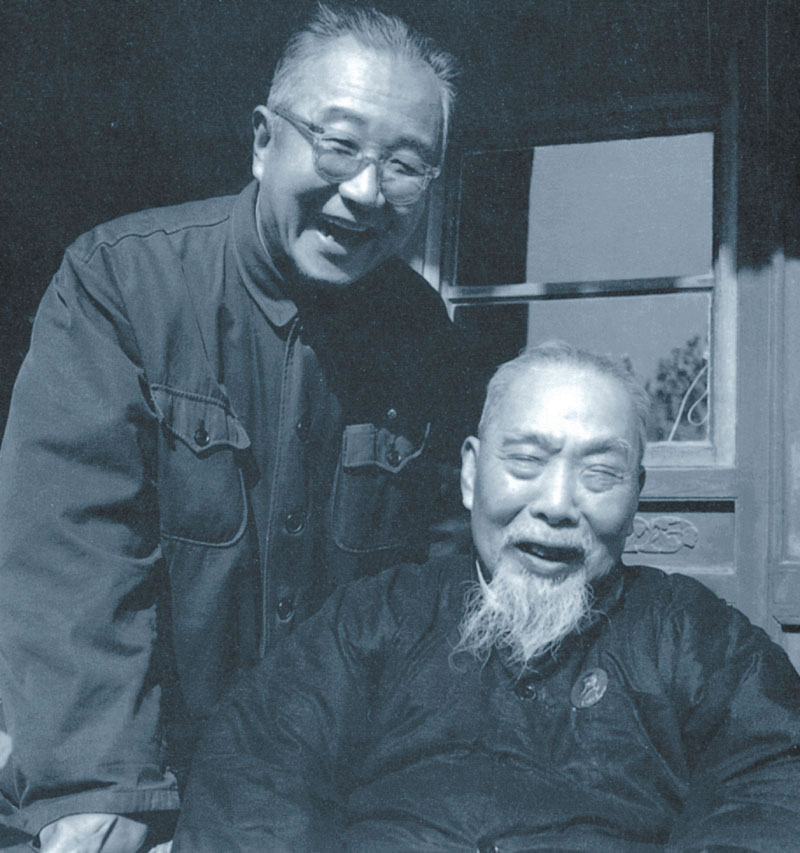
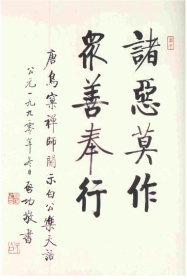

0630启功

启功（1912年7月26日——2005年6月30日），雍正皇帝的九世孙，启功明确表示自己不是姓“爱新觉罗”，而是姓“启”。北京师范大学教授，著名的学者、书画家。

启功先生的法书名满天下，是他的独创，称为启体。求字的人趋之若鹜，启功很少拒绝别人，几乎有求必应。可是启功声明他首先是一个教师，然后勉强算是一个画家，书法只是他的业余爱好而已。

66岁时，给自己写《自撰墓志铭》：中学生，副教授。博不精，专不透。名虽扬，实不够。高不成，低不就。瘫趋左，派曾右。面微圆，皮欠厚，妻已亡，并无后。丧犹新，病照旧。六十六，非不寿。八宝山，渐相凑。计平生，谥且陋。身与名，一齐臭。

不姓爱新觉罗的皇族

1912年7月26日，启功出生于北京，满族正蓝旗人。是清朝皇室后裔，是雍正皇帝的九世孙。但后来，启功明确表示不是姓“爱新觉罗”，而是姓“启”。很多人给他写信，写“爱新觉罗启功”收，他便标明“查无此人，请退回”。

1岁，父亲去世，此后多由姑姑照料，因此称姑姑为爹爹。祖父让他拜雍和宫的一位老喇嘛为师，做记名的小喇嘛。10岁时，曾祖父和祖父也去世了。在北京汇文小学和汇文中学读书，15岁辍学。

（启功（中）与家人合影）

包办的美满婚姻

辍学后，在朋友帮助下陆续结识了一些当时知名的艺术家、学者，如吴镜汀、溥雪斋、齐白石等，在他们的教诲下，启功打下了古典文学和艺术创作的扎实根基。

1932年（20岁），与大他两岁的章宝琛举行了婚礼。这是母亲和姑姑包办物色的亲事，但婚后相敬如宾、相濡以沫，虽无子女，但情深意重。启功称她为姐姐。

（1930年，18岁的启功）

没有学历的大学教授

1933年（21岁），拜师于辅仁大学校长陈垣，到辅仁中学教国文，但由于只有中学文凭，启功先后被辞退2次。在陈垣的提携下，启功得以第三次站上讲台，最终成为一位没学历的大学教授。因此启功对陈垣的感情极为深厚，认为“有逾父子”。

1935年（23岁），任辅仁大学美术系助教。1938年（26岁），任辅仁大学国文系讲师。1949年（37岁），升为副教授。1952年（40岁），辅仁大学与北京师范大学合并，任北京师范大学中文系副教授，教授古典文学。同年加入“九三”学社。

（启功和陈垣校长）

姐姐今又千古

1957年（45岁），母亲和姑姑相继去世，在反右运动中，被划为右派。1962年后（50岁），出版《古代字体论稿》和《诗文声律论稿》、《〈红楼梦〉札记》等著作。1966年（54岁），“文革”爆发，被列为“牛鬼蛇神”之中，遭受审查与批判，由于他精通书法，常被造反派命令抄写大字报。

1975年（63岁），妻子章宝琛逝世。临死前，将文革期间，冒死保存下来的手稿交给了启功。启功重新见到那些底稿时，犹如劫后重逢，感激不尽。妻子逝世后，启功先生有《痛心篇二十首》倾诉苦情：“爹爹久已长眠，姐姐今又千古。未知我骨成灰，能否共斯土。”启功终生未再娶，死后合葬。

1978年（66岁），启功回想半世艰辛岁月，写下了这首诙谐、精炼《自撰墓志铭》：中学生，副教授。博不精，专不透。名虽扬，实不够。高不成，低不就。瘫趋左，派曾右。面微圆，皮欠厚，妻已亡，并无后。丧犹新，病照旧。六十六，非不寿。八宝山，渐相凑。计平生，谥且陋。身与名，一齐臭。

（左起启功、妻子章宝琛、妈妈、姑姑）

报答师恩的励耘奖学金

文革后，北师大恢复课程，被聘为教授，先后出版了《诗文声律论稿》、《古代字体论稿》、《启功丛稿》等著作。1984年（72岁），被聘为博士研究生导师，被选为中国书法家协会主席。1986年，被任命为国家文物鉴定委员会主任委员。

1992年（80岁），他把通过义卖书法绘画作品，筹集了200余万元，捐给北京师范大学，报答老师教育之恩，以陈垣的书斋为名，设立励耘奖学金，用于表彰了优秀的青年教师和学生。

2005年6月30日2时25分，病逝于北京，享年93岁。启功逝世一周年后骨灰从八宝山请来，下葬在“北京香山万安公墓”。2012年，被评为影响中国收藏界十大经典人物。

（启功墓）

独创的启体书法

启功先生的法书名满天下，是他的独创，称为启体。求字的人趋之若鹜，启功很少拒绝别人，几乎有求必应。可是启功声明他首先是一个教师，然后勉强算是一个画家，书法只是他的业余爱好而已。

启老到一个“造假作品”的专卖店，一件一件看得挺仔细。老板就过来问：“启老，这是您写的吗？”启老听了，微微一笑说：“比我写得好。”在场的人全都大笑了起来。过了一会儿，启老又改口了：“这是我写的。”

