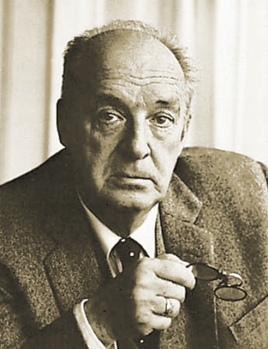
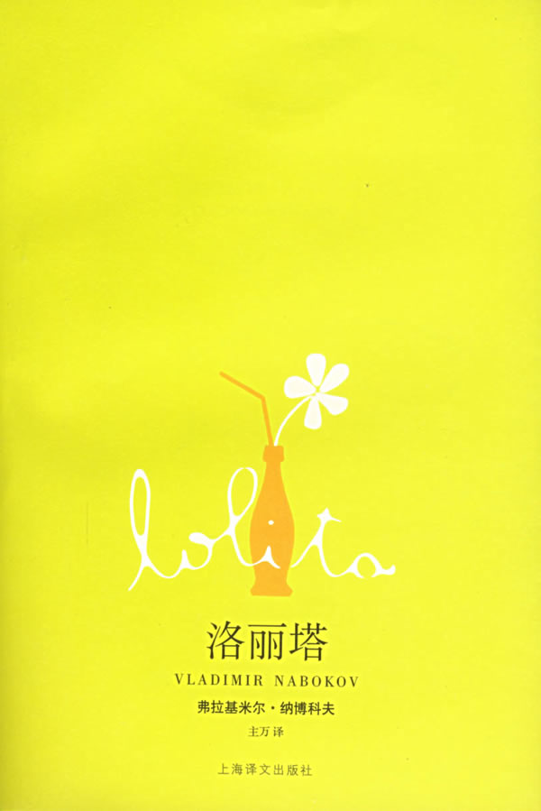
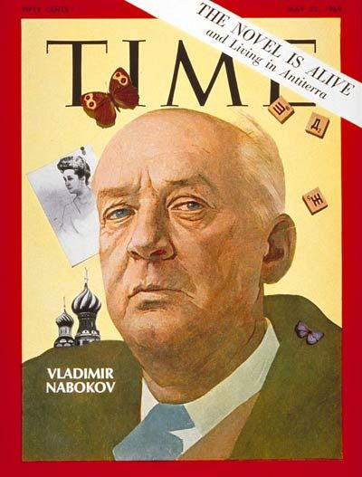

40年前的今天，20世纪最伟大的爱情写手、追蝴蝶的人、当代小说之王、惊世骇俗的《洛丽塔》作者纳博科夫在美国逝世

（万象特约作者：一一）

40年前的今天，1977年7月2日，给妻子写了50年情书，惊世骇俗的《洛丽塔》作者纳博科夫病逝

纳博科夫（1899年4月22日－1977年7月2日），著名俄裔美国作家，蝴蝶研究爱好者。

纳博科夫在1955年写的小说《洛丽塔》，叙述了一个中年男子与一个未成年少女的惊世骇俗的恋爱故事。费尽艰难在美国出版后，一路蹿升到《纽约时报》畅销书单的第一位，人尽皆知，却被当做一本“黄书”。而洛丽塔和萝莉从此成为少女的代称。

他出版了大量小说，被称为"当代小说之王"。他认为伟大的作家应该是：讲故事的人、教育家、魔法师三者合一，但最要紧的是魔术师。他一生中与妻子薇拉几乎从未分离，却一直坚持为她写情书直到去世。50多年里，情书竟超过300篇，有人称他为20世纪最伟大的爱情写手。

他一生只追一个女人和蝴蝶。

（电影《洛丽塔》剧照）

曾经完美的童年

1899年4月22日，纳博科夫出生于俄罗斯圣彼得堡一个显赫而富有的贵族家庭。父亲是自由派律师、记者和政治家，母亲则来自矿业豪门。纳博科夫自称有“完美”的童年，自幼就通晓俄语、英语和法语三种语言。尽管家庭名义上信奉东正教，但家人都不太热衷。

1917年（18岁），二月革命爆发，沙皇俄国倒台，父亲任职于临时政府。不久，列宁领导的十月革命爆发，建立苏维埃政府。纳博科夫一家被迫离开圣彼得堡，前往克里米亚。1919年初，克里米亚白军起义失败，纳博科夫一家离国前往英国定居，纳博科夫成为剑桥大学三一学院的学生，最初修读动物学，后来学习法文与俄文。1922年6月，纳博科夫取得学位后，跟随家人前往柏林。

1922年3月（23岁），父亲为掩护流亡的立宪民主党领袖Pavel Milyukov，被同样流亡却支持君主制的杀手刺杀。因此，纳博科夫日后的小说，多次出现因角色误会而被错杀的情节。纳博科夫以写作，以及私人教授英语、法语、网球和拳击等维持生计。

和妻子逃到美国

纳博科夫本已订婚，但女方父母嫌他太穷，解除了婚约。1923年5月，纳博科夫在柏林的慈善化装舞会上，邂逅了犹太律师的女儿薇拉（Vera Slonim，1902—1997）。1925年（26岁），两人结婚。1934年（35岁），儿子出世。

1936年（37岁），德国反对犹太人，薇拉失去工作，而杀害父亲的凶手成为流亡人士的领袖，纳博科夫被迫移居法国。1940年，纳粹德军进军法国，纳博科夫一家坐轮船逃亡美国。在欧洲生活的这些年里，纳博科夫出版大量小说，如《玛丽》、《王、后、杰克》、《防守》、《眼睛》、《荣耀》、《黑暗中的笑声》、《天赋》、《斩首之邀》、《天赋》等等。

1941年（42岁），成为卫斯理学院比较文学住校讲师，每周教授俄语三日。1942年以后，他同时担任哈佛大学“比较动物学博物馆”馆长。1945年，与薇拉成为美国公民。1948年至1959年，在康奈尔大学任俄国与欧洲文学教授。1952年，兼任哈佛大学斯拉夫语客座教授。

惊世骇俗的洛丽塔

每年夏天，纳博科夫会到美国西部旅行，采集蝴蝶样本，他在旅途中动笔创作小说《洛丽塔》，而薇拉则担任“秘书、打字员、编辑、校对、律师、司机、研究助理、教学助理和后备教授”。1953年6月（54岁），他完成了《洛丽塔》。1955年，《洛丽塔》遭四家美国出版社拒绝后，转由巴黎的奥林比亚出版社出版。

1958年（59岁），《洛丽塔》在美国出版，一路蹿升到《纽约时报》畅销书单的第一位。《洛丽塔》的绝大部分篇幅是死囚亨伯特的自白，叙述了一个中年男子与一个未成年少女的惊世骇俗的恋爱故事。出版后，此书在美国人尽皆知，被当做一本畅销的“黄书”。而洛丽塔和萝莉从此成为少女的代称。

当代小说之王

他在留美期间还出版了《菲雅尔塔的春天》、《普宁》、《微暗的火》、《阿达》、《纳博科夫十三篇》、《塞巴斯蒂安-奈特的真实生活》、《尼古拉-果戈里》、《俄国三诗人》、《庶出的标志》、《故事九则》、《确证》等书。其中《普宁》、《微暗的火》、《阿达》等，展现了他对于咬文嚼字以及细节描写的钟爱。

（时代周刊封面上的纳博科夫）

纳博科夫的声誉在晚年达到顶峰，被誉为“当代小说之王”。纳博科夫认为伟大的作家应该是：讲故事的人，教育家和魔法师三者合一。他强调的是后者，认为大作家最要紧的是大魔术师。

1961年（62岁），他和薇拉搬到瑞士居住。1977年7月2日（78岁），纳博科夫因病去世。1997年4月7日，薇拉去世。

（纳博科夫的墓地）

只追一个女人和蝴蝶

纳博科夫的儿子，在整理父母遗物时，发现了薇拉收藏的大量情书。原来，纳博科夫与薇拉虽然几乎从未分离，却坚持给她写情书，一生的50多年里，竟写了超过300封情书。有人称他为20世纪最伟大的爱情写手。

（1969年，纳博科夫与薇拉）

纳博科夫花很多业余时间在蝴蝶上，他不会开车，因此每次外出都是薇拉陪伴。他们为追逐一只蝴蝶，可以跋涉十几英里。他对捕获的蝴蝶进行分类，并用显微镜仔细观察。

他主攻灰蝶的其中一支，他认为这种灰蝶在数百万年前从西伯利亚经白令海峡迁徙至美洲大陆。1945年，他公布此结论，称这种灰蝶有过五次大迁徙，并绘出在美洲大陆的分布区域，但结论遭到学界尖锐批评。2011年1月，英国皇家学会宣布，学者经过为期十年的基因研究，证实纳博科夫的研究成果完全正确。

（捕蝴蝶的纳博科夫）