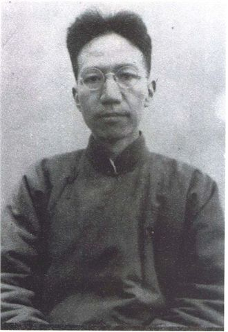
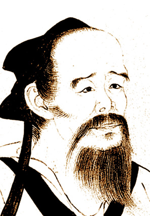
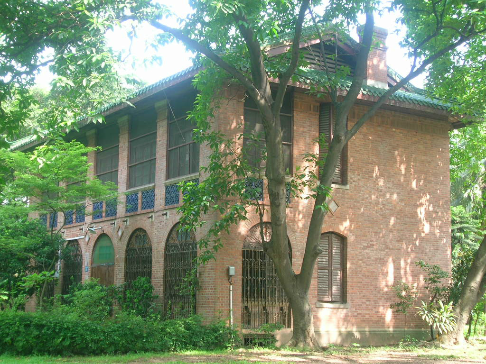

127年前的今天，通晓20多种语言的现代四大史学家、在哈佛大学留学时顿顿吃炒腰花的贫困生、考证出华佗和孙悟空可能是亲戚的陈寅恪出生于湖南长沙

万象特约作者：一一

陈寅恪（1890年7月3日－1969年10月7日），是一位籍贯江西省义宁州（今修水县）、生于湖南长沙的中国现代历史学家、古典文学研究家、语言学家，曾获选为中央研究院院士，亦为民初时期清华大学国学院四大导师之一（其余三人为梁启超、王国维、赵元任）。通晓二十余种语言。其史学脱胎于乾嘉考据学，著有《柳如是别传》、《隋唐制度渊源略论稿》、《唐代政治史述论稿》。与钱穆、陈垣、吕思勉并称为严耕望所评选的“现代四大史学家”。

陈寅恪曾自言：“平生为不古不今之学，思想囿于咸丰、同治之世，议论近乎湘乡、南皮之间。”陈寅恪一生治学秉持“独立之精神，自由之思想”。1953年已决定其为中国科学院历史研究所第二所所长。在他1953年12月1日的《对科学院的答复》里，提出就任所长的两个条件。第一条：“允许中古史研究所不宗奉马列主义，并不学习政治。”第二条：“请毛公或刘公给一允许证明书，以作挡箭牌。”并说：“其意是，毛公（毛泽东）是政治上的最高当局，刘公（刘少奇）是党的最高负责人。我认为最高当局也应和我有同样看法，应从我之说。否则，就谈不到学术研究。”遂不能就任。仍任教于中山大学。此事于20世纪80年代方公之于世。

陈寅恪学贯中西，学富五车，常有新论。  陈寅恪不仅验证孙悟空的原型即《罗摩衍那》中的哈奴曼，同时还找出另一部《贤愚经》（卷十二）作为重要佐证。他认为，“大闹天宫”故事源于两个不同的印度民间故事，而在传入中国之后，由“传教士”将其合二而一，最终敷衍成《西游记》样式。另外，他还认为华佗是从印度医生传说虚构出来的人物。这位印度医生，精擅汉医完全不懂的外科手术，并能熟练运用印度植物曼陀罗花提取液“麻沸散”，为东亚病人解除手术之痛。他的名字最为有趣，竟然就是印度风神伐陀的名号，也是猴神哈努曼的父亲。古印度人喜欢尊称医生为“伐佗”（Vāta），以此纪念这位风一般奔走治病的善神。印度医生的故事传到中国被命名为华佗，可惜曹操生性多疑，杀掉了这位以梵语“医生”命名、并在中原行医救世的“国际主义战士”。据说他的唯一“罪行”，只是请求为病人曹操施行开颅手术而已。

1939年秋，陈寅恪、唐筼夫妇与三个女儿避难香港。

家世
1890年7月3日，陈寅恪生于湖南长沙，祖籍江西省义宁州（今修水县）客家人。陈寅恪是为其父陈三立继室俞明诗所生的第二子，陈氏门堂三代世家，祖父陈宝箴官拜湖南巡抚，其父陈三立为诗文名家。祖母黄氏以在寅年生，取名寅恪（恪字为家族字辈），在家族中排行第六，晚辈称其六叔。

关于“恪”的读音，常读作“què（确）”，根据是陈寅恪先祖原居福建上杭，属客家系统，客家人读“恪”作“què（确）”。据陈寅恪家乡方言怀远话（江西修水客家话，较之福建上杭客家话受赣方言影响更大），恪与确同音，“确”在怀远话中应读quò，所以也有人认为，恪实读quò。陈寅恪认为，用普通话时，“恪”当读作“kè（课）”。根据目前官方标准，“kè（课）”是“恪”字在普通话中的惟一读音。

日本留学
陈寅恪儿时启蒙于家塾，学习四书五经、算学、地理等知识。1900年（光绪26年）祖父陈宝箴去世后，陈三立举家迁居江苏金陵，在家中开办思益学堂，教授四书五经、数学、英文、体育、音乐、绘画等课程。先后延聘教师有国学大师王伯沆、柳翼谋、周大烈。陈家两代素来倡议新政，“思益学堂”领风气之先采用现代化教育，陈三立与教师相约一不打学生、二不背死书，一派新式作风，深得当时两江总督张之洞赞赏。如此家学渊源下，陈寅恪自小除打好深厚的国学底子，眼界并扩及东西洋，留学日本前便“从学于友人留日者学日文”。
1904年秋天，14岁的陈寅恪随长兄陈衡恪经上海吴淞码头离岸东渡日本，自费入东京弘文学院就读，父亲陈三立相送并作诗一首《十月二十七日江南派送日本留学生百二十人登海舶隆寅两儿附焉遂送至吴淞而别其时派送泰西留学生四十人亦联舟并发怅望有作》。

每顿吃炒腰花的哈佛贫困生

1905年因足疾辍学回国，后就读作为大学预科学校的上海吴淞复旦公学。1910年考取官费留学，先后到德国柏林洪堡大学、瑞士苏黎世大学、法国巴黎政治学院学习。1914年因第一次世界大战爆发，回到中国。
1918年冬获得江西教育司官费资助，再度出国深造，先在美国哈佛大学随兰曼教授（Charles Rockwell Lanman）学梵文和巴利文。后因时局不稳，官费停寄，生活至为艰苦，每餐吃炒腰花（猪肾），省下的钱买书。性情孤僻，很少社交。
1921年转往德国柏林洪堡大学，随路德施教授攻读东方古文字学，同时向缪勤学习中亚古文字，向黑尼士学习蒙古语。通过留学期间的学习，具备了阅读蒙古语、藏语、满语、日语、梵语、英语、法语、德语、巴利语、波斯语、突厥语、西夏语、拉丁语、希腊语等十余种语言的能力，尤精梵文和巴利文。
颇具意味的是，陈寅恪四处求学，学贯东西，可一生中没有一张文凭。

清华中“教授的教授”
1925年3月再次回到中国，时吴宓主持清华国学研究院，应清华学校之聘，与王国维、梁启超、赵元任同为国学研究院导师。1928年清华学校改制为清华大学，应聘为中文、历史二系教授，并在北京大学兼课。1928年暑假，回上海探亲，与原台湾巡抚唐景崧之孙女唐筼完婚。在此期间主要讲授佛经翻译文学、两晋南北朝隋唐史料和蒙古史料研究等课程。当时名家如吴宓、朱自清、冯友兰都来旁听，郑天挺称他是“教授的教授”，历史系教授姚从吾说：“陈寅恪先生为教授，则我们只能当一名小助教而已。”自视甚高的刘文典认为西南联大文学院真正的教授只有“两个半”，陈寅恪便是其中的一个，他自己只能算半个。他甚至公开说：“陈寅恪才是真正的教授，他该拿四百块钱，我该拿四十块钱……”同时还兼任中央研究院理事、历史语言研究所研究员及第一组(历史)主任、故宫博物院理事、清代档案编委会委员等职，得遍阅故宫满汉文宗。陈寅恪本人是谦虚的，自称：“寅恪不敢观三代两汉之书，而喜谈中古以降民族文化之史。”在清华大学任教时，仍经常到东交民巷向钢和泰学习梵文。

南渡北归
中国抗日战争爆发后，其父陈三立忧愤死。寅恪悲恸过度，导致右眼失明。11月携眷南逃，途中手稿遗失甚多，任教昆明西南联合大学，主要讲两晋南北朝史、隋唐史专题和元白诗研究等。1939年，英国牛津大学聘请他为中国史教授。隔年前往蒙自的西南联大，次年又随西南联大迁往昆明。1940年9月，他离昆明赴香港，准备转英国。因战事未能成行，返昆明。在昆明期间撰有《隋唐制度渊源略论稿》，有诗“食蛤那知天下事，看花愁近最高楼。”
1941年受香港大学中国文学系主任许地山所邀，任职客座教授，讲授隋唐史，仅讲授韦庄《秦妇吟》一诗，耗时两个月，1941年8月4日，许地山逝世，接任系主任。1941年底香港沦陷，学校停课，生活物资奇缺，由于陈寅恪懂日文，日军十分礼遇之，寅恪拒不接受日人馈赠。期间寅恪闭门治学，撰《唐代政治史略稿》一书。香港日本政权欲以高薪聘请其任香港东亚学院院长，未果。1942年，携妻女逃离香港，至桂林，中科院物理所长丁西林前去迎接，任教于广西大学。1943年12月再前往燕京大学。1945年，左眼失明。是年9月，前去英国治眼疾，却因耽搁太久，无法痊愈，仅一眼能见微光。1946年再任清华大学教授。

《论〈再生缘〉》轰动海外
1948年底，解放军逼进北平，陈寅恪没有前往台湾的打算。傅斯年电话催请寅恪南下，寅恪举家乘飞机至南京，次日赴上海。最后在岭南大学，未能前去台湾。
1952年院系调整，岭南大学并入中山大学，自此一直担任中山大学教授，为历史系、中文系讲授两晋南北朝史、唐史、唐代乐府等三门课程。1960年7月被聘任为中华人民共和国中央文史研究馆副馆长。1954年，陈寅恪写成《论〈再生缘〉》，油印稿由章士钊带到香港，辗转由香港友联出版社出版，一时轰动海外，议论纷纭，引起北京方面的注意。有关方面与郭沫若、周扬、齐燕铭等人交换意见后，决定在大陆出版陈端生著和郭亲自校订的十七卷本《再生缘》，以回应海外议论。然而，由于这部乾隆年间的虚构作品语涉“征东”，在上世纪60年代初的特殊国际环境下，周恩来、康生出面中止了对《再生缘》的讨论，陈著与郭氏校订本也被搁置起来。胡乔木拜访陈寅恪时，陈氏因言：“盖棺有期，出版无日。”即指此事。

晚年
国务院副总理，时人称为“南霸天”的陶铸敬重陈寅恪的学识和人品，1957年亲自关心陈寅恪的眼疾。1962年，陈寅恪滑倒于浴盆内，右腿折断，陶铸派三名护士轮班照顾，助手为黄萱。大陆文化大革命时，陶铸被江青打倒，陈寅恪同时遭到迫害，红卫兵冻结寅恪夫妇工资，多次写书面检查交待，声明：“我生平没有办过不利于人民的事情。我教书四十年，只是专心教书和著作，从未实际办过事。”珍藏多年的大量书籍、诗文稿，多被洗劫，有诗云：“涕泣对牛衣，卌载都成肠断史；废残难豹隐，九泉稍待眼枯人。”刘节代替寅恪受批斗，造反者依然发明了对付盲人学者的独特批斗法，甚至将喇叭设在他床前，“让反动学术权威听听革命群众的愤怒控诉”。1969年10月7日在广州因心力衰竭且骤发肠梗阻麻痹逝世，陈寅恪逝世11天后，1969年10月18日，《南方日报》刊登了一条一百多字的消息：“中国人民政治协商会议全国委员会常务委员、中央文史研究馆副馆长、中山大学教授陈寅恪先生因病医治无效，于本月七日在广州逝世，终年七十九岁。”蒋天枢《陈寅恪先生编年事辑》卷下，“己酉年 一九六九 先生八十岁”条目载：“……旧历五月十七日，先生八十诞辰……阳历十月七日（依陈垣《二十史朔闰表》推算，为旧历己酉年八月二十六日乙卯）晨五时半，先生逝世……”次月21日，唐筼亦逝。
陈寅恪与唐筼相继逝世后，二人的骨灰先是寄存火葬场，后改存银河公墓，直到2003年才安葬于江西庐山植物园，是为陈寅恪墓。

