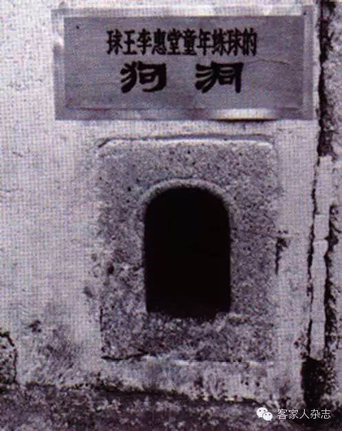
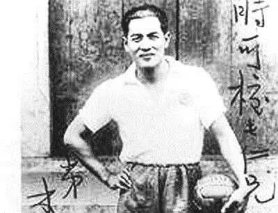
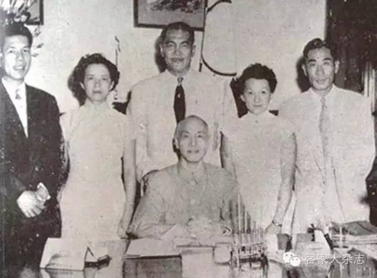
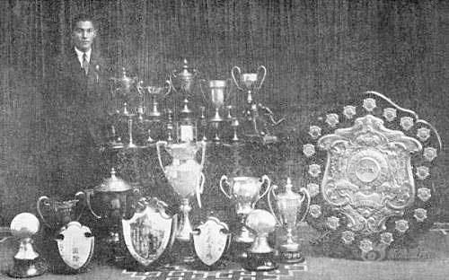

0704李惠堂

（万象历史特约作者：东西望）

1979年7月4日，中国足球球王李惠堂逝世

李惠堂（1905年10月16日－1979年7月4日），出生于香港，公认的中国足球球王。

他带领中华民国足球队，10年内连续称雄远东运动会。大家都说“看戏要看梅兰芳，看球要看李惠堂”。抗战中，支持体育救国，募捐义赛，还担任青年军体育总教官，被授少将军衔。

43岁退役后，任中华民国足球队教练，连续两届获得亚运会冠军，登上亚洲之巅。对于此后50年的中国足球，这简直是遥不可及的荣誉。他还曾两度带队杀入奥运会，可惜都铩羽而归。

1976年，德国一家足球杂志，将中国的李惠堂、巴西的贝利、德国的贝肯鲍尔、阿根廷的斯蒂法诺和匈牙利的普斯卡什，并列评为“世界五大球王”。

踢狗洞的富家少爷

1905年10月16日，李惠堂出生于香港大坑村。父亲是香港建筑巨商。7岁，李惠堂被父母送往家乡梅州（今梅州市五华县），自学足球，以门旁侧的狗洞练习射门。10岁，返回香港。1917年（12岁），考入皇仁书院接受西式中学教育，两年后辍学。

1922年（17岁），南华体育俱乐部举办“夏令营杯”足球赛中，李惠堂代表大坑村童子会足球队获得佳绩，并且进球惊人，赛后被吸纳为香港南华足球队队员。

第一次击败外国球队

1923年（18岁），李惠堂第一次入选中国足球队参加在日本大阪举行的第六届远东运动会，李惠堂在决赛对日本取得进球，并获得冠军。

1925年（20岁），李惠堂到上海加盟乐华队，任队长，其成员主要来自圣约翰、交通、沪江、复旦、暨南等几所大学。参加“史考托杯”足球赛，以4－1的比分一举击败蝉联了9届冠军的英国猎克斯队，首开上海华人足球队击败外国球队的纪录。第二年更囊括上海球界三个最高锦标：西联会甲组冠军、高级杯冠军、中华足联甲组冠军。

远东运动会上的球王

1925年5月，第七届远东运动会于菲律宾首都马尼拉举行，李惠堂带领中华民国足球队，一路挺进决赛，在与菲律宾对决中，李惠堂上演帽子戏法，以5－1的比分获得冠军。稍后的第八届（1927上海）、第九届（1930东京）、第十届（1934马尼拉）中，以他为队长的中华民国足球队均获金牌。

尤其1934年（29岁）的足球决赛中，李惠堂踢进关键一球，使中华民国以4－3击败日本。1930年代有句流行语说“看戏要看梅兰芳，看球要看李惠堂”，自此中国足球球王的别号不胫而走。

获少将军衔的运动员

1936年（31岁），柏林奥运会，李惠堂带领中华民国足球队以亚洲第一的进入奥运会。由于财政困难，足球队提前两个多月出国，一路打比赛筹措经费，先后在越南、新加坡、印尼、马来西亚、缅甸和印度等6个亚洲国家打了27场，胜24场平3场，挣得20多万港元。8月6日下午，在奥运会上对英国的首轮淘汰赛中，上半场打成零比零平手，下半场连失两球，以0－2落败。

抗日战争开始后，李惠堂的足球生涯也受到严重影响。1940年（35岁），避战于香港，再到广东。他拒绝为日本人踢球，也拒绝在汪伪政府任职。在大后方开始“体育救国”的历程，巡环重庆、成都、自贡、昆明等地，为抗战募捐出赛达138场。他在重庆还担任了青年军体育总教官，被授少将军衔。

（1936年，伦敦奥运会足球队合影，一排中为李惠堂）

43岁挂靴的老将

1945年（40岁），二战结束后，返回香港。1948年（43岁），李惠堂宣告挂靴退休。同年，伦敦奥运会上，李惠堂出任中国足球队教练。为自筹经费，球队又提前三个月出国，先后在菲律宾、泰国等地进行了35场比赛。到伦敦后，首场对垒土耳其，以0－4惨败提前打道回国。

1949年，中华人民共和国成立，贺龙曾邀请李惠堂做中国国家队主教练，被断言拒绝。
他与同为足球运动爱好者蒋纬国与郑为元的共同合作下，足球运动成为1970年代之前台湾的最兴盛运动。

（蒋介石（中）接见李惠堂）

蝉联亚洲之巅的中国足球

1954年（49岁），第二届亚洲运动会于马尼拉举行，定居香港的李惠堂任中华民国足球代表队教练，组成了香港球员为主，台湾球员为辅的“港台联队”。中华民国代表队，在预赛中以3－2胜越南、四分之一决赛4－0大胜菲律宾、半决赛4－2胜印尼，决赛5－2轻取韩国，获得中华民国难得的一块亚运会金牌。

1958年（53岁），东京亚运会上，他继续担任中华民国足球代表队主教练，以连胜四场，进八球失两球的成绩挺进决赛。决赛中，中华民国更在10人应战的情况下，于加时赛凭黄志强一头破网，以3－2打败韩国，卫冕金牌。此后，中国男子足球再也没有登上亚洲之巅。

难说再见的足球

1965年（60岁），当选为国际足联副主席，成为在国际足联获得最高职务的中国人。1966年，被选为亚洲足球联合会副主席。

1976年，联邦德国一家权威性的足球杂志曾组织过一次评选活动，将中国的李惠堂、巴西的贝利、德国的贝肯鲍尔、阿根廷的斯蒂法诺和匈牙利的普斯卡什，并列评为“世界五大球王”。

李惠堂生前写有《球圃菜根集》《足球规则诠释》《香港足球五十年》《足球登龙术》《足球读本》《鲁卫吟草》等多本著作。 1979年7月4日，一代球王李惠堂病逝香港，终年74岁。

（担任国际足联副主席时的李惠堂）

