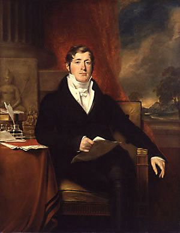
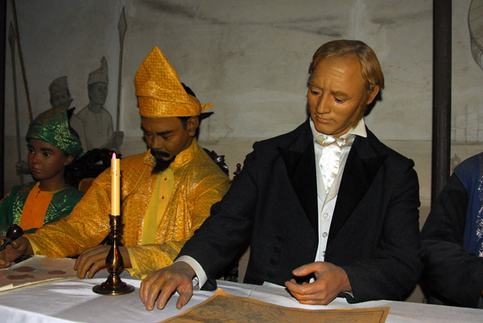
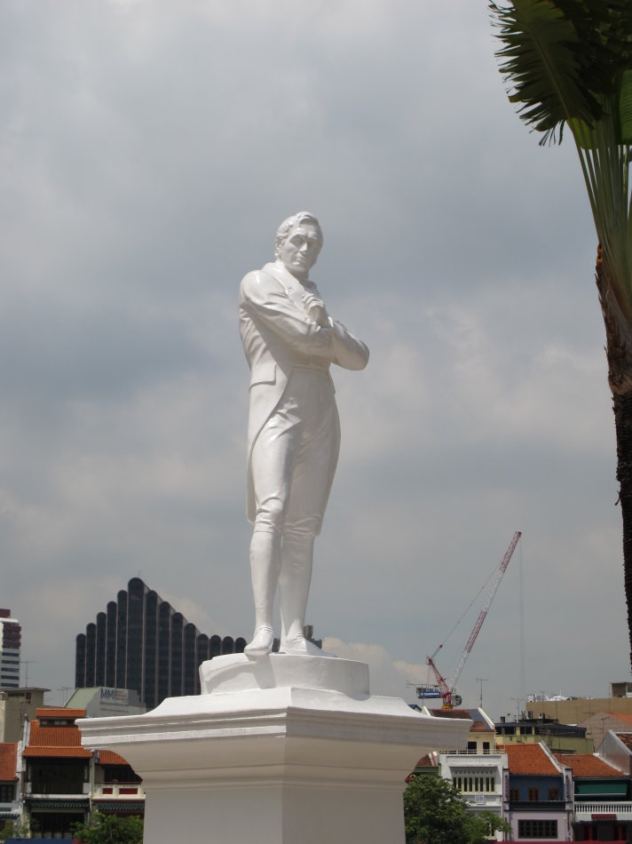

（万象特约作者：一一）

191年前的今天，开创了最发达华人国家的英国殖民者莱佛士逝世

莱佛士爵士（1781年7月6日——1826年7月5日）是英国殖民时期重要的政治家。他的主要贡献是把新加坡建立为欧洲与亚洲之间的国际港口。

1819年，莱福士与随从登入新加坡，并成为新加坡总督，从此改变了新加坡的历史。新加坡处在中国与印度（当时是英国的殖民地）之间， 英国将其发展为一个港口与贸易城市。随着新加坡的繁荣，带来了大量移民，其中以中国人最多。新加坡是目前世界上最发达的国家之一，新加坡国父李光耀将新加坡成功的关键归结为英国人留下的法制制度而不是什么儒家文化。

东南亚的殖民总督

1781年7月6日，莱佛士出生于英国。14岁，进入伦敦的英国东印度公司工作，该公司是一家半官方性质的企业，负责英国在远东的殖民活动。1805年（24岁），他被公司派往今天的马来西亚槟城，开始了他与东南亚的一段情谊。 

1811年（30岁），莱佛士被任命为爪哇总督，在英国占领了原本属于荷兰的苏门答腊岛后，又被提升为苏门答腊总督。统治期间，莱佛士尝试实行一定程度的自治，废除奴隶贸易，恢复了一些当地古迹，并以新的土地租赁系统，取代过去荷兰人的强制农业计划。他还写了一部《爪哇史》。

开创自由贸易港口——新加坡

1815年（34岁），英国将爪哇归还荷兰，莱佛士返回英国受命找寻一个港口基地。1817年，获册封为爵士。1818年，他再度来到苏门答腊。1819年2月29日，在马来亚半岛南端的一个小岛上，建立了一个自由贸易港，即今日的新加坡。

他宣布东印度公司已经从苏丹手中获得了新加坡的治理权，而事实上并不完全合法：当时合法的苏丹并未同意莱佛士的要求，莱佛士是在推翻了苏丹，另立新苏丹后，才取得治理权。莱佛士成为新加坡总督，直到1823年离职，返回伦敦。

1826年7月5日，莱佛士在45岁生日的前一天与世长辞。

一个小渔村的纪念

在今天新加坡，他的名字四处流传，如新加坡的顶尖学府莱佛士学院、莱佛士女中、莱佛士初级学院等等。新加坡国父李光耀、总理吴作栋都是莱佛士学院的校友。莱佛士饭店则是新加坡最好的五星级饭店之一。此外还有莱佛士坊地铁站、斯坦福路、莱佛士城、莱福士广场等等。

在亚洲文明博物馆旁边，新加坡河畔的小广场上，是莱佛士首次到访新加坡的登陆地点。这里肃立着传奇人物莱佛士的雕像，莱福士昂首挺立，双臂插在胸前，凝望远方。塑像基座的铜牌上铭刻着这样一段话（英文翻译）：在这一历史性地点，莱佛士爵士于1819年1月28日首次登陆新加坡，由此将一个小渔村的命运改写为一个伟大港口和现代化大都会。

