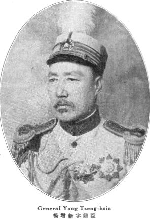

89年前的今天，在新疆主政17年、保护阿勒泰地区不落入蒙古和苏俄手里的杨增新被人暗杀

万象特约作者：一一

杨增新（1864年3月6日－1928年7月7日），字鼎臣，云南蒙自人，清末民初政治人物，光绪进士。中华民国初年曾主政新疆达十七年，历任新疆都督、督理新疆军务、新疆督军、督办新疆军务善后、新疆省主席等职衔。

新疆总督

杨增新生于清同治三年（1864年）正月二十八日。光绪十四年（1888年）中举，次年中进士，同年五月，著交吏部掣签，分发各省以知县即用。署甘肃中卫知县、河州知府。因处理当地回汉问题有功，又任甘肃提学使兼武备学堂总办。1907年调任新疆陆军学堂总办。后在新疆布政使王树枏的推举下，在新疆阿克苏、乌鲁木齐、巴里坤等地历任道台。1911年升任镇迪道兼提法使。
辛亥革命爆发，新疆省哥老会起事，革命党人在伊犁成立军政府。原新疆巡抚袁大化了解其才干，任其为提刑按察使，并训练穆斯林军队（回营）。后来袁大化逃离新疆，众人推举杨增新为督军。袁世凯任命杨增新为新疆都督，封其为一等伯。袁世凯逝世后，杨增新长期任新疆省长。他靠老练的政治经验与军事实力，平定哈密、阿克苏的动乱，分化并镇压了各地哥老会与农民起事，并与伊犁军政府和谈达成统一；尔后逐步排除军政府人物的影响力，掌握实权。到他去世为止的17年中，虽然杨增新名义上接受北洋政府的管辖任命，后来接受南京国民政府领导，但他是新疆的实际统治者。杨增新同时调整新疆的政制，集中权力，解决了清末以来新疆巡抚、伊犁将军、各处参赞大臣事权不统一的问题。

怀柔和牵制
在内政方面，杨增新推行老子的“无为而治”，信奉“浑噩长为太古民”。在政治、财政上有所改革，包括更有效率的调整建制，使新疆各地更易于为省城迪化（乌鲁木齐）所控制，此外整顿吏治，打击中饱，奖励垦荒，使财政收入大为增加，并实行裁军，维持了较长的安定和平。但杨增新在经济文化方面则较少建树，使新疆虽然能保持安定，并受到许多当地人民的爱戴，但缺乏现代化建设和发展。
为保证新疆的稳定，杨增新统治时期在与甘肃、外蒙古接壤的哈密、吐鲁番、巴里坤驻军设卡，严防甘肃、青海军阀、外蒙古黑喇嘛与革命党势力向新疆境内渗透。1928年6月，杨增新电告服从南京国民政府，改悬青天白日满地红旗，并就任新疆省主席。
在民族和宗教的政策上，杨采用了怀柔牵制的政策以防止了动乱。一方面以对各族上层王公的笼络支持，并使其中各集团互相牵制，少数民族之间、回汉之间也尽量使之互相牵制，在宗教方面，以不干涉一般性宗教活动为原则，但加强了政府对清真寺、伊斯兰经学院的管理，希望维持当地伊斯兰教现状，用宗教来协助社会秩序的维持，并防止外来的宗教力量进入影响。

避免俄患
新疆的地理位置使其成为清末以来英国与俄国争夺侵略的对象。民国初年，中国北洋政府因孙文势力不断制造内乱而无暇顾及新疆、外蒙古、西藏等边疆地区。外蒙古第八世哲布尊丹巴呼图克图宣布独立后，外蒙古军攻陷科布多，又出兵曾属清朝科布多参赞大臣管辖的阿尔泰（今阿勒泰地区）。杨增新多次击退外蒙古军队，保全了阿尔泰。民国七年（1918年），裁撤阿尔泰办事大臣，设立阿山道，以周务学作道尹，将该区并入新疆省，免于落入苏俄和外蒙古独立势力之手。

杨增新在位时，多次向俄、英两国争取权利，包括保护俄境华侨、要求英俄商人纳税等问题等，而在俄国十月革命后与苏俄政府订立了较为平等的新通商条款，并趁此时机要求英国取消原有的最惠国待遇。此外在面对俄国内战时，杨增新严守中立，保境安民，成功降服了逃入新疆的白俄军队，将其改编为归化军，使新疆最大程度地免受到俄国内战的侵扰。外交上的成功使得新疆在他统治时期未受到到严重的侵略。

逝世
1928年7月7日，杨增新在俄文法政专门学校的毕业生庆贺宴上，被当时军务厅长、外交署长樊耀南一派刺杀。政变不久后，掌军队的金树仁出兵讨伐樊耀南成功，成为新疆统治者，有一种看法，认为此次暗杀实为樊、金二人所合谋。
杨增新遗体经苏联运至北京。1929年，被安葬于昌平南沙河一带。1950年代，杨增新墓被拆毁，石料用于整修河道。现仅存墓碑一块，立于南沙河北岸，为昌平区文物保护单位。

