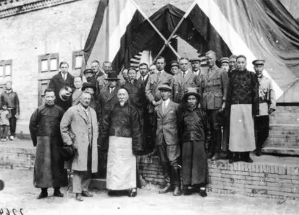

（万象特约作者：一一）

89年前的今天，打退蒙古军，保存了阿勒泰的新疆王杨增新被暗杀

杨增新（1864年3月6日－1928年7月7日），云南蒙自人，光绪进士，辛亥革命后主政新疆长达17年。

他训练穆斯林军队，成为新疆都督，名义上接受北洋政府、南京国民政府领导，实际上新疆几乎是在他统治下的独立王国。他封锁边境，防止外来的宗教力量进入，用怀柔牵制的政策，让各种力量相互牵制，使得新疆和平稳定。

他打退了独立后的外蒙古的多次进攻，将阿勒泰地区纳入新疆管理，避免落入外蒙或苏俄手里。合理的外交，使得新疆在他统治时期未受到到严重的侵略。不幸在毕业宴会上被刺身亡，震惊世界，葬于北京昌平沙河。

按部就班的公务员

1864年3月6日（清同治三年），杨增新出生于云南蒙自。1888年（24岁））中举，次年中进士。署甘肃中卫知县、河州知府。因处理当地回汉问题有功，又任甘肃提学使兼武备学堂总办。

1907年（43岁），调任新疆陆军学堂总办。后在新疆布政使王树枏的推举下，在新疆阿克苏、乌鲁木齐、巴里坤等地历任道台，后升任提法使（省最高司法长官）。

新疆的实际统治者

1911年（47岁），辛亥革命爆发，新疆省哥老会起事，革命党人在伊犁成立军政府。杨增新任提刑按察使司，负责训练穆斯林军队（回营）。后来新疆巡抚逃离，杨增新被推举为督军。袁世凯任命杨增新为新疆都督，封其为一等伯。袁世凯逝世后，杨增新任新疆省长。

他靠老练的政治经验与军事实力，平定哈密、阿克苏的动乱，镇压了各地哥老会与农民起事，并与伊犁军政府和谈达成统一；之后逐步削除军政府的影响力，掌握实权。到他去世为止的17年中，虽然杨增新名义上接受北洋政府的管辖任命，后来也接受南京国民政府领导，但他是新疆的实际统治者。

维持统一稳定的新疆

为保证新疆的稳定，杨增新统治时期在与甘肃、外蒙古接壤的哈密、吐鲁番、巴里坤驻军设卡，严防甘肃、青海军阀、外蒙古黑喇嘛与革命党势力向新疆境内渗透。1928年6月（64岁），杨增新电告服从南京国民政府，改悬青天白日满地红旗，并就任新疆省主席。

在民族和宗教的政策上，杨采用了怀柔牵制的政策以防止了动乱。一方面以对各族上层王公笼络支持，并使各集团互相牵制，少数民族之间、回汉之间也尽量使之互相牵制。在宗教方面，以不干涉一般性宗教活动为原则，但加强了对清真寺、伊斯兰经学院的管理，并防止外来的宗教力量进入。

在外蒙和苏俄的虎视眈眈下

民国初年，中国北洋政府无暇顾及新疆、外蒙古、西藏等边疆地区。外蒙古宣布独立后，外蒙古军攻陷科布多，又出兵阿尔泰（今阿勒泰地区）。杨增新多次击退外蒙古军队，保全了阿尔泰。1918年，设立阿山道，将该区并入新疆省，免于落入苏俄和外蒙古势力之手。

杨增新在位时，在俄国十月革命后与苏俄政府订立了较为平等的新通商条款。在俄国内战时，杨增新严守中立，保境安民，成功降服了逃入新疆的白俄军队，将其改编为归化军，最大程度地免受侵扰。外交上的成功使得新疆在他统治时期未受到到严重的侵略。

（杨增新和中外人士合影）

毕业宴会上的刺杀

1928年7月7日（64岁），杨增新在俄文法政专门学校的毕业生庆贺宴上，被当时军务厅长、外交署长樊耀南一派刺杀，轰动了全国。政变不久后，掌军队的金树仁出兵讨伐樊耀南成功，成为新疆统治者。也有一种看法，认为此次暗杀实为樊、金二人所合谋。

杨增新遗体经苏联运至北京。1929年，被安葬于昌平南沙河一带。1950年代，杨增新墓被拆毁，现仅存墓碑一块，立于南沙河北岸。

