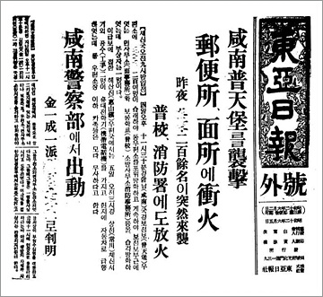

0708金日成

（万象特约作者：东西望）

23年前今天，在中国长大，年年要见毛主席的朝鲜国父金日成逝世

23年前的今天，打死2个日本人，不太会说朝鲜话的金日成逝世

)

（金日成的标准像）

金日成（1912年4月15日－1994年7月8日），朝鲜国父，朝鲜最高领导人，掌权长达46年。

他从小在中国东北长大，加入苏联共产党，组建游击队抗日，是东北抗日联军的一员。他著名的抗日功绩，是袭击朝鲜普天堡，打死7名警察2名日本人，家喻户晓。然而，因年龄相差太大，被怀疑此金日成非彼金日成。

在苏联的支持下，回到朝鲜，成为领导人，因说不好朝鲜话，练习三天后，才在会上念稿发言。随后发动了震惊世界的朝鲜战争。

通过外交手段，朝鲜获得了苏联和中国的大量援助，生活水准一直高过韩国，直到1970年代末才被扭转。1970年后，每年都要来中国拜访毛泽东。死后被尊为朝鲜国父，宪法规定他是“共和国永远的主席”。

)

（金日成的永生塔）

流亡中国的朝鲜难民

1912年4月15日，金日成出生于今平壤市万景台区，原名金成柱。13岁，随父亲离开日本统治的朝鲜，逃亡到中国，在吉林省抚松县第一小学就读了一年，其后进入吉林市毓文中学。

1931年（19岁），九一八事变后，金日成加入苏联共产党。1932年春，被派遣到安图县创建安图游击队，后并入东北抗日联军，进行抗日活动。

)

（青年时期的金日成）

不清不楚的游击队英雄

1937年6月4日（25岁），日占朝鲜境内的普天堡被袭击，指挥官自称是东北抗日联军的金日成。袭击中，打死了7名警察和2名日本平民。《东亚日报》对此事的连续报道，使得金日成在朝鲜家喻户晓。日本悬赏3000日圆捉拿抗联第一路军的首领，悬赏2000日圆捉拿金日成。

1937年11月18日，朝鲜的《京城新闻》发布了金日成被满洲国军击毙的报导。在满洲国军的官方月刊《铁心》上，也发表有“金日成匪贼讨伐详报”的详细记录。而且普天堡的居民称，金日成约为40岁左右，而不是25岁。因此不少人认为这不是同一个金日成。此事件后来被列为金日成抗日的重要战功。

逃亡苏联的东北抗日联军

1938年（26岁），任东北抗日联军第一路军第二方面军（兵力相当于一个营）指挥，在此期间他取名为金一星，后改为金日成。1940年秋（28岁），与金正淑结婚。

1941年（29岁），在日本关东军围剿下，东北抗日联军第一路军损失惨重，缩编为东北抗日联军第一支队，金日成任支队长，率部撤往苏联境内。1942年，任东北抗日联军教导旅第一营上尉营长。2月16日，金正淑在苏联伯力（哈巴罗夫斯克市）郊区宿营地生下金正日。

)

说不好朝鲜话的领导人

1945年（33岁），从苏联乘坐军舰返回离开了20年的朝鲜，建立朝鲜共产党中央组织委员会，成为朝鲜北部共产党的领袖。金日成的朝鲜语十分差，他花了三天时间反复练习，才在朝鲜共产党第一次大会上宣读准备好的讲稿。

1946年2月8日（34岁），在苏联支持下，成立北朝鲜临时人民委员会，金日成为委员长。1948年9月9日（36岁），建立了朝鲜民主主义人民共和国，并被选为朝鲜劳动党的委员长和朝鲜内阁首相，成为朝鲜最高领导人。

)

（1945年10月，金日成在平壤群众大会发表演说）

武力统一朝鲜的野望

1949年3月（37岁），金日成率团访问苏联，提出武力统一朝鲜。9月22日，金正淑难产去世，终年32岁，朝鲜尊奉她为“国母”。1950年5月13日（38岁），金日成到达北京，寻求对武力统一朝鲜的支持。6月11日，北方的三名代表越过三八线，打算递交和平统一国家的呼吁书，遭到韩国政府逮捕。

6月25日，朝鲜向韩国发动进攻，朝鲜战争爆发。金日成任朝鲜人民军最高司令官。朝鲜人民军开战初期势如破竹，迅速占领韩国首都汉城和韩国绝大部分领土。9月15日，以美军为主的联合国军在仁川登陆，发动反攻，朝鲜人民军节节败退。

)

（1950年6月，金日成向朝鲜人民发表广播演说）

中国人民的抗美援朝

10月5日，中国同意出兵援朝。10月19日，中国人民志愿军正式入朝参战，此时平壤被已被联合国军占领，朝鲜人民军已败退到鸭绿江边。中朝联军随后在云山、长津湖、价川等地取得数次战斗胜利，12月收复平壤，1951年1月重占汉城。1951年4月，联合国军发动反攻，重占汉城，将中朝联军赶回三八线以北，随后双方在三八线陷入僵局。

1953年3月5日，斯大林逝世。在主张立即停战的马林科夫和赫鲁晓夫调节下，1953年7月27日，《朝鲜战争停战协定》正式签字，朝鲜战争结束。金日成被授予元帅军衔。

)

（1953年8月，金日成庆祝朝鲜战争胜利演讲）

两个主席的会面

朝鲜战争后，金日成逐渐清洗了党内的竞争对手。1966年（54岁），金日成在成为朝鲜劳动党中央委员会总书记（之前是委员长）。

1970年（58岁），美苏缓和，金日成再次重访中国。毛泽东甚至改变了在中南海宴请的习惯，主动到金日成下榻的钓鱼台国宾馆去会见他。此后，金日成每年都会到访中国，甚至一年两次，一直维持到1976年毛泽东逝世。

1972年（60岁），任朝鲜民主主义人民共和国主席，由他一人全面掌握了朝鲜党政军的绝对权力。

)

共和国永远的主席

朝鲜透过外交往来、经贸手段获得了苏联和中国的大量援助，生活水准一直高过韩国，直到1970年代末情况才被扭转。

1988年，苏联宣布派团参加汉城奥运会，并准备与韩国建交，朝鲜与苏联断交，并驱逐所有苏联在朝人员。1990年9月30日，苏联与韩国建交。1992年，中韩建交，朝鲜与中国关系也恶化。

1992年4月（80岁），金日成被授予“大元帅”称号。1994年7月8日，金日成因心脏病死去，享年82岁。金日成的遗体现被永久保存于平壤的锦绣山太阳宫，被尊为国父。1998年，修改的《朝鲜宪法》规定他为“共和国永远的主席”，废除国家主席一职。

)

