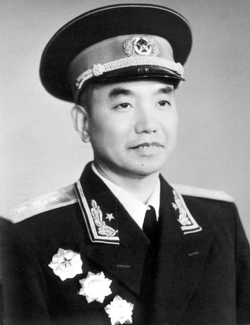
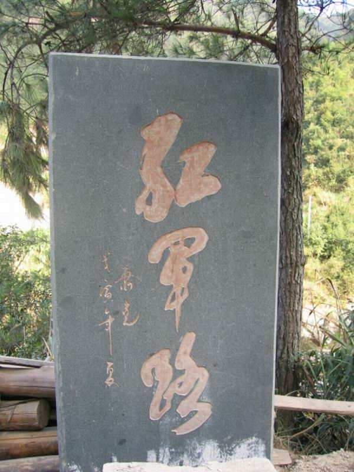

110年前的今天，获得茅盾文学奖的开国上将萧克出生于湖南

（万象特约作者：一一）

110年前的今天，排名第一的开国上将，获茅盾文学奖的萧克出生

 

萧克（1907年7月14日－2008年10月24日），湖南省嘉禾县人，排名第一位的解放军上将。

萧克从青年时期参加北伐战争投身革命，历经南昌起义、长征、抗日战争、解放战争等重大历史事件。在抗日战争中，任司令员，与日军交战上百次。解放战争中，南征北战，是主力战将。

萧克文武双全，他的长篇小说《浴血罗霄》荣获1988年茅盾文学奖荣誉奖，该书主要描写萧克在第一次国共内战、抗日战争时期的故事。1989年后，萧克力主创办了改革派的杂志《炎黄春秋》。101岁与世长辞。

参加北伐的年轻人

1907年7月14日，萧克出生于湖南省嘉禾县泮头乡小街田村一个清贫的书香门第。幼年入私塾，后就读同善高小（后改同善中学）。1923年（16岁），考入嘉禾甲种简习师范学校。1925年冬（18岁），毕业后，只身前往广州。

1926年初（19岁），考入国民政府军事委员会宪兵教练所（该教练所后归并黄埔军校）。毕业后参加北伐战争，并随国民革命军征战江西、浙江等地。1927年（20岁），萧克在叶挺部第七十一团三连任政治指导员，不久加入中国共产党。8月，参加南昌起义并随部南下，起义军在广东潮汕失败后，转移到地方发展。

从井冈山到延安

1928年1月（21岁），萧克任宜章县游击队长参加湘南起义，随后率部上井冈山编入红军第四军，先后担任连长、营长、营党代表、第一纵队参谋长等职。1929年，随部进军赣南、闽西，并参加当地根据地创建。1930年6月后，历任红四军第三纵队司令员、第十二师师长、红一方面军独立第五师师长、红八军军长、红六军团军团长等职，参加了中央革命根据地历次反围剿作战。

1934年（27岁），萧克率红六军团西征，转战贵州、云南等地，与贺龙所率红二军团会合，随后创建湘鄂川黔根据地。1936年，贺龙、萧克接到红军总司令部的来电，北渡金沙江，与红四方面军会合。随后，红二、六军团组成红二方面军，贺龙为总指挥，任弼时为政委，萧克为副总指挥。两月后，萧克代替生病的王树声出任红四方面军红三十一军军长，与胡宗南部交战，并同主力北上抵达陕北。

百战日军的司令员

抗日战争爆发后，担任八路军120师副师长，被授予中华民国国民革命军中将军衔。率部指挥忻口战役，参与开辟晋西北抗日根据地，组织指挥了收复河曲、保德、偏关等7座县城的战役。萧克给贺龙当副手时，向中央告了贺龙一状，说贺在120师搞土匪作风，提拔乡族亲信。因此，贺龙与萧克这个120师的二把手关系颇为紧张。

（萧克与朱德、贺龙、刘伯承、任弼时等在延安）

1939年（32岁），出任冀热察挺进军司令员兼政治委员，领导平西、平北、冀东等抗日根据地的发展。1940年1月，指挥部队反击日军的“十路围攻”，歼灭日伪军800余人，击落飞机1架。先后作战数百次，歼灭日伪军5500余人，巩固了平西根据地，开辟平北根据地，发展了冀东根据地，并向热河南部、辽宁西部地区发展。

1942年2月（35岁），任晋察冀军区副司令员。1943年8月，代理司令员。1944年4月，他回到延安，参加整风运动和中国共产党第七次全国代表大会。1945年（38岁），华北座谈会上，彭德怀因为百团大战挨批时，萧克是少数为他声辩的人之一。

（1938年，山西洪洞县马牧村八路军总部合影，自左起分别为彭德怀、朱德、彭雪枫、萧克、邓小平）

解放中国的南征北战

第二次国共内战爆发后，萧克担任晋察冀第二野战军司令员，组织指挥承德战役、叶赤战役、古北口保卫战。1946年（39岁），出任晋察冀野战军司令员，参与指挥正太战役、怀来战役、石家庄战役等。1948年，任华北军区副司令员。

1949年，调任第四野战军兼华中军区第一参谋长，率部南下参加渡江战役，并组织策划河南张轸起事和湖南程潜、陈明仁起事，使得解放军顺利攻占湖北、湖南。之后其率军进入中南、西南地区，参与指挥衡宝战役、广东战役、广西战役等。

（1947年4月，萧克与聂荣臻、杨成武在正太战役前线）

获茅盾文学奖的第一上将

中华人民共和国建国后，1950年4月（43岁），任人民革命军事委员会军训部部长。1955年9月27日（48岁），被授予上将军衔（排名第一位），一级八一勋章、一级独立自由勋章、一级解放勋章。1957年，任训练总监部部长、党委书记。1959年，改任中国农垦部副部长。文化大革命期间，遭受迫害并下放到江西五七干校进行劳改。

1972年1月起（65岁），任中国人民解放军军政大学校长。1977年（70岁），任国防部副部长兼军事学院院长、第一政治委员等职。1980年9月（73岁），增补为第五届全国政协副主席。萧克凭小说《浴血罗霄》，获得了1988年茅盾文学奖。1989年后，萧克力主创办了改革派的杂志《炎黄春秋》。

2008年10月24日上午12时51分，因病在北京逝世，享年101岁。

