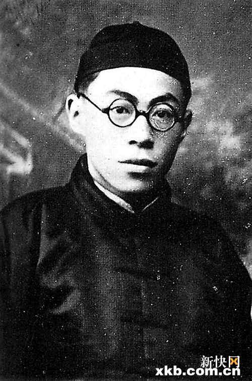
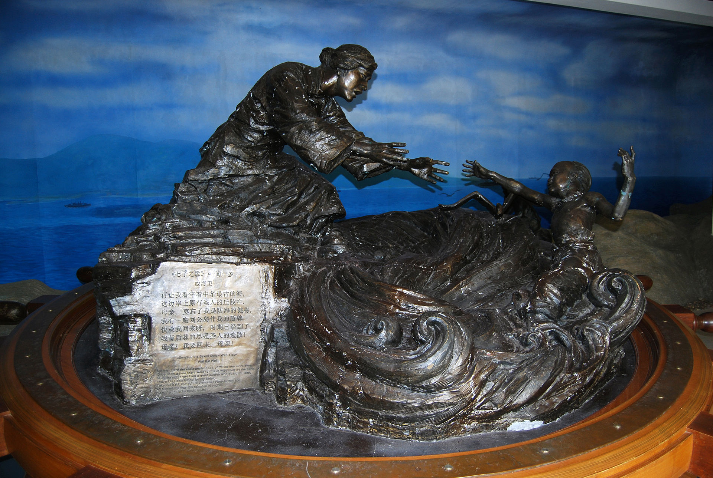
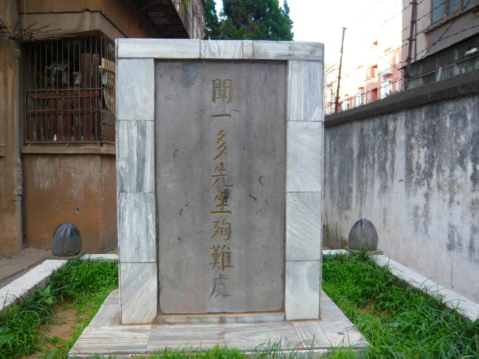
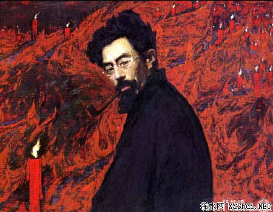

0715闻一多

（万象特约作者：东西望）

71年前的今天，1946年7月15日，发表最后一次讲演的爱国诗人闻一多被暗杀

闻一多（1899年11月24日－1946年7月15日），湖北黄冈浠水人，著名的诗人、学者、爱国主义者和民主主义者。

抗战八年中，他蓄起一把胡子，发誓不取得抗战的胜利不剃去。1944年，他加入中国民主同盟。1946年7月11日，民盟负责人李公朴被杀。4天后，发表著名的《最后一次讲演》，随即也被暗杀。

有人认为：“闻一多遭暗杀事件，是国共内战转折的重要关键。当时国民政府处理不当，被批为法西斯独裁，让红色政权赢得知识分子、学生支持，甚至连国际舆论、支持也开始转向。”

（诗人主要的天赋是爱，爱他的祖国，爱他的人民。）

清华学校的widow

1899年11月24日，闻一多出生于今黄冈市浠水县巴河镇的一个书香门第。5岁，入私塾启蒙，11岁到武昌就读于两湖师范附属高等小学。1912年（13岁），以湖北籍第二名考入北京清华学校中等科一年级。从此在清华度过了十年学子生涯。

入校时他的姓名是闻多，同学就用谐音的英文词widow（寡妇）给他起了绰号。那时候，革命主张是废姓，朋友间直呼其名，潘光旦便建议他改名为一多，他从善如流，立刻笑领了。

1916年（17岁），开始在《清华周刊》上发表系列读书笔记，总称《二月庐漫记》。1919年（20岁），五四运动时积极参加学生运动，曾代表学校出席全国学联会议（上海）。

写新诗的文艺青年

1920年4月（21岁），发表第一篇白话文《旅客式的学生》。9月，发表第一首新诗《西岸》。1921年，从清华学校毕业后，与梁实秋等人发起成立清华文学社。1922年3月，写成《律诗的研究》，系统地研究新诗格律化理论。

1922年7月（23岁），赴美国芝加哥艺术学院学习。年底出版与梁实秋合著的《冬夜草儿评论》，代表了闻一多早期对新诗的看法。1923年，出版第一部诗集《红烛》，把反帝爱国的主题和唯美主义的形式典范地结合在一起。

爱国的大学教授

1925年5月（26岁），回国后，历任国立第四中山大学（今南京大学）、国立武汉大学（任文学院首任院长并设计校徽）、国立青岛大学（现山东大学）、北京艺术专科学校、政治大学、清华大学、西南联合大学教授。

1925年7月4日（26岁），发表《七子之歌》，写出中国被列强掳掠的七片土地的声音。1928年（29岁），出版第二部诗集《死水》，在颓废中表现出深沉的爱国主义激情。此后致力于古典文学的研究。对《周易》、《诗经》、《庄子》、《楚辞》四大古籍的整理研究，被郭沫若称为“前无古人，后无来者”。　

抗日的民主斗士

1937年（38岁），中国抗日战争开始，他在昆明西南联大任教。抗战八年中，他蓄起一把胡子，发誓不取得抗战的胜利不剃去。1943年（44岁），时在中共南方局任宣传部长的华岗，被派到昆明，担任与“云南王”龙云之间的联络人。不久，华岗与闻一多正式见面并成为朋友。 

1944年（45岁），他加入中国民主同盟，后出任民盟中央执行委员、民盟云南支部宣传委员兼《民主周刊》社社长，成为积极的民主斗士。

1945年12月1日（46岁），昆明发生国民党当局镇压学生爱国运动的一二一惨案，闻一多亲自为死难烈士书写挽词：“民不畏死，奈何以死惧之”。出殡时，他拄着手杖走在游行队伍前列，并撰写了《一二一运动始末记》。

最后一次讲演

1946年7月11日（47岁），民盟负责人、当年救国会七君子之一的李公朴，在昆明被国民党特务暗杀。闻一多当即通电全国，控诉反动派的罪行。他为《学生报》的《李公朴先生死难专号》题词：“反动派！你看见一个倒下去，可也看得见千百个继起来！”

7月15日，在悼念被暗杀的李公朴的大会上发表了讲演，后称为《最后一次讲演》。当天下午在西仓坡宿舍门口，即被国民党枪杀，年仅47岁。

7月21日，在昆明学联主办的《学生报》上以《无耻啊！无耻啊！他们在慌啊，在恐慌啊！》为题，全文刊载此次演讲的原始记录稿。

枪决凶手

闻一多被暗杀后，举世震惊，蒋介石下令唐纵彻查，暗杀事件很快就破案。昆明警备司令部下级军官汤时亮和李文山，是事件凶手。两人由宪兵司令部举行公开军法审讯，然后被枪决。

台湾学者陈永发表示：“闻一多遭暗杀事件，是国共内战转折的重要关键。当时国民政府处理不当，被批为法西斯独裁，让红色政权赢得知识分子、学生支持，甚至连国际舆论、支持也开始转向。”

1948年8月，闻一多的遗著——《闻一多全集》出版，由朱自清主编。

