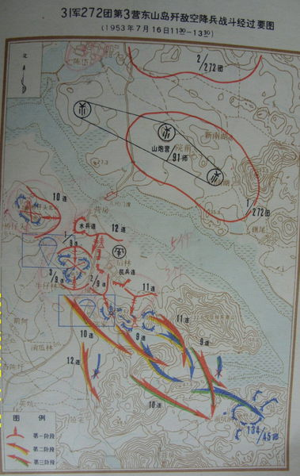
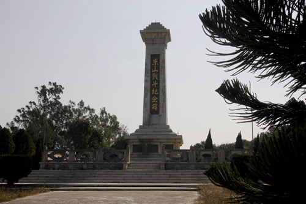
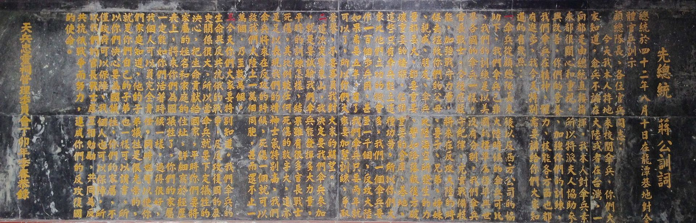

64年前的今天，国民党最后一次用成建制部队反攻大陆的东山岛战役打响

万象特约作者：一一

东山岛战役（中华人民共和国方面称为东山岛保卫战），是1953年7月16日，韩战停战协定签署前，中华民国陆军二级上将、金门防卫司令胡琏率1万多国民党军队，对位于福建和广东二省交界处的东山岛突然发起了突击作战。以中国人民解放军击败国民党军队，成功守住东山岛而结束。

东山保卫战被称作国共两党的最后一场酷烈的战争，当时，国民党军队出动军舰13艘，兵力1.3万人，在飞机、坦克的掩护下和伞兵部队配合下，叫嚣要在4至8小时之内占领福建省东山岛。我驻岛部队以一当十，痛击来敌。援军从厦门、泉州、汕头三个方向火速施援。在两天一夜的激烈战斗中，我军共歼敌3379人，击落敌机2架，击毁坦克2辆，缴获大量军用装备。英勇的东山岛人民自发支前，奋勇擒敌，涌现了许多可歌可泣的动人故事。战后毛泽东说：东山保卫战的胜利，不光是东山的胜利，也不光是福建的胜利，而是全国的胜利。

战前态势

此役是美国中央情报局（CIA）的化身—西方公司（Western Enterprises Inc.）计划的。1939年毕业于西点军校的“独眼龙”汉弥顿中校（Edward Smith Hamilton）草拟的作战计划中包含中华民国陆军、伞兵支队、中华民国海军陆战队、政战人员等，再加上中华民国海军、中华民国空军的配合。西方企业公司成员何乐伯（Frank Holober）著书《中国海上突击队》（Raiders of the China Coast）记载了此役。
1953年2月初国防部即开始计划突击东山岛，原本计划使用两个师的兵力，因故延至7月。7月初国防部计划完成，代号为“粉碎计划”，由金门防卫司令部成立联合任务指挥部，由金防部司令胡琏中将担任指挥官。而此次战役的目的，在于以实战验证三军联合作战的能力，尤其是对于伞兵的运用，进行一种实战测试。
国防部在战前研判中认为，在开战36小时候后，东山岛120公里范围内，解放军可以增援1万2千人，如时间延长，北起厦门南迄汕头，解放军将可以动员5万5千人的部队。所以，最初的战术计划，就是不论成败以作战36小时为限，并不会占领东山岛。
东山岛上当时驻守有解放军福建军区公安第80团(欠第三营与第二营第四连）及1个水兵连共1200人，团长游梅耀是闽西籍老红军，抗战时曾当过陈毅的副官。驻军在岛上构筑了工事并制定了在东山岛遭到攻击时的增援方案。东山岛为福建沿海最南端的岛屿，是福建省内第二大岛，与1950年5月被解放军攻占。

战斗进程

第一日
国民党军队闽海两栖突击部队，以扫荡东山岛为目的之突击行动，在极机密准备完成后，从金门发航。7月15日夜，驻金门国民党军队第19军第45师等1万余人从金门出发，驶向东山岛，此前，国民党军队空军炸断了解放军增援东山岛的必经之路“九龙江大桥”，至国民党军队出发之日，国民党军队所得到的报告仍称九龙江大桥并未被解放军修复。
国民党军队航行出料罗湾后被解放军海岸观察哨发现，福建军区遂立刻通知沿海部队做好战斗准备。当晚，九龙江大桥即被民工修复，使得汽车又能顺利通行，此点为胡琏所始料未及。

第二日
第31军在7月16日拂晓得知了国民党军队在东山岛登陆的消息，立即命令驻漳浦以南旧镇机动部队第272团在团长郑克诚率领下前往增援，5点50分，战斗刚刚打响，先头部队就已坐上军车出发了。其余指战员则急行军到交通要道，向来往的客车、卡车叫停。一时间，通往东山岛的各交通要道上，不同型号、颜色各异的轿车、公交车、卡车纷纷加入军车行列，向东山岛方向进发。在国民党军队登陆过程中，由于码头处于在制高点上的解放军守军重迫击炮的射程之内，损失了部分运载兵员的舰船。

除了解放军核心阵地外，以八尺门地区的战斗尤为激烈，因为八尺门是解放军增援部队增援东山岛的必经渡口，一旦被国民党军队控制，解放军援军即使赶到，也在短时间内无法渡海登岛增援。解放军方面当时驻守八尺门的为1个水兵连不足100人，当国民党军队登陆后，水兵连中多数人正在掩护东山岛上的解放军机关干部登船向大陆撤退。当日，国民党军队向八尺门地区空降了425名伞兵，当国民党军队开始空降时，八尺门地区仅剩下水兵连连长和6名士兵，国民党军队现在200米低空投下部分伞兵。水兵连长发现之后，立即带领6名士兵从仓库中取出4挺轻机枪对空进行射击，击死击伤部分跳伞国民党军队，同时迫使国民党军队飞机拉高至1000米，进行高空空投，导致了国民党军队伞兵飘落时间延长，空降范围扩大，空降后分散，同时在空中成为了解放军地面部队的活靶子。空降后一个小时，国民党军队伞兵才被组织起来投入战斗。解放军八尺门地区部队在国民党军队伞兵空降后处于混乱之机，集合了水兵连队伍，同时集合了一些民兵，抢占临时工事，准备抗击国民党军队空降部队。国民党军队空降部队集合完毕后，利用兵力火力优势向解放军发起进攻，水兵连且战且退至渡口，凭借码头的围墙作为屏障继续阻击国民党军队，使国民党军队3个小时尚未攻占八尺门，为解放军增援部队的到达争取了时间。

第三日
解放军方面记载，7月17日凌晨，解放军第31军第272团全部登陆东山岛，第28军和第41军先头部队也已经登上东山岛。解放军守岛部队与增援部队会师后，四位团长召开会议，游梅耀决定不等增援部队全部到达就发起反击，战斗开始向有利解放军的方向发展。而解放军登陆增援的部队也发现国民党军队开始出现动摇，也在兵力还不占优势的条件下立即向国民党军队发起进攻。17日，解放军31军军长周志坚率91师指挥所上岛，一夜之间，双方力量对比彻底转变。到7月17日上午，国民党军队见预定作战目标已经不能达成，遂决定收缩兵力。临近中午，解放军各部队向国民党军队发起全面进攻，重新夺回东山岛主控权。解放军表示，国民党军队伞兵精锐死伤惨重，仓皇撤退时又留下一些伞兵未能带回金门。由于当时没有海空军力量支持，解放军无法拦截国民党军队从海上撤退，至17日黄昏，解放军歼灭了国民党军队掩护部队，取得东山岛战役的胜利，成功守住东山岛。

战后总结
叶飞于7月23日，向华东军区、中央军委报告东山战斗情况时：“我们这次为什么能打得好，首先是前线指挥官不机械执行命令，照当地战斗情况需要，下决心打，不撤。前线指战员的极端坚强，这是国民党军队所学不到的……东山战斗解决了我们一个问题：敌人随时可能集中绝对优势兵力来侵犯我们，我们能不能顽强地抵抗？南日岛的失败是一个连没有能坚持到晚上。敌人一开始来是集中的，我们是从分散到集中，东山这个部队能够坚持，证明完全可以用少数部队依靠地形抵抗强大优势敌人，争取主力增援消灭敌人。这个结论，文章由边防八0团来做，做得很好。”
陈毅说：“东山战斗胜利的意义不在于战果数量多少，而在于把敌人的计划彻底粉碎，不仅是军事上的很大胜利，而且是政治上的很大胜利。”
毛泽东对东山战斗总结报告评价为：“东山战斗不光是东山的胜利，也不光是福建的胜利，这是全国的胜利。”并致电叶飞：“你们头脑要冷静，不要轻敌，现在美帝蒋介石就是看中你们福建。”“我们还要准备比东山更大规模的战斗，把敌人消灭在水上。陆上来了，消灭他在陆地上，不要怕。”

影响

东山岛战役后，蒋介石不再派出编制部队反攻大陆，而解放军指挥官叶飞则是一雪金门战役（中华民国称古宁头战役）的前耻，成功打胜了号称“解放军版本的金门战役”。通过此次战役，解放军一雪一年前南日岛战役之耻。而国民党军队反攻大陆军事作战行动至此告终。挖掘工事坚守与机动增援从此成为解放军沿海防御战术。解放军于1955年发起三军协同作战，攻占一江山岛。
此次战役是国民党伞兵运用与三军联合作战的实战测试。然而在国民党军队的主力战斗机仍使用二次大战研发的P-51与P-47螺旋桨战斗机时，解放军却已经从1950年开始换装米格15喷射战斗机，随着空优的丧失，使国民党军队不再进行突击作战。不过，经此次实战验证后，对于大规模伞兵运用与三军联合作战，还是有了实务上的战术经验，促使国民党军队在重新掌握空优后，设计出国光计划的全面反攻大陆计划，不过随着时局的变化，这个计划最终还是成了一纸空文。

