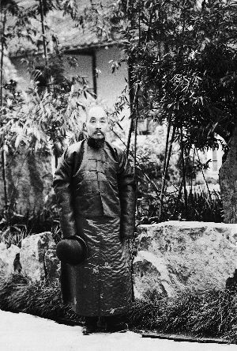
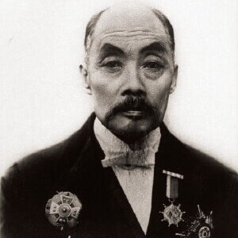
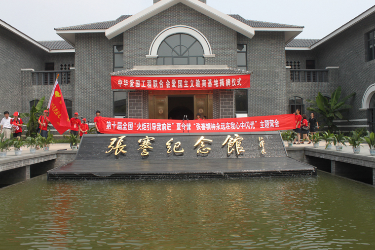

（万象特约作者：一一）

91年前的今天，创办370多所学校、最终破产的状元郎张謇去世

张謇（1853年7月1日－1926年7月17日），江苏海门人，清末状元。中国近代实业家、政治家、教育家。

他曾经冒名顶替考中秀才，与袁世凯是同事。得到“清流”青睐，几乎是内定状元，却经过5次会试才最终成功状元郎。

甲午战败后，一心实业救国，一生创办了20多个企业，最终却全部破产。他一生疯狂创办了370多所学校。是中国民族工业的领头人，更是中国学校教育的最大贡献者。

冒名顶替考中秀才

1853年7月1日，张謇出生于江苏海门。兄弟五人，他排行第四，世代务农。1868年（15岁），由于祖上是三代没有功名的“冷籍”，不容易在科举中被录取，因此冒用如皋县张铨儿子张育才的名义报名，经县、州、院三试胜出，考取如皋县学为生员。

1869年（16岁），张謇考中秀才。不久张铨意图勒索，在如皋官府控诉，“冒名顶替案”爆发。张謇连年打官司，吃足了苦头，后来得到江苏学政等人的帮助，案件才得以撤销。

袁世凯的同事幕僚

1874年（21岁），张謇前往南京投奔孙云锦。1876年夏（23岁），应淮军“庆字营”统领吴长庆的邀请，任文书，后袁世凯也投奔而来，两人成为吴长庆的文武两大幕僚。1880春（27岁），吴长庆升浙江提督，张謇随同前往。同年冬，吴长庆奉命帮办山东防务，张謇随庆军移驻登州黄县。

1882年（29岁），朝鲜发生“壬午兵变”，日本乘机派遣军舰进抵仁川，吴长庆奉命支援朝鲜平定叛乱。张謇随军奔赴汉城，起草《条陈朝鲜事宜疏》，并撰写《壬午事略》、《善后六策》等政论文章，主张对外强硬政策，由此得到南派“清流”首领潘祖荫、翁同龢等的赏识。1884年（31岁），吴长庆奉命回国，驻防金州，袁世凯则留守朝鲜。不久，吴长庆病故，张謇离开庆军回归故里，继续攻读应试。

费尽周折的内定状元郎

张謇从16岁录取生员起，先后5次赴江宁府参加江南乡试（俗称南闱）均未中试。1885年（32岁），转赴顺天乡试（俗称北闱），考取中第二名举人，俗称“南元”（南人列北榜名次最先者），成为“清流”着重招揽的对象，但此后张謇四次参加会试均遭失败。

1894年（41岁），张謇第五次进京应试，终于中了一等第十一名，翁同龢将他改为第十名。殿试时，翁同龢命收卷官坐着等张謇交卷，直接送到自己手里，评阅后劝说其他阅卷大臣把张謇的卷子定为第一，并向光绪帝介绍说：“张謇，江南名士，且孝子也。”于是，张謇在41岁的时候，终于考中第一名，成为状元郎。

“清流”中的佼佼者

不久，中日甲午战争爆发，以翁同龢为首的“清流”拥戴光绪帝，坚持主战。名噪一时的新科状元张謇，由于历史渊源和政见相近，很快就成为“清流”的佼佼者，是“翁门”弟子中的决策人物。

1895年初（42岁），两江总督张之洞奏派张謇举办通海团练，以防御日军可能对长江下游的侵犯。不久，甲午战争中清政府战败并签订了《马关条约》，通海团练半途而废。同年底，加入康有为组织的上海强学会。

.jpg)

民族资本的实业救国

此后，张謇渐渐转向实业救国。1898年，大生纱厂正式在江苏南通的通州区动土兴建，次年建成投产。经过数年的惨淡经营后，大生纱厂逐渐壮大，到1911年为止，大生一、二厂已经共获净利约370余万两。

1901年起（48岁），在两江总督刘坤一的支持下，建成了纱厂的原棉基地－－通海垦牧公司。随着资本的不断积累，张謇又创办了广生油厂，复新面粉厂，资生冶厂等，逐渐形成唐闸镇工业区。同时，又在唐闸西面建了港口──天生港。以后，又兴建发电厂，开通公路，使天生港逐步成为当时南通的主要长江港口。南通成为中国早期的民族资本主义工业基地之一。

“疯狂”的教育救国

发展工业需要科学技术，促使张謇去努力兴办学堂。1902年（49岁），张謇创立了通州师范，翌年正式开学，这是中国第一所师范学校。1905年（52岁），张謇与马相伯在吴淞创办了复旦公学（今复旦大学）。1907年（54岁），创办了农业学校和女子师范学校。1909年，倡建通海五属公立中学（今南通中学）。1912年（59岁），创办了医学专门学校和纺织专门学校、河海工程专门学校（今河海大学），并陆续兴办一批小学和中学。

 1912年，张謇创办江苏省立水产学校，1913年全校迁往吴淞，称“吴淞水产专科学校”（今上海海洋大学）。 1917年（64岁），同济医工学堂（今同济大学）在吴淞复校。 1921年，上海商科大学在上海成立，后合并为南通大学。此外，还建立了中国第一所特殊教育学校——聋哑学校（现为南通特殊教育中心）。总共创办了370多个学校。

破产后黯然离世

1922年（69岁）—1924年，棉花价格暴涨，张謇的纱厂破产。1926年7月17日，张謇黯然离世，享年73岁。他的陪葬品是：一顶礼帽、一副眼镜、一把折扇，还有一对金属的小盒子，分别装着一粒牙齿，一束胎发。（1966年8月24日，张謇墓被红卫兵当做“四旧”砸毁，张謇的孙女目睹墓中葬物。）

