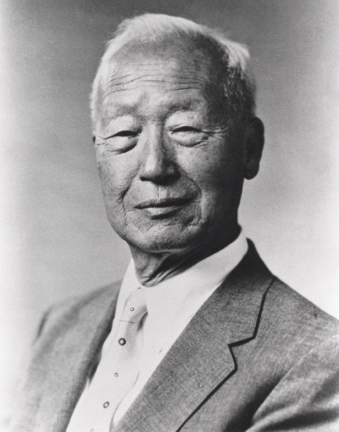
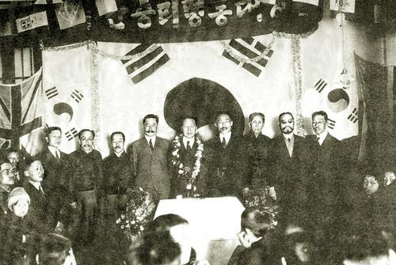
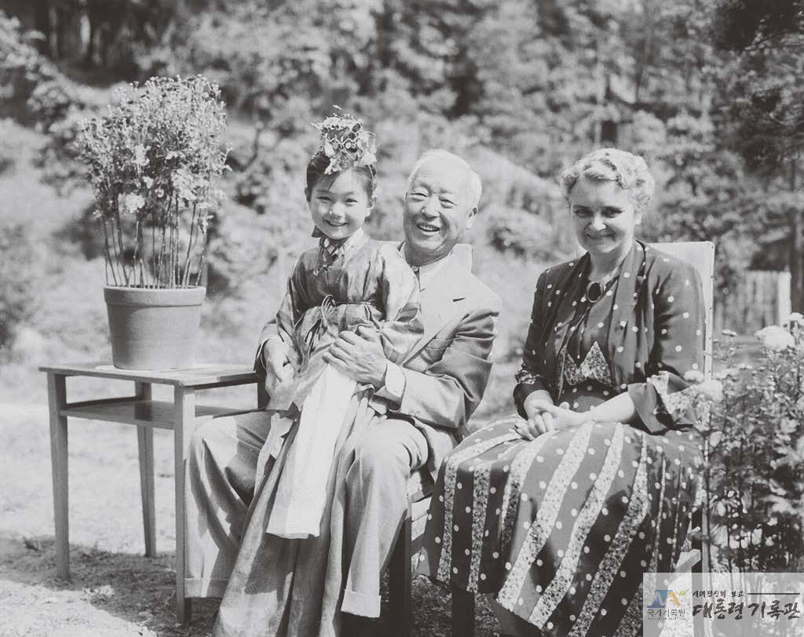
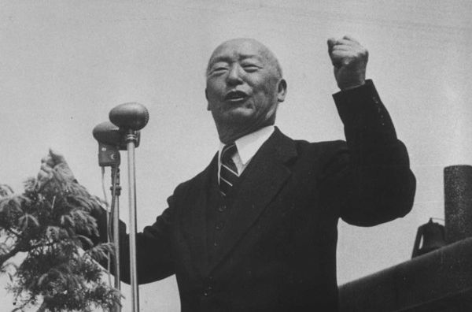
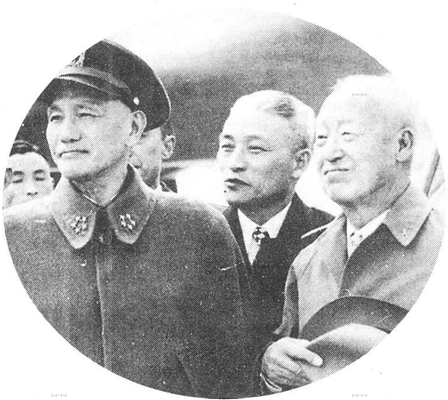
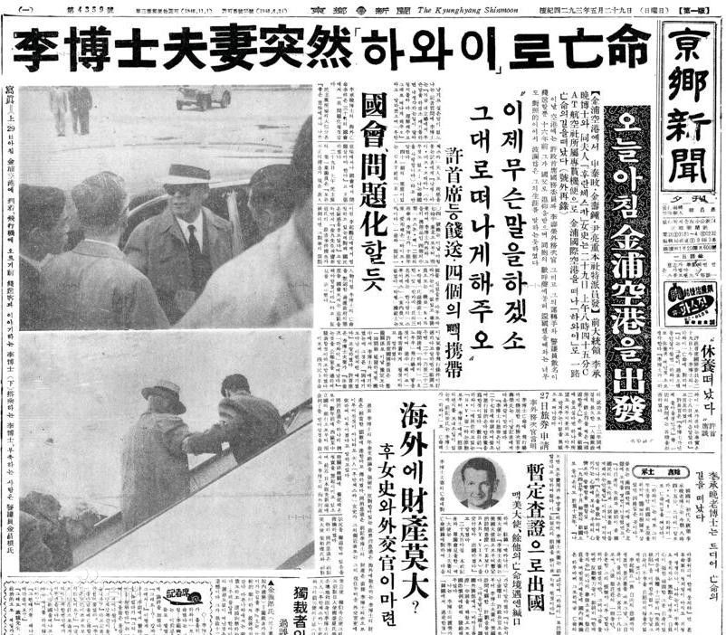

（万象特约记者：一一）

52年前的今天，因为独裁被剥夺国父称号、三次连任总统的李承晚在美国去世

52年前的今天，1965年7月19日，韩国第1、2、3任、差点第4任总统李承晚逝世

李承晚（1875年3月26日－1965年7月19日），朝鲜王朝太宗的十六世孙，大韩民国第1、2、3任总统。

他在韩国第一家报纸《独立新闻》任英文版主笔，因抨击时政被判死刑，狱中编撰了韩国历史上第一部《韩英词典》。出狱后，留学美国，是第一个获美国博士的韩国人。

在美军的支持下，当选为韩国总统。后废除国会选举总统，改为直选，连任第2任总统。连任第3任总统后，胁迫国会通过废除总统最多连任两次的限制。在第4次选举中，舞弊获得90%得票。随后爆发全国抗议，被迫离职，流亡美国。韩国国父的称号，也被拿掉。

（韩国为李承晚铸造铜像，揭幕式遭市民反对）

被判死刑的第一个留美博士

1875年3月26日，李承晚出生于朝鲜全州，是朝鲜王朝太宗的第十六世孙。幼年入黄海道私塾学习汉字和儒家经典。1894年（19岁），进入美国卫理公会在汉城创办的教会学校——培才学堂就读。在这里，李承晚学会了英语，并接受了基督教信仰和西方近代政治思想的影响。

（18岁时的李承晚（右立者）与父亲（中坐者））

毕业后，李承晚参加了“独立协会”，并担任韩国第一家近代报纸《独立新闻》的英文版主笔。1898年（23岁），李承晚因抨击时政，被捕后被判处死刑，后来不断减刑。在狱中，李承晚编撰了韩国历史上第一部《韩英词典》。

1904年（29岁），李承晚出狱后，在教会的资助下渡美留学。1905年，获得美国乔治华盛顿大学政治学士学位。1908年（33岁），获哈佛大学哲学硕士学位。1910年，获普林斯顿大学国际政治博士学位，成为第一个在美国荣膺博士头衔的韩国人。

（狱中李承晚（左立者））

大韩民国临时政的总统

1912年（37岁），李承晚曾短暂回国，后被日本殖民当局驱逐出境。此后，侨居美国夏威夷，积极从事独立运动，成为声名显赫的独立运动领袖。

1919年（44岁），韩国的民族主义者在上海成立“大韩民国临时政府”，远在美国的李承晚缺席，却被选为临时政府总统。但不久因与临时政府其他成员不和而离职，远走美国。此后20多年一直在美国从事独立运动。

(1920年12月，李承晚到上海就任临时政府总统的欢迎会)

他曾是大韩民国临时政府的首任总理（1919年4月－9月）、驻美代表（1919年9月－1941年）、首任总统（1919年4月－1925年3月11日）、国务委员（1933年－1940年）、驻美代使（1941年－1945年10月）。

1933年，在纽约市娶奥地利人弗兰西斯卡·端娜（Franziska Donner，朝鲜名李富兰）为妻。

大韩民国的第一任总统

1948年7月20日（73岁），在驻朝鲜美国陆军的支持下，李承晚在大韩民国国会获选为韩国总统，得票率92.3％；得票次高的候选人金九仅6.7％。第二年，金九便遭暗杀身亡，不少评论认定为李承晚下令暗杀。

1950年6月11日（74岁），朝鲜北方的三名代表越过三八线，打算向韩国递交和平统一国家的呼吁书，被韩国政府逮捕。6月25日，朝鲜得到苏联和中国的支持和援助，向南进攻韩国，引发了朝鲜半岛最大规模的一次战争，史称朝鲜战争。经过一年惨烈战斗后，1951年，南北双方相持在三八线。

（李承晚与麦克阿瑟在大韩民国开国典礼上合影）

大韩民国的第二任总统

1951年，李承晚认为难以再获国会选为总统，于是要求修宪改为总统直选。在国会抵制后，李承晚下令拘捕反对党议员，于1952年（77岁）通过修正案，同年总统选举以74%得票率当选总统。

1953年6月15日，朝鲜停战谈判达成全部协议，但是李承晚拒绝在《朝鲜停战协议》上签字。6月17日深夜起，他擅自释放反共战俘27000人（朝鲜人民军被俘人员）逃出战俘营，并且表示要继续“北进”、“单独干”，不服从美军的领导。

大韩民国的第三任总统

此事，引起联合国军参战各国的强烈不满，美国担心停火谈判破裂，当天紧急召开会议，讨论除掉李承晚的提案，艾森豪在会上说道：“唯一能够快速结束危险的办法就是兵变”。但幸运地，在时任美国国务院亚太助卿的饶伯森的协调之下，李承晚同意停火协议，韩美两国得以顺利度过危机，并在当年8月签订《韩美互相防卫条约》。

1956年（81岁），李承晚在大韩民国总统选举以70%绝对多数票连任。其后，他胁迫国会通过废除总统最多连任两次的限制。

（1953年11月27日李承晚访台，与蒋中正会晤）

差一点的第四任总统

1960年3月15日（85岁），在韩国第四任总统大选中，李承晚通过舞弊以90%得票当选。在野党总统候选人在选前遭到暗杀，引发了学生和民众抗议。事情愈演愈烈，促成了4·19全国性大规模学生抗议活动，人数超过10万人，而士兵和警察拒绝攻击示威者。

4月26日，李承晚被迫宣布辞职，5月29日，与妻子亡命美国夏威夷。一年后，朴槿惠的父亲朴正熙少将发动了军事政变，韩国进入长达27年的军事统治时期。朴正熙担任了韩国第5至9任总统。

1965年7月19日，李承晚在夏威夷去世，享年90岁。李承晚一度被称为国父，李承晚被迫下台流亡后，失去了国父的称号。1962年，朴正熙追授金九大韩民国建国勋章，追尊为韩国国父。

