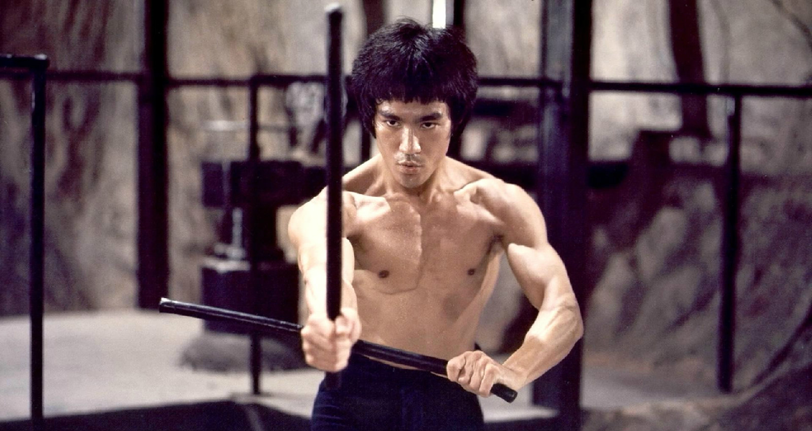
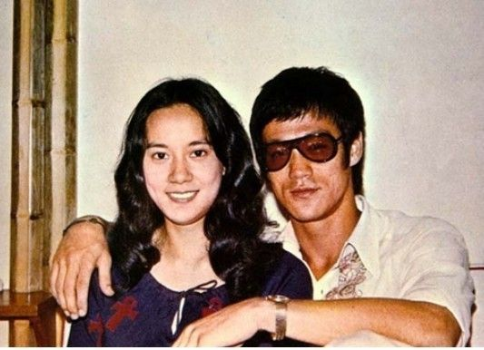

0720李小龙

（万象特约作者：东西望）

44年前的今天，1973年7月20日，打败太极高手，只有四部半电影的李小龙离奇死亡

李小龙（1940年11月27日－1973年7月20日），出生于美国旧金山的香港人。著名武术家、演员。

演员世家，从小便是天才童星。因和流氓打架，拜咏春拳宗师叶问为师。到美国开武馆，3分钟打败形意拳、北少林拳、太极拳的高手。创建无套路、无规则、后发制人的截拳道。后被人开枪袭击，身中两弹，虽未受重伤，却无心再开馆。

回香港重回影坛，出演《唐山大兄》、《精武门》、《猛龙过江》，一举拯救了正在衰败的香港电影，成就了嘉禾公司的辉煌。他只主演了一部好莱坞电影《龙争虎斗》，就成为名动天下的国际巨星。

拍摄电影《死亡游戏》，讲述一位高手勇闯七层宝塔，换来一句谒语：“生是一个等待死亡的历程”。未曾想一语成谶，李小龙猝死在台湾女星家中，震惊世界。5年后，《死亡游戏》上映，片中主角的葬礼就直接取自李小龙真实的葬礼。

（香港星光大道上的李小龙像）

丑星家里的天才童星

1940年11月27日，李小龙出生于旧金山唐人街，出生后即被父母带回香港。父亲是香港粤剧四大名丑之一李海泉。李小龙自幼身体孱弱，在他7岁时，父亲便教他练习太极拳，以锻炼身体。

1950年（10岁），以男主角身份出演电影《细路祥》，饰演一个从好变坏，又从坏变好的孤儿，获得一致好评。第二年，参演《人之初》再次获得好评。有人称他为“天才童星”。随后，李小龙先后参演10多部电影，大部分角色均为“乖仔”。

咏春拳叶问的亲授弟子

1955年（15岁），李小龙在一次帮派打架中受挫，于是去拜咏春拳宗师叶问为师。不久，因咏春练习单调而放弃。但后来，在一次与流氓打架时，使出一招日字冲拳击倒对方。于是重新回到叶问门下，成为亲授弟子。1957年（17岁），夺得香港校际拳击比赛少年组冠军。

（李小龙跟叶问学习咏春拳）

在美国的高手对决

1959年（19岁），李小龙到美国学习。1961年（21岁）考入西雅图华盛顿大学，主修戏剧，副修哲学、心理学。1962年4月，李小龙大二期间租用了校园的一个停车场角落，挂起了“振藩国术馆”的牌子。期间，结识了未来的妻子琳达。

1964年8月（24岁），李小龙在加州奥克兰开设武馆。曾与形意拳、北少林拳以及太极拳的好手黄泽民，与进行了一场极富争议的对决。结果3分钟后，黄泽民被击败。1964年8月17日，李小龙与琳达结婚，育有一子一女。

（李小龙的妻子莲达）

1966年（26岁），李小龙参与演出30集电视剧《青蜂侠》，担演配角“加藤”（Kato），其后以“加藤”角色又演了2集《蝙蝠侠》。

（李小龙在电视剧《青蜂侠》的造型）

创办截拳道的武术宗师

1967年7月9日，李小龙正式在洛杉矶中国城开办振藩武术馆，确定其武道哲学为截拳道，英语Jeet Kune Do，简称JKD，为粤语音译。与一般武术不同的是，截拳道是一种“无套路”、“无规则”的一种“未完成”武学。

截拳道是一套武学逻辑，旨在拦‘截’对手，后发制人。截拳道的二大核心精神是：1攻击是最好的防御，2实用、简单、迅速。截拳道目前在全世界学员在百万人以上。截拳道图腾上写到：以无法为有法，以无限为有限。

1969年（29岁），李小龙在成年后的首部电影《丑闻喋血》上映，剧中他饰演反派角色。1970年，李小龙被人开枪袭击，身中两弹，子弹口径为0.22杀伤力不大，且当时穿皮夹克，没受大伤。经此事后，李小龙决定离开美国，回到香港。

（截拳道的图腾）

拯救香港电影的武打明星

1971年（31岁），李小龙主演的《唐山大兄》上映，片中李小龙迅猛的三脚回旋连环踢、凌空飞脚以及高亢的啸叫等武打噱头极具个性，令观众如痴如醉，功夫热潮因而掀起。该片创下了香港开埠以来的电影最高票房纪录，达到300万港元。

1972年（32岁），《精武门》上映，李小龙在片中饰演霍元甲弟子陈真，首次将双节棍搬上银幕，大闹日本武馆，砸烂污蔑中国人是“东亚病夫”和“狗与华人不得入内”的牌匾。自此成为了一大经典，该片票房收入超过400万。同年，自编自导自演了《猛龙过江》。

当时电影界正陷于低潮，几乎停止生产。李小龙凭借一身武艺与银幕魅力，重新掀起一股电影热潮，将观众拉回影院中，让衰退的香港电影工业重新找到一线生机，也奠定了嘉禾公司香港电影霸主的地位。

只有一部电影的好莱坞巨星

1973年（33岁），与美国华纳公司合作拍摄《龙争虎斗》。李小龙仅凭此一部好莱坞电影，却成为在好莱坞星光大道中占有一席位置的3位华人之一。美国电影自此常将华人设定为武术高手，甚至使得很多人以为华人都是武术高手。

1973年5月10日下午17时，李小龙在片场配音时突然呕吐抽筋，陷入半昏迷，呼吸困难，情况一度危殆，被送入浸会医院抢救。2小时后逐渐苏醒，医生诊断为发高热及低血压。之后转到九龙法国医院，留医一星期后出院，经医生检查一切如常。

一语成谶的死亡游戏

这时，正在拍摄《死亡游戏》，片中讲述一位强者为了夺得传说中的稀世珍宝而勇闯七层宝塔，经过一轮恶斗后到达塔顶，却只换来一句古老的谒语：“生是一个等待死亡的历程”。1973年7月20日（33岁），李小龙突然猝死于台湾女星丁佩在香港的家中，事件引起极大震撼，死因至今充满争议。

（《死亡游戏》中李小龙和NBA巨星贾巴尔打斗场面）

7月25日早上，李小龙于大角咀九龙殡仪馆出殡，附近街道挤满近3万名市民送行。7月26日，遗体空运到美国西雅图湖景公墓土葬。1973年9月，法院认定死亡原因为：由于他长期服用肌肉松弛剂，与丁佩随手给他的止痛药，产生化学反应，导致脑水肿而死；虽然解剖发现胃部有少量大麻，但并不致命。

一语成谶的电影《死亡的游戏》，只完成了三分之一的镜头。1978年，补演完后公映，主角比利的葬礼部分，直接取自李小龙真实的葬礼。

