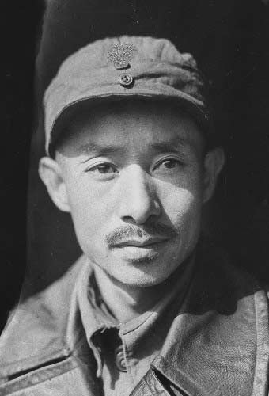
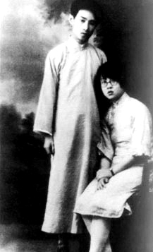
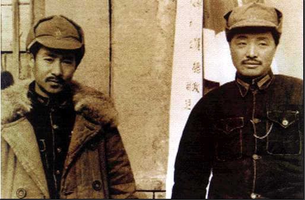

71年前的今天，曾担任团中央书记、第一任妻子被捕后投降的关向应病逝于延安

71年前的今天，贺龙的最佳搭档，曾经的2号人物关向应病逝

（万象特约作者：一一）

关向应（1902年9月10日－1946年7月21日），今辽宁大连市金州人，满族。中国共产党高级军事将领。

青年投身革命后，赴莫斯科参加中共六大，代号为2号，期间迎娶娇妻。回国后任共青团书记、中央军委书记，主持军事。不幸夫妻先后被捕，关向应被营救逃脱，而妻子叛变，造成党内重大损失。

关向应与贺龙组成了最佳搭档，建立湘鄂川黔边革命根据地。在长征中，吸引了大量敌人兵力，有力掩护了中央红军的撤离，并与张国焘进行了坚决斗争。抗日中，改为八路军，战功卓绝。

1946年，因肺结核病逝。贺龙在追悼会上泣不成声。毛泽东为其题的挽词是：“忠心耿耿，为党为国，向应同志不死”。

（最佳三人组合：贺龙、关向应、任弼时）

投身革命的满族青年

1902年9月10日，关向应出生于辽宁金县（今大连市金州区）。满族人，为镶白旗长白山瓜尔佳氏。1922年（20岁），从大连伏见台商业学校毕业，进入一家日资印刷企业当工人，不久与日本雇员发生矛盾，愤而辞职。

1924年4月（22岁），加入中国社会主义青年团，随后前往上海，进入上海大学读书，并从事秘密活动。12月，派往苏联莫斯科东方劳动大学学习。1925年，经陈独秀的儿子陈乔年介绍，加入中国共产党。不久，五卅运动爆发，他主动要求回国，先后在上海、济南、青岛等地工作。

夫妻被捕的不同命运

1927年（25岁），四一二事变发生后，逃亡到武汉；七一五事变后，被派往河南，任中共河南省委书记。1928年，前往莫斯科出席中国共产党第六次全国代表大会，代号为2号，并被选为中共中央政治局候补委员、中共中央军委委员，并担任中国共青团中央委员会书记。期间，与在莫斯科中山大学学习的秦曼云结婚。

1930年3月（28岁），夫妻回到上海后，关向应任中央军委书记，主持军事工作。同年冬，任中共中央长江局书记。1931年4月，关向应在上海被捕，但没有暴露身份，3个月后被营救出狱，前往湘鄂边苏区，夫妻两人就此分道扬镳。3年后，秦曼云被捕叛变，并说服男友上海中央局书记盛忠亮投降，加入中统，解放后两人迁居台湾。

（秦曼云与关向应合影）

贺龙的最佳搭档

1932年1月（30岁），到达湘鄂边苏区，任红三军政委，与贺龙一起领导湘鄂西革命根据地建设和红军的发展。1934年10月（32岁），红三军与红六军团会师，创建了湘鄂川黔苏区。

11月，部队攻入湖南，并建立湘鄂川黔边革命根据地，关向应任红二军团兼军区副政治委员，先后参与指挥陈家河、桃子溪、忠堡、板栗园等战斗。

（贺龙与关向应）

红二方面军的长征

1935年10月，蒋介石率领国民革命军进攻湘鄂川黔边。11月，他与贺龙、任弼时等从湖南省桑植县统一指挥红二、六军团突围国军封锁，开始长征。

1936年2月（34岁），在黔西县城参加中共湘鄂川黔省委会议，决定创建川滇黔边根据地，之后与贺龙、任弼时率红二、六军团在乌蒙山区与国民革命军周旋。

7月2日，红二、六军团到达四川甘孜，与张国焘、徐向前的红四方面军会合。红二、六军团及红三十二军组成红二方面军，关向应任红二方面军副政治委员兼副政委。10月，红二方面军与红一方面军在将台堡会师，长征结束。

（红军长征胜利后，红二方面军部分领导人合影，前排左三为关向应）

抗日战争的八路军

1937年8月22日，关向应出席洛川会议，随后红二方面军改编为八路军120师，关向应任政训处主任，同贺龙率部参加抗日战争。10月，到晋西北地区开辟根据地。1938年2月，与贺龙指挥晋西北七城战役，收复七座县城。

1938年10月10日，与第二任妻子马丹在延安结婚，只请了一桌客人。1938年12月，与贺龙率120师主力开赴冀中，参与指挥齐会、陈庄等战斗。1940年2月，率部回师晋绥。11月起，任晋西北军区政治委员，参加指挥百团大战。

（1938年，组建中共中央北方分局时，关向应、彭真、聂荣臻三人合影）

向应同志不死

1941年（39岁），关向应患有的肺结核病情恶化，被迫回延安休养。1942年，他担任中共中央晋绥分局书记。1945年，在中共七大上当选中央委员。

1946年7月21日（44岁），关向应在延安病逝。贺龙在追悼会上泣不成声。毛泽东为其题挽词：“忠心耿耿，为党为国，向应同志不死”。

