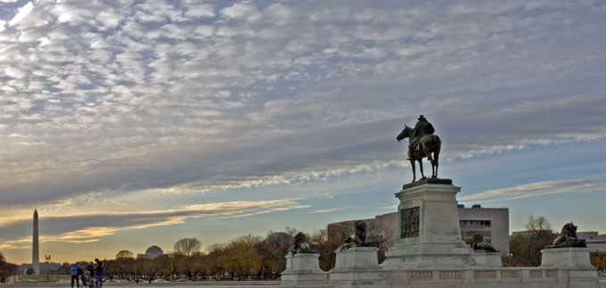
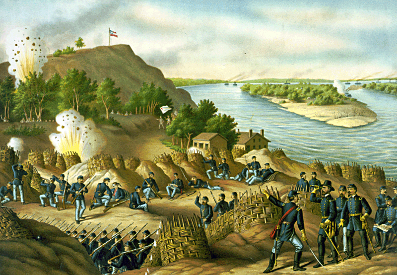
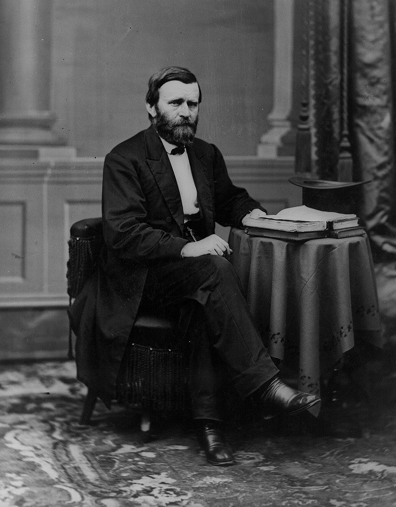
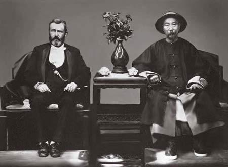

（万象特约作者：一一）

132年前的今天，集战争英雄、贪污犯、50元美金封面人物于一体的美国总统格兰特在纽约逝世 

132年前的今天，被儿子害得破产的美国英雄总统格兰特抑郁病逝

格兰特（英语：Ulysses S. Grant；1822年4月27日－1885年7月23日），美国军事家、政治家，第18任美国总统。

在美国南北战争中，战绩卓绝，被任命为南北战争联邦军总司令，最终击败南军，赢得胜利。因而，在50美元钞票上有他的头像，国会山有他骑马的雕像。战后，他连任两届美国总统。期间，曾突然抛售40亿美元的黄金，令金市大幅下跌，引发了一场称为黑色星期五的金融危机。

卸任后，周游世界。他是第一个到中国的美国总统，并帮助中国与日本调停琉球问题。后与儿子开公司，被儿子欺诈而倒闭，陷入贫困后，抑郁病逝。

西点军校的高材生

1822年4月27日，格兰特生于美国俄亥俄州一个小业主的家庭。1843年（21岁），毕业于西点军校（陆军军官学校），并参加过美墨战争，1854年（32岁）退役。

1861年（39岁），南北战争爆发后，格兰特于伊利诺伊州乔戴维斯县协助招募并训练军队。先后担任志愿军的团长、旅长，作战于西部战场。1862年2月，率军攻克南军的亨利堡、多纳尔森堡，而名声大震，升任少将。4月，在西罗之役（Battle of Shiloh）中击败并重创南军。

联邦军的总司令

1863年4至7月（41岁），率田纳西州军队迂回包抄密西西比河畔南军最重要的堡垒——维克斯堡，经历了外围作战和攻坚战，最终迫使南军投降，俘获南军3.1万人。11月，率部挫败进攻查塔努加的南军。

（1863年，围攻维克斯堡画）

1864年起（42岁），格兰特被任命为南北战争联邦军总司令，制定东西战线协同作战，分割歼敌的计划。5月，率主力军在弗吉尼亚州同南军主力决战，南军遭受重创。1865年4月2日，攻克美利坚联盟国“首都”里士满。
1865年4月9日，格兰特接受南军投降，长达四年的南北战争结束。

在接受南方军队投降时，北方军营响起庆贺的炮声，但随即遭到格兰特的制止，他说：“叛乱者现在又是我们的同胞了。”双方随后互致军礼。

（联盟军司令罗伯特·李向格兰特投降）

黑色星期五的连任总统

1866年4月（44岁），格兰特晋升陆军上将。1867年8月，任陆军代理部长。1868年，参加总统选举，由于在内战时期彪炳的战功，格兰特赢得执政的共和党提名，成功当选美国总统。

1869年9月24日（47岁），星期五，格兰特突然宣报抛售价值40亿美元的黄金，购回战时发行钞票。此举令金市大幅下跌，并引发恐慌性抛售，跌势迅速波及股市。这场金融危机称为黑色星期五。

1872年（50岁），成功连任总统。作为美国重建时期的重要总统，八年任期政绩平平，激进共和党人批评他对南方妥协太多，而南方及民主党则批评其领导的联邦政府对南方实行剥削。

第一位到中国的美国总统

1877年3月（55岁），格兰特卸任后，和妻子开始环游世界。1878年，格兰特成为美国第一位到达日本和中国的总统，会见明治天皇，并与当时中国清朝北洋大臣李鸿章合照，称两人是当代伟大的人。1879年12月，回到美国。

当时日本正强迫琉球国王退位，设置冲绳县，将琉球并入日本版图。清朝总理各国事务衙门大臣恭亲王委请格兰特为调解人，格兰特欣然同意。但被日方以《中日北京专约》为由搪塞，只好力劝中日互让，以免失和。

1880年（58岁），日本接受格兰特的调停，提出“分岛改约案”，将宫古岛以南诸岛归还琉球国，但未获中国同意，最后不了了之。此后琉球南部由中国控制，北部由日本控制，直至甲午战争爆发。

被儿子搞倒闭了

1880年（58岁），在共和党人士及支持者的推动下，他第三度参选总统，欲打破华盛顿以来总统不担任多过二任的习惯，但最后在共和党大会初选三十六轮投票中落败。

1881年（59岁），格兰特的儿子巴克(Buck)与瓦德(Ferdinand Ward)在华尔街成立“格兰特与瓦德”公司，他被儿子说服参与投资，但因瓦德欺诈，“格兰特与瓦德”公司于1884年倒闭，导致格兰特的生活陷入贫困。

1885年，格兰特在纽约州抑郁病逝，终年63岁。

（格兰特墓）