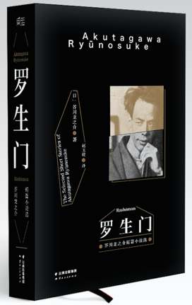

90年前的今天，《罗生门》作者芥川龙之介自杀。

万象特约作者：一一

芥川龙之介（1892年3月1日－1927年7月24日），号“澄江堂主人”，俳号“我鬼”，日本知名小说家，博通汉学、日本文学、英国文学，但一生为多种疾病、忧虑所苦而自鸩轻生，年仅35岁。其名作甚多，以极短篇为主，1950年，日本著名导演黑泽明，将芥川的作品《竹林中》与《罗生门》合而为一，改编为电影《罗生门》，在国际上获得包括戛纳影展金棕榈奖在内的多个大奖，使日本电影走向世界。此后，“罗生门”更成为华语地区对于扑朔迷离的、各方说法不一的事件的代名词。

1935年芥川龙之介自杀去世8年后，他的毕生好友菊池宽设立了以他的名字命名的文学新人奖“芥川赏”，现已成为日本最重要文学奖之一，与“直木赏”齐名，作为奖励新进纯文学作家的重要奖项之一，影响深远。鲁迅评价其作品: "所用的主题最多的是希望之后的不安，或者正不安时之心情。"室生犀星评价其人: "这个作家好像从书籍之间变出来的，在世上只活了三十几年，谈笑一通，马上又隐身于自己出来的书籍之间，不再出来。"

早年生涯

芥川龙之介原姓名新原龙之助，1892年（明治廿五年）生于东京。父亲新原敏三在京桥区入船町8丁目以贩卖牛奶为生。为家中长子，有2个姐姐，他出生7个月后，由于母亲精神异常，他被送到母亲的娘家抚养，后来母亲在他11岁离世后，过继为兄长芥川道章（芥川龙之介之舅舅）的养子，遂改姓芥川。
芥川一家锺好文学与戏剧，充满浓厚的江户文人气息，龙之介受此熏陶，故有深厚之文艺底蕴。11岁时就与同学发行手抄杂志，并自己写作、编辑，甚至自绘插图。1913年他进入东京帝国大学，学习英国文学，期间开始写作。毕业后通过英文教学和报纸编辑维生。早在1912年廿二岁时，他已完成了处女作《老年》，两年后又发表了短篇小说《罗生门》，但并未受到重视。
1916年芥川毕业，论文题为“威廉·莫理斯研究”，其成绩位列同届二十人中之第二名。他在《新思潮》杂志发表短篇小说《鼻子》，夏目漱石读到后非常赞赏，对他多方关怀。这段时间他也开始创作俳句。1918年他发表《地狱变》，讲述一个日本战国时期的残酷故事，通过画师、画师女儿等人的遭遇，反映了纯粹的艺术和无辜的底层人民受邪恶的统治者的摧残。

访问中国

1921年芥川龙之介作为大阪每日新闻报社的记者前往中国四个月，在结束访问之际与胡适会面，7月返抵日本，之后写成《支那游记》一书。这次任务非常繁重。在任务的压力和自身压抑作用下，他染上了多种疾病，一生为胃肠病、痔疮、神经衰弱、失眠症所苦。

回到日本后，1922年他发表了《竹林中》，与安布罗斯·比尔斯的《月光小路》结构类似，都是在一件案子的调查采集的各方的证词与说法。不同的是《月光小路》最后澄清了事实，而《竹林中》中各方的证词某些地方重合却有很大矛盾，但是又都能自圆其说。整个作品弥漫着压抑、彷徨、不定向的气氛。这反映了作者本人迷茫的思想。自此以后，由于病情恶化，芥川龙之介常出现幻觉，当时的社会形势也右倾，言论自由受到从政府到普通人的打压。这使得他的作品更加压抑，如《河童》。

服药自杀

1925年（大正14年）在文化学院文学部担任讲师。隔年，由于胃溃疡，失眠，神经衰弱的复发再次入住汤河源疗养。另一方面，妻子冢本文（婚后改为芥川文）搬到了鹄沼的别墅。2月22日，龙之介也来到了鹄沼并住在旅馆东屋。7月20日租下了东屋i-4号别墅，让妻子和三男居住。在此期间，完成了小品‘租房子之后’‘鹄沼杂纪’‘点鬼簿’。
1927年（昭和二年）芥川龙之介继续写作随想集《侏儒的话》，作品短小精悍，每段只有一两句话，但意味深长。姐夫卧轨自杀，芥川为二姐一家债务奔走导致身心俱疲。7月24日因“恍惚的不安”而仰药自尽，年仅35岁。

主要著作
芥川龙之介在他短暂的一生中，写了超过150篇小说。他的极短篇小说篇幅很短，取材新颖，情节新奇甚至诡异。作品关注社会丑恶现象，但很少直接评论，而仅以冷峻的文字和简洁有力的语言来陈述，让读者深深感觉到其丑恶性，这使得他的小说即具有高度的艺术性又成为当时社会的缩影，《竹林中》、《罗生门》、《蜘蛛之丝》、《地狱变》、《杜子春》、《鼻子》、《南京的基督》等皆是经典之作，时常被选入课文、小说选集，或改编为戏剧。

1950年，日本著名导演黑泽明，将芥川的作品《竹林中》与《罗生门》合而为一，改编为电影《罗生门》，在国际上获得包括戛纳影展金棕榈奖在内的多个大奖，使日本电影走向世界。此后，“罗生门”更成为华语地区对于扑朔迷离的、各方说法不一的事件的代名词。

