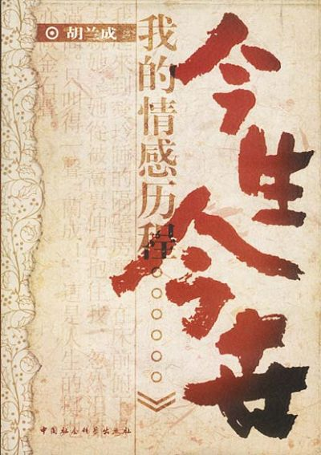
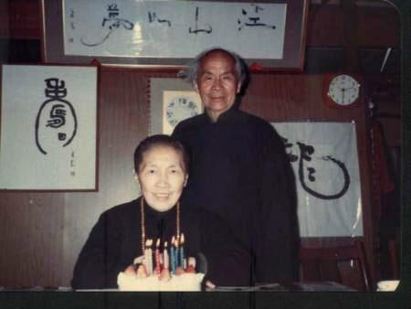
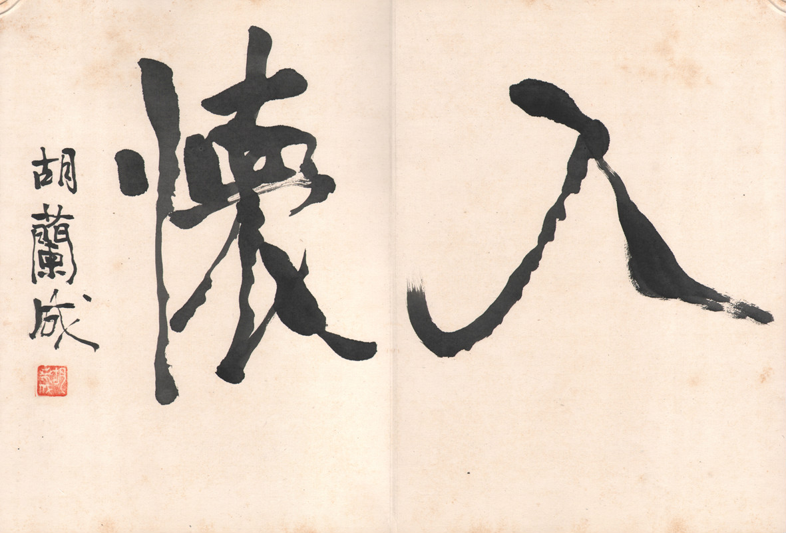

0725胡兰成

36年前的今天，写下8个女人今世今生的著名汉奸胡兰成病逝日本

胡兰成（1906年2月28日－1981年7月25日），浙江绍兴人，为中国近代作家。

年轻时，四处找工作。后投奔汪精卫，成为其文胆，号称政论家第一把交椅，也因此被定位为著名“汉奸”。在汪伪政府期间，与黑帮老大遗孀同居。不久，成为著名女作家张爱玲的第一任丈夫。

日本投降后，鼓动武汉军方独立，失败后流亡江浙。流亡期间，发生外遇，张爱玲与其结束4年婚姻。后逃到日本，与坐了7年牢的黑帮老大遗孀邂逅，两人相伴一生。

代表作《山河岁月》、《今生今世》等。《今生今世》描写了与胡兰成有关系的8个女人，每人篇幅竟大致相同，被戏称为《群芳谱》。

找不到工作的年轻人

1906年2月28日，胡兰成出生于浙江绍兴嵊县，兄弟7人，排行第六。1919年（13岁），进入绍兴五中，只读一学期，因学生风潮回家。1920年（14岁），跟表哥进入杭州惠兰中学读书。

1923年（17岁），因编辑校刊得罪校务主任，被学校开除。1925年（19岁），娶发妻唐玉凤，婚后在村里小学教书。1926年，到杭州邮政局工作，3个月后被开除，后到燕京大学当文书，旁听课程，结识周作人、梅兰芳等人。

1927年（21岁），因北伐战争回家，经常失业状态。1932年，妻子唐玉凤病逝，前往广西找工作。

汪精卫的第一文胆

1933年（27岁），先后在广西多个中学教书，娶第二任妻子全慧文。1936年（30岁），受雇于军方，开办《柳州日报》，后发生两广兵变，胡兰成被监禁。写信给白崇禧，获得释放，回到家乡。1937年3月，受汪精卫邀请，担任《中华日报》主笔。

1938年初，被调到香港《南华日报》任总主笔。12月，汪精卫脱离重庆到河内，响应近卫声明，发表艳电。1939年5月，紧随汪精卫回到上海，再任《中华日报》主笔。1940年，出版社论集《战难和亦不易》。3月，汪精卫伪政府在南京成立，胡兰成任宣传部政务次长，成为汪精卫的“文胆”，“稳坐政论家第一把交椅”。

迎娶张爱玲

1942年（36岁），胡兰成被任命为行政院法制局长，出版社论集《争取解放》。上海滩特工总部警卫队长吴四宝被暗杀后，胡兰成与其遗孀佘爱珍同居。因胡兰成不赞成对英美宣战，与汪精卫产生矛盾。1943年12月，被汪精卫下令逮捕，一个月后被释放。

1944年2月（38岁），回到上海，初次见到张爱玲。不断在《新东方》《天地》的杂志，发表文章。8月，与张爱玲结婚。11月，汪精卫病逝日本。

与张爱玲离婚

1945年（39岁），在武汉与汉阳医院护士周训德恋爱，出版政论集《中日问题与世界问题》、《文明的传统》、《中国人的声音》。日本投降后，怂恿二十九军在武汉独立，以对抗国民政府，失败后逃亡江浙一带，在浙江丽水与范秀美同居。

1947年（41岁），他匿名潜藏于温州，在多所中学教书，开始写《山河岁月》，初名为《中国文明之前身与现身》。同年，因范秀美事，张爱玲与他离婚，称他为无赖人。

8个女人的今生今世

1950年（44岁），逃往香港，不久前往日本。1954年，佘爱珍坐了7年牢后，也逃到日本，两人结婚。同年《山河岁月》出版，这期间与张爱玲还有书信来往。

1959年（53岁），《今生今世》全书完成。此书，写了与胡兰成有关系的8个女人：发妻玉凤、女教师全慧文、护士小周、斯家小娘范秀美、日本女子一枝、歌女小白杨应英娣、临水照花的才女张爱玲、上海滩黑帮老大的压寨夫人佘爱珍。这几个人，在书中所占篇幅竟大致相同，胡兰成或许是想不做选择吧。人们戏称《今生今世》是一部《群芳谱》。

今日何日兮

1974年（68岁），经蒋介石批准，来到台湾，受聘为台湾中国文化学院（当时叫做阳明山文化学院）终身教授。部分台湾文人，尤其是朱西甯、朱天文父女，受其影响颇深。1976年，因遭到台湾文化界围剿，被迫离开。完成《禅是一枝花》，他在序言：“小孩儿有时候说谎话，是为了想说更真的话。”。

1981年7月25日（75岁），胡兰成逝于日本福生市。同年《今日何日兮》出版。

